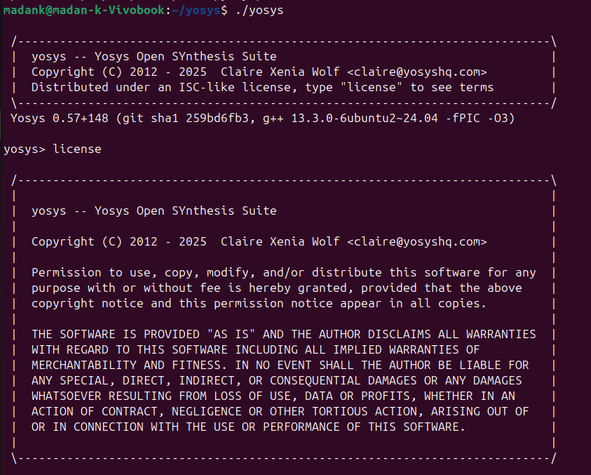
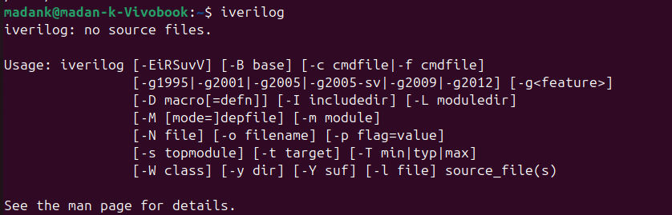
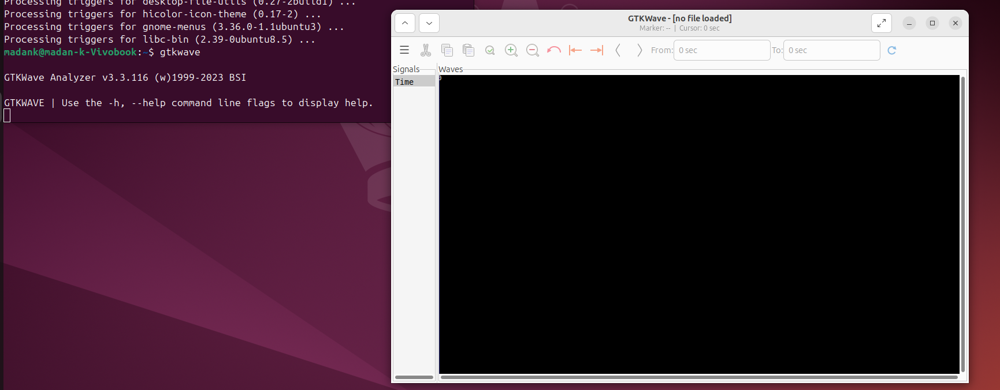

# RISC‑V Reference SoC Tapeout Program

## Week 0 - Tools installation

### Yosys
```
$ sudo apt-get update 
$ git clone https://github.com/YosysHQ/yosys.git 
$ cd yosys 
$ sudo apt install make (If make is not installed please install it)  
$ sudo apt-get install build-essential clang bison flex \
    libreadline-dev gawk tcl-dev libffi-dev git \
    graphviz xdot pkg-config python3 libboost-system-dev \
    libboost-python-dev libboost-filesystem-dev zlib1g-dev 
$ make config-gcc 
$ make  
$ sudo make install 
```


### Iverilog
```
$ sudo apt-get update
$ sudo apt-get install iverilog 
```


### gtkwave
```
$ sudo apt-get update
$ sudo apt install gtkwave
```


### ngspice

Download ngspice tarball from https://sourceforge.net/projects/ngspice/files/

Then unpack and install with the following steps:
```
$ tar -zxvf ngspice-45.2.tar.gz 
$ cd ngspice-45.2 
$ mkdir release
$ cd release
$ ../configure  --with-x --with-readline=yes --disable-debug
$ make
$ sudo make install
```


