# Post-Synthesis and Verification of BabySoC

This document explains the process of performing post-synthesis simulation and verification of the BabySoC design. The synthesis is carried out using **Yosys**, and the verification is done using **Icarus Verilog (iverilog)** to observe and analyze the waveform output.


## Tools Used

- **Yosys** – Open-source synthesis tool used to convert RTL code into a gate-level netlist.  
- **Icarus Verilog (iverilog)** – Used for functional and post-synthesis simulation to verify the synthesized design.  
- **GTKWave** –  Used to visualize waveforms generated from simulations.


## Workflow

1. RTL Design of BabySoC modules (CPU, PLL, DAC)
2. Synthesis using Yosys
3. Netlist generation
4. Post-synthesis simulation using iverilog
5. Waveform analysis using GTKWave


## ‼️Note: The entire workflow is done from the `/VSDBabySoC` directory
The commands for accessing other directories are relative to this directory as specified in this report. To view the Directory structure [click here](/week2/lab/README.md#Setting-up-Project-directory)

## Yosys Synthesis Flow

## 1. Launch Yosys

```
yosys
```

## 2. Load Standard Cell and IP Libraries

```
read_liberty -lib src/lib/sky130_fd_sc_hd__tt_025C_1v80.lib
read_liberty -lib src/lib/avsdpll.lib
read_liberty -lib src/lib/avsddac.lib
```

## 3. Read Verilog Source Files

```
read_verilog src/module/vsdbabysoc.v
read_verilog -I src/include src/module/rvmyth.v
read_verilog -I src/include src/module/clk_gate.v
```

## 4. Perform Synthesis

```
synth -top vsdbabysoc
```
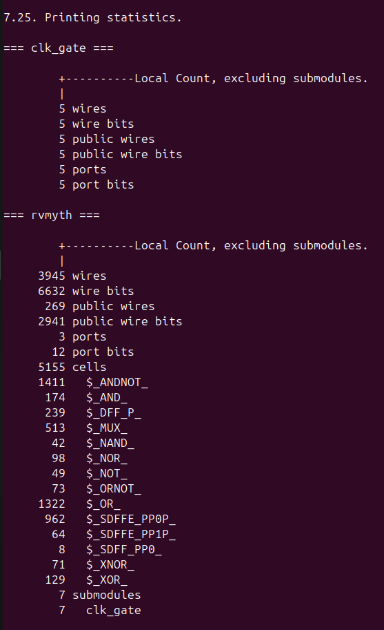

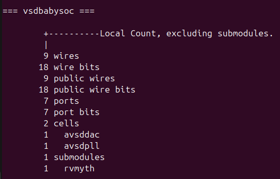

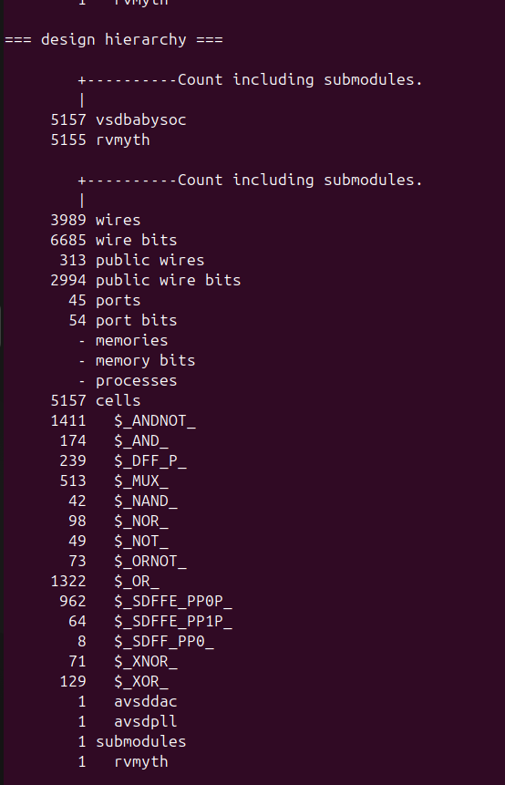

```
show
```

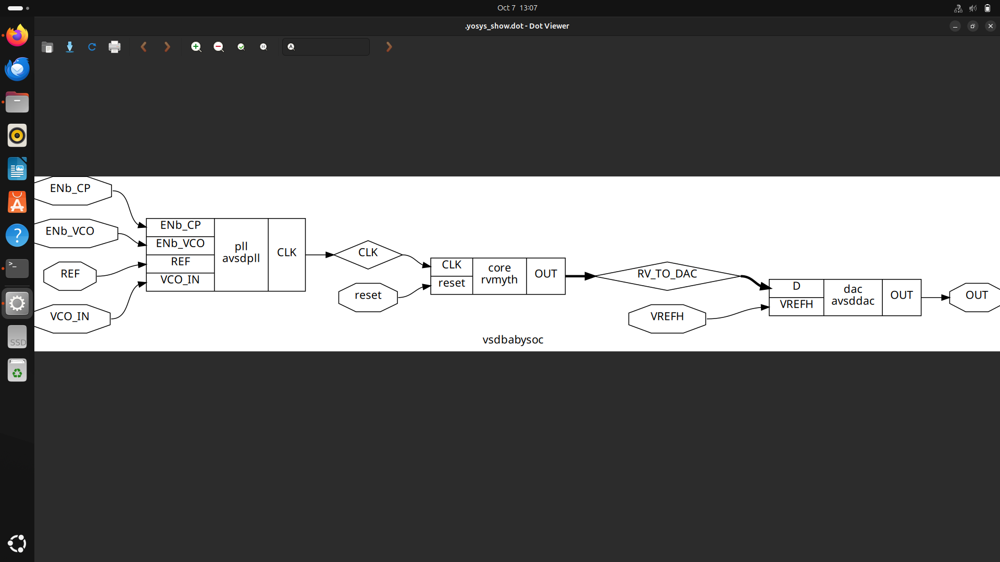

## 5. Map Flip-Flops to Standard Cells

```
dfflibmap -liberty src/lib/sky130_fd_sc_hd__tt_025C_1v80.lib
```
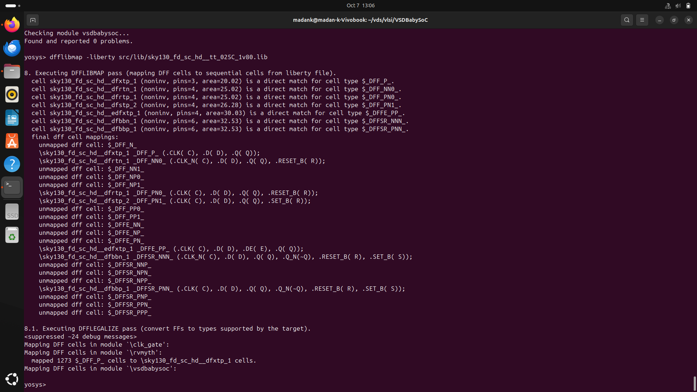

## 6. Optimize and Map Logic Gates

```
opt
abc -liberty src/lib/sky130_fd_sc_hd__tt_025C_1v80.lib
```

## 7. Flatten and Clean Design

```
flatten
setundef -zero
clean -purge
rename -enumerate
```
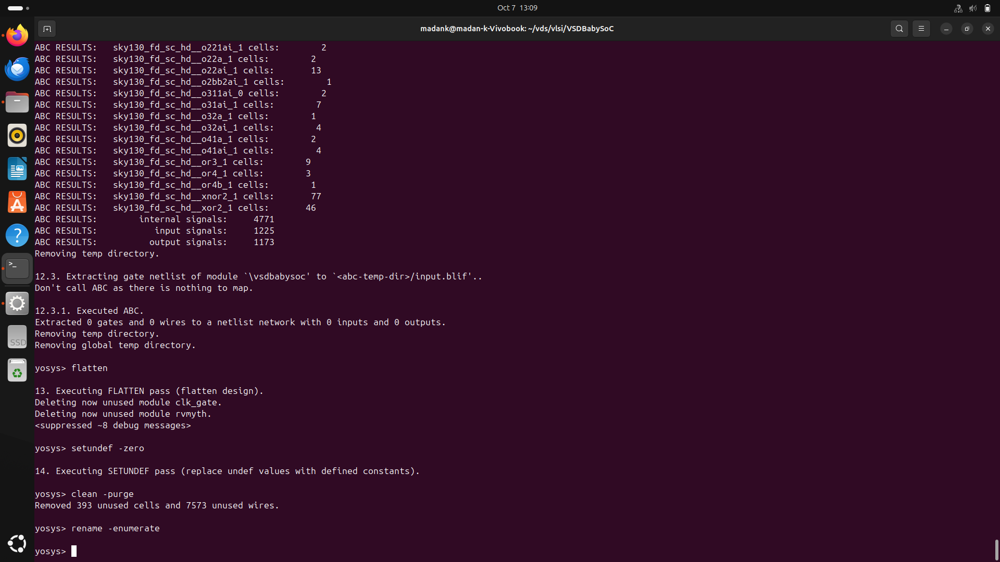

## 8. Report Statistics

```
stat
```
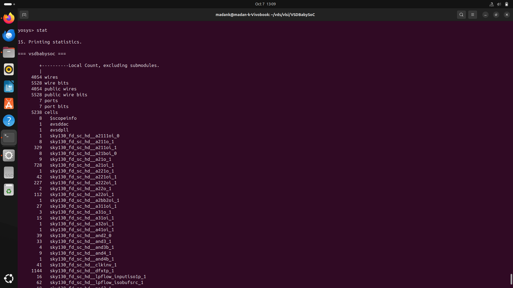

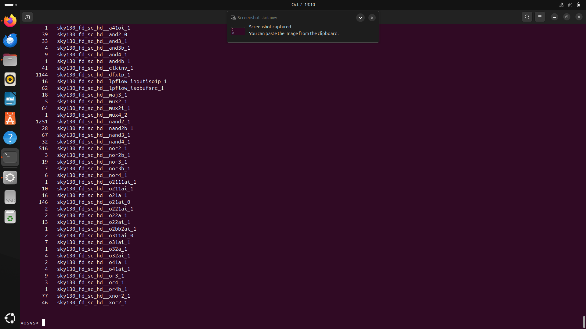

## 9. Write Synthesized Netlist

```
write_verilog -noattr output/post_synth_sim/vsdbabysoc.synth.v
```
Note: Create `output/post_synth_sim/` directory using `mkdir` if you don't already have it.


# Post-Synthesis Simulation Flow for VSDBabySoC

## 1. Compile the Design using Icarus Verilog

```
iverilog -I src/gls_model -I output/post_synth_sim -I src/include -I src/module -o output/post_synth_sim/post_synth_sim.out -DPOST_SYNTH_SIM -DFUNCTIONAL -DUNIT_DELAY=#1 src/module/testbench.v
```

### Explanation of the Command:

* `-I src/gls_model`, `-I output/post_synth_sim`, `-I src/include`, `-I src/module`:
  These flags specify the directories where Verilog header and source files are located.
* `-o output/post_synth_sim/post_synth_sim.out`:
  This specifies the name and location of the compiled simulation output file.
* `-DPOST_SYNTH_SIM`:
  Defines a macro indicating that the simulation being performed is post-synthesis. This enables conditional compilation sections meant for gate-level simulations.
* `-DFUNCTIONAL`:
  Defines a macro to simulate functional behavior of standard cells rather than their detailed timing behavior.
* `-DUNIT_DELAY=#1`:
  Assigns a unit delay of 1 time unit to all gates for simplified timing analysis in the functional simulation.
* `src/module/testbench.v`:
  Specifies the top-level Verilog testbench file used for simulation.

## 2. Run the Simulation Executable

```
./output/post_synth_sim/post_synth_sim.out
```

## 3. View Waveforms in GTKWave

```
gtkwave post_synth_sim.vcd
```

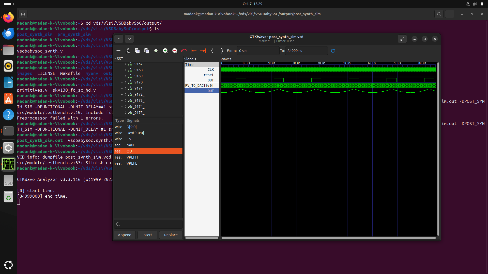

## Comparing Pre-Synthesis and Post-Synthesis Simulation

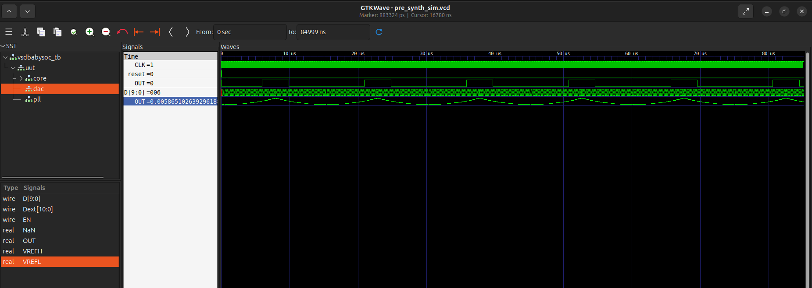

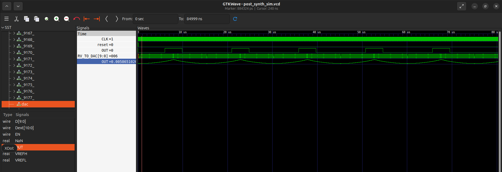
