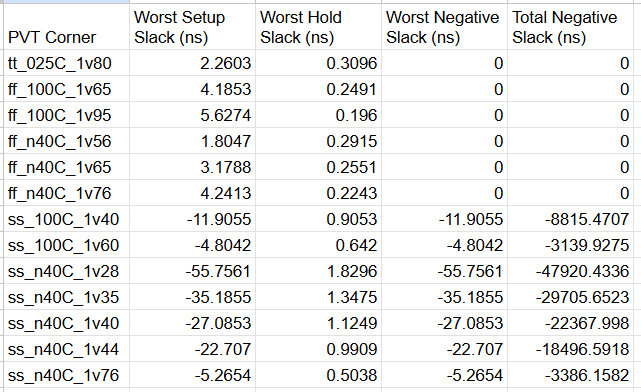

# Week 3 Part 3 - Generate Timing Graphs with OpenSTA

## Installation of OpenSTA
Follow these steps to install OpenSTA on your system:

```bash
# Clone the OpenSTA repository
git clone https://github.com/The-OpenROAD-Project/OpenSTA.git 

# Navigate into the repository
cd OpenSTA  

# Create build directory
mkdir build

# navigate to the build directory
cd build  

# Configure the build using CMake
cmake ..  

# Compile OpenSTA
make  

# Install OpenSTA (requires sudo)
sudo make install
````

After installation, you can launch OpenSTA by running:

```bash
sta
```


## Example Directory Structure

Create the following directory structure to organize your libraries and SoC design files:

```
OpenSTA/
|____examples/
      |___timing_libs/   
      |       ├── avsddac.lib  
      |       ├── avsdpll.lib  
      |       └── sky130_fd_sc_hd__tt_025C_1v80.lib
      |
      |___BabySoC/
              ├── cd_sky130hd.sdc
              ├── vsdbabysoc_synthesis.sdc 
              └── vsdbabysoc.synth.v
```

* **timing_libs/**: Contains standard timing libraries for STA.
* **BabySoC/**: Contains SoC design constraints and synthesized netlist files.


## Script to run min/max timing check:
### vsdbabysoc_min_max_delays.tcl

```
# Load Liberty Libraries (standard cell + IPs)
read_liberty -min ~/OpenSTA/examples/timing_libs/sky130_fd_sc_hd__tt_025C_1v80.lib
read_liberty -max ~/OpenSTA/examples/timing_libs/sky130_fd_sc_hd__tt_025C_1v80.lib

read_liberty -min ~/OpenSTA/examples/timing_libs/avsdpll.lib
read_liberty -max ~/OpenSTA/examples/timing_libs/avsdpll.lib

read_liberty -min ~/OpenSTA/examples/timing_libs/avsddac.lib
read_liberty -max ~/OpenSTA/examples/timing_libs/avsddac.lib

# Read Synthesized Netlist
read_verilog ~/OpenSTA/examples/BabySoC/vsdbabysoc.synth.v

# Link the Top-Level Design
link_design vsdbabysoc

# Apply SDC Constraints
read_sdc ~/OpenSTA/examples/BabySoC/vsdbabysoc_synthesis.sdc

# Generate Timing Report
report_checks
```

Execute the script:
```
sta
source ~/OpenSTA/examples/BabySoC/vsdbabysoc_min_max_delays.tcl
```


If an error is encountered like this:

```
Warning: /home/madank/OpenSTA/examples/timing_libs/sky130_fd_sc_hd__tt_025C_1v80.lib line 23, default_fanout_load is 0.0.
Warning: /home/madank/OpenSTA/examples/timing_libs/sky130_fd_sc_hd__tt_025C_1v80.lib line 1, library sky130_fd_sc_hd__tt_025C_1v80 already exists.
Warning: /home/madank/OpenSTA/examples/timing_libs/sky130_fd_sc_hd__tt_025C_1v80.lib line 23, default_fanout_load is 0.0.
Error: /home/madank/OpenSTA/examples/timing_libs/avsdpll.lib line 54, syntax error
```


Open avsdpll.lib and comment line 54-60 and 68-78 (only use multi-line comment /* */ ) as shown:


Now execute the script:


## VSDBabySoC PVT Corner Analysis 

To perform PVT corner analysis using various timing libraries, first we download sky130_fd_sc_hd Timing Libraries from: 

https://github.com/efabless/skywater-pdk-libs-sky130_fd_sc_hd/tree/master/timing

and place it inside `~/OpenSTA/examples/timing_libs/skywater-pdk-libs-sky130_fd_sc_hd/`

Script for performing Static Timing Analysis across the PVT corners:

### sta_across_pvt.tcl

```
 set list_of_lib_files(1) "sky130_fd_sc_hd__tt_025C_1v80.lib"
 set list_of_lib_files(2) "sky130_fd_sc_hd__ff_100C_1v65.lib"
 set list_of_lib_files(3) "sky130_fd_sc_hd__ff_100C_1v95.lib"
 set list_of_lib_files(4) "sky130_fd_sc_hd__ff_n40C_1v56.lib"
 set list_of_lib_files(5) "sky130_fd_sc_hd__ff_n40C_1v65.lib"
 set list_of_lib_files(6) "sky130_fd_sc_hd__ff_n40C_1v76.lib"
 set list_of_lib_files(7) "sky130_fd_sc_hd__ss_100C_1v40.lib"
 set list_of_lib_files(8) "sky130_fd_sc_hd__ss_100C_1v60.lib"
 set list_of_lib_files(9) "sky130_fd_sc_hd__ss_n40C_1v28.lib"
 set list_of_lib_files(10) "sky130_fd_sc_hd__ss_n40C_1v35.lib"
 set list_of_lib_files(11) "sky130_fd_sc_hd__ss_n40C_1v40.lib"
 set list_of_lib_files(12) "sky130_fd_sc_hd__ss_n40C_1v44.lib"
 set list_of_lib_files(13) "sky130_fd_sc_hd__ss_n40C_1v76.lib"

 read_liberty ~/OpenSTA/examples/timing_libs/avsdpll.lib
 read_liberty ~/OpenSTA/examples/timing_libs/avsddac.lib

 for {set i 1} {$i <= [array size list_of_lib_files]} {incr i} {
 read_liberty ~/OpenSTA/examples/timing_libs/skywater-pdk-libs-sky130_fd_sc_hd/$list_of_lib_files($i)
 read_verilog ~/OpenSTA/examples/BabySoC/vsdbabysoc.synth.v
 link_design vsdbabysoc
 current_design
 read_sdc ~/OpenSTA/examples/BabySoC/vsdbabysoc_synthesis.sdc
 check_setup -verbose
 report_checks -path_delay min_max -fields {nets cap slew input_pins fanout} -digits {4} > ~/OpenSTA/examples/BabySoC/STA_OUTPUT/min_max_$list_of_lib_files($i).txt

 exec echo "$list_of_lib_files($i)" >> ~/OpenSTA/examples/BabySoC/STA_OUTPUT/sta_worst_max_slack.txt
 report_worst_slack -max -digits {4} >> ~/OpenSTA/examples/BabySoC/STA_OUTPUT/sta_worst_max_slack.txt

 exec echo "$list_of_lib_files($i)" >> ~/OpenSTA/examples/BabySoC/STA_OUTPUT/sta_worst_min_slack.txt
 report_worst_slack -min -digits {4} >> ~/OpenSTA/examples/BabySoC/STA_OUTPUT/sta_worst_min_slack.txt

 exec echo "$list_of_lib_files($i)" >> ~/OpenSTA/examples/BabySoC/STA_OUTPUT/sta_tns.txt
 report_tns -digits {4} >> ~/OpenSTA/examples/BabySoC/STA_OUTPUT/sta_tns.txt

 exec echo "$list_of_lib_files($i)" >> ~/OpenSTA/examples/BabySoC/STA_OUTPUT/sta_wns.txt
 report_wns -digits {4} >> ~/OpenSTA/examples/BabySoC/STA_OUTPUT/sta_wns.txt
 }
```

Execute the script file and perform STA:
```
sta
source ~/OpenSTA/examples/BabySoC/sta_across_pvt.tcl
```

Now, `STA_OUTPUT/` directory is created inside `~/OpenSTA/examples/BabySoC/`


| File | Description |
|------|------------|
| `min_max_<lib>.txt` | Contains detailed reports of setup and hold timing paths for each process-voltage-temperature (PVT) corner |
| `sta_worst_max_slack.txt` | Contains the most critical (worst) setup slack values observed across all corners |
| `sta_worst_min_slack.txt` | Contains the most critical (worst) hold slack values across all corners |
| `sta_tns.txt` | Contains the total negative slack (TNS) accumulated over all corners |
| `sta_wns.txt` | Contains the worst negative slack (WNS) found among all corners |


Thus, the final directory structure looks something like this:

```
OpenSTA/
└── examples/
    ├── timing_libs/
    │   ├── avsddac.lib  
    │   ├── avsdpll.lib  
    │   ├── sky130_fd_sc_hd__tt_025C_1v80.lib
    │   └── skywater-pdk-libs-sky130_fd_sc_hd/
    │       ├── sky130_fd_sc_hd__tt_025C_1v80.lib
    │       ├── sky130_fd_sc_hd__ff_100C_1v65.lib
    │       ├── sky130_fd_sc_hd__ff_100C_1v95.lib
    │       └── ...
    │
    └── BabySoC/
        ├── cd_sky130hd.sdc
        ├── vsdbabysoc_synthesis.sdc 
        ├── vsdbabysoc.synth.v
        └── STA_OUTPUT/
            ├── min_max_sky130_fd_sc_hd__ff_100C_1v65.lib.txt
            ├── min_max_sky130_fd_sc_hd__ff_100C_1v95.lib.txt
            ├── min_max_sky130_fd_sc_hd__tt_025C_1v80.lib.txt
            └── ...
```


STA For this timing library, `min_max_sky130_fd_sc_hd__tt_025C_1v80.lib.txt` :

```
Warning: sta_across_pvt.tcl line 25, unknown field nets.
Startpoint: _9108_ (rising edge-triggered flip-flop clocked by clk)
Endpoint: _8046_ (rising edge-triggered flip-flop clocked by clk)
Path Group: clk
Path Type: min

Fanout       Cap      Slew     Delay      Time   Description
-------------------------------------------------------------------------------------
                    0.0000    0.0000    0.0000   clock clk (rise edge)
                              0.0000    0.0000   clock network delay (ideal)
                    0.0000    0.0000    0.0000 ^ _9108_/CLK (sky130_fd_sc_hd__dfxtp_1)
     1    0.0017    0.0329    0.2749    0.2749 ^ _9108_/Q (sky130_fd_sc_hd__dfxtp_1)
                    0.0329    0.0000    0.2749 ^ _8046_/D (sky130_fd_sc_hd__dfxtp_1)
                                        0.2749   data arrival time

                    0.0000    0.0000    0.0000   clock clk (rise edge)
                              0.0000    0.0000   clock network delay (ideal)
                              0.0000    0.0000   clock reconvergence pessimism
                                        0.0000 ^ _8046_/CLK (sky130_fd_sc_hd__dfxtp_1)
                             -0.0346   -0.0346   library hold time
                                       -0.0346   data required time
-------------------------------------------------------------------------------------
                                       -0.0346   data required time
                                       -0.2749   data arrival time
-------------------------------------------------------------------------------------
                                        0.3096   slack (MET)


Startpoint: _9085_ (rising edge-triggered flip-flop clocked by clk)
Endpoint: _8462_ (rising edge-triggered flip-flop clocked by clk)
Path Group: clk
Path Type: max

Fanout       Cap      Slew     Delay      Time   Description
-------------------------------------------------------------------------------------
                    0.0000    0.0000    0.0000   clock clk (rise edge)
                              0.0000    0.0000   clock network delay (ideal)
                    0.0000    0.0000    0.0000 ^ _9085_/CLK (sky130_fd_sc_hd__dfxtp_1)
   512    1.2682   11.6586    8.4347    8.4347 ^ _9085_/Q (sky130_fd_sc_hd__dfxtp_1)
                   11.6586    0.0000    8.4347 ^ _6479_/B1 (sky130_fd_sc_hd__a21oi_1)
     1    0.0017    1.2722   -0.2494    8.1853 v _6479_/Y (sky130_fd_sc_hd__a21oi_1)
                    1.2722    0.0000    8.1853 v _8462_/D (sky130_fd_sc_hd__dfxtp_1)
                                        8.1853   data arrival time

                    0.0000   11.0000   11.0000   clock clk (rise edge)
                              0.0000   11.0000   clock network delay (ideal)
                              0.0000   11.0000   clock reconvergence pessimism
                                       11.0000 ^ _8462_/CLK (sky130_fd_sc_hd__dfxtp_1)
                             -0.5544   10.4456   library setup time
                                       10.4456   data required time
-------------------------------------------------------------------------------------
                                       10.4456   data required time
                                       -8.1853   data arrival time
-------------------------------------------------------------------------------------
                                        2.2603   slack (MET)


```

The critical path in the design is identified as the path from flip-flop _9085_ to flip-flop _8462_, which corresponds to the maximum delay path (setup analysis). This path has the highest data arrival time relative to the data required time, making it the most timing-sensitive path in the design.

The slack values indicate whether timing requirements are met:

Positive slack signifies that the data arrives at the endpoint flip-flop before the required time, meaning the timing constraints are satisfied.

Negative slack indicates a timing violation, where the data does not arrive within the required window.

For the reported paths:

The path _9108_ to _8046_ has a slack of 0.3096 ns, indicating timing is met.

The path _9085_ to _8462_ has a slack of 2.2603 ns, also indicating timing is met, but as it represents the maximum delay path, it is identified as the critical path that defines the maximum operating frequency of the design.


### Table:




## Graphs 


