# WEEK 4 Ngspice Sky130

To install Ngspice, follow the steps mentioned [here](/week0/task2/README.md#ngspice)

## NMOS Analysis

Let us understand the DC behavior of an NMOS transistor and its response to varying voltages especially how the NMOS transistor conducts when gate (Vin) and drain (Vdd) voltages change, by designing a simple nmose circuit and obtaining SPICE simulation

```
cd sky130CircuitDesignWorkshop/design
gedit day1_nfet_idvds_L2_W5.spice 
```
### SPICE Code

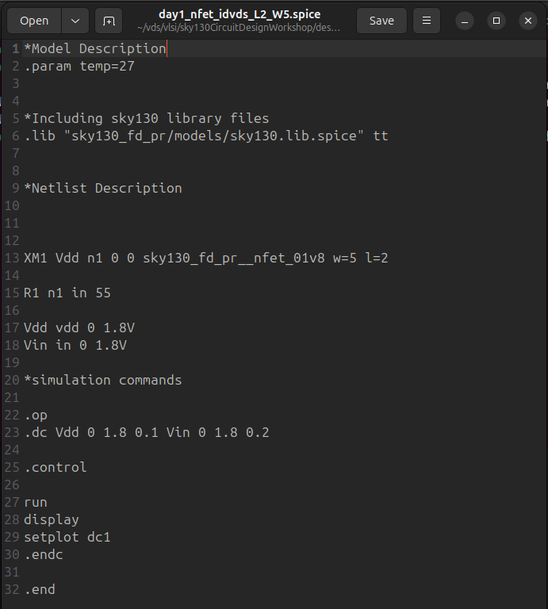

```
ngspice day1_nfet_idvds_L2_W5.spice
plot -vdd#branch
```

### Plot

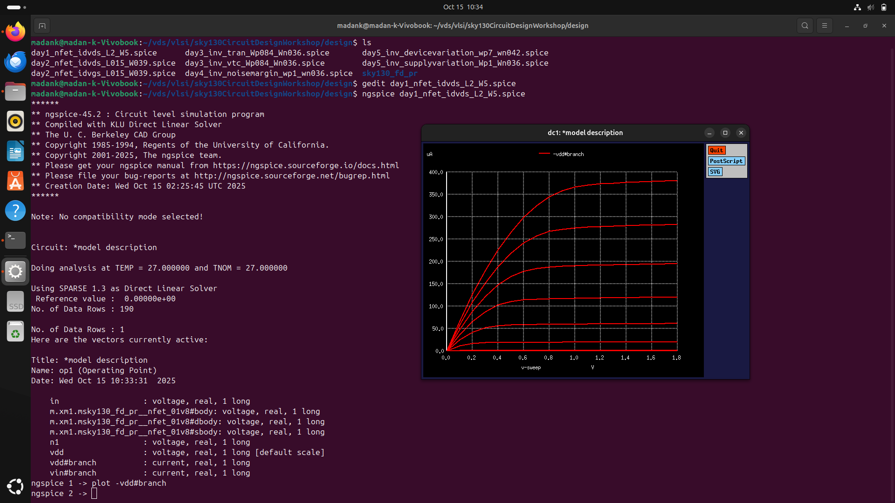

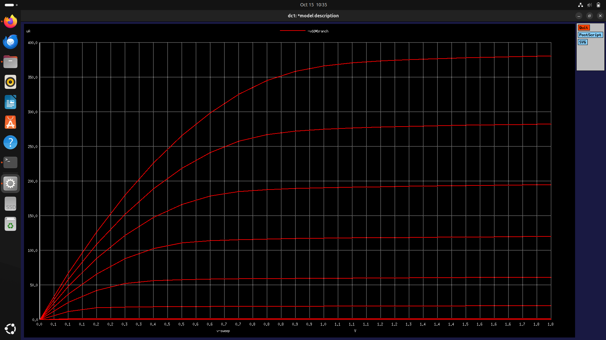

Click on the curve to get the exact values at that point:

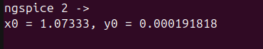

### Observation

The output of the NMOS transistor is analyzed by varying Vin and Vdd.
As Vin (gate-to-source voltage) increases, the output current rises until it reaches a saturation point, beyond which further increases in Vin have little effect.
Similarly, increasing Vdd results in a higher output current, reflecting the transistor’s dependence on the drain-to-source voltage.


## Analysing MOSFET

Short Channel Effect and Velocity Saturation

When the channel length (L) and width (W) of a MOSFET are reduced while maintaining the same W/L ratio, it might be expected that the drain current (Id) would exhibit the same behavior as before. However, in practice, this does not occur.

As the channel length decreases, the relationship between the input voltage (Vin) and the drain current (Id) becomes more linear, unlike in long-channel devices where the relationship is quadratic.

This deviation arises due to short channel effects (SCEs). In short-channel MOSFETs, the electric field in the channel becomes very strong, especially near the drain. The high field causes the carrier velocity to saturate — a condition known as velocity saturation. Once carriers reach this saturation velocity, increasing the gate voltage further does not significantly increase the current, leading to a linear dependence of Id on Vin.

Hence, as the device dimensions shrink:

The quadratic behavior (Id ∝ (Vgs − Vth)²) transitions to a linear behavior (Id ∝ (Vgs − Vth)).

The drain current increases less rapidly with gate voltage.

The short channel effect and velocity saturation dominate the device characteristics.


Let us consider a simple model:

$$
I_D = k_n \left[ (V_{gt} \cdot V_{\min}) - \frac{(V_{\min})^2}{2} \right] (1 + \lambda V_{DS})
$$
where,
$$
V_{\min} = \min(V_{GS}, V_{DS}, V_{DSAT})
$$


Here, we take Vgt = Vgs - Vt for simplicity.


1. When Vgs is minimum, Vmin = Vgs 

$$
I_D = k_n \left( V_{gt}^2 - \frac{1}{2}V_{gt}^2 \right) (1 + \lambda V_{DS})
$$

$$
I_D = \frac{1}{2}k_n V_{gt}^2 (1 + \lambda V_{DS})
$$

2. When Vds is minimum, Vmin = Vds 

$$
I_D = k_n \left[ (V_{gt} \cdot V_{DS}) - \frac{V_{DS}^2}{2} \right] (1 + \lambda V_{DS})
$$

$$
I_D \approx k_n \left[ V_{gt} \cdot V_{DS} - \frac{V_{DS}^2}{2} \right]
$$

3. When Vdsat is minimum, Vmin = Vdsat 

$$
I_D = k_n \left[ (V_{gt} \cdot V_{DSAT}) - \frac{(V_{DSAT})^2}{2} \right] (1 + \lambda V_{DS})
$$


Let us simulate the circuit behavior.

## Id vs Vds of NMOS After reducing Channel length (From 200nm to 150nm)

Let us examine the behaviour of the Id current with respect to Vds after reducing the channel length (L) of the NMOS ans maintaining the same W/L ratio. Ideally, The drain current must be similar to the previous case. but due to short shannal effect and velocity saturation, that is not the case.

### SPICE Code
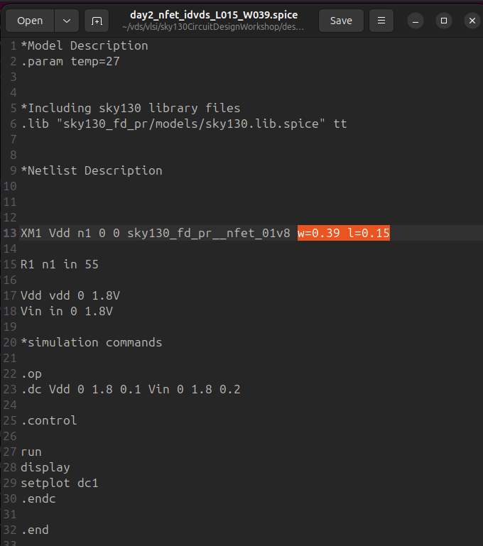

We have reduced the Length but maintained same W/L ratio by reducing width too.
Now let us plot the graph (Id vs Vds)

```
ngspice day2_nfet_idvds_L015_W039.spice
plot -vdd#branch
```

### Plot

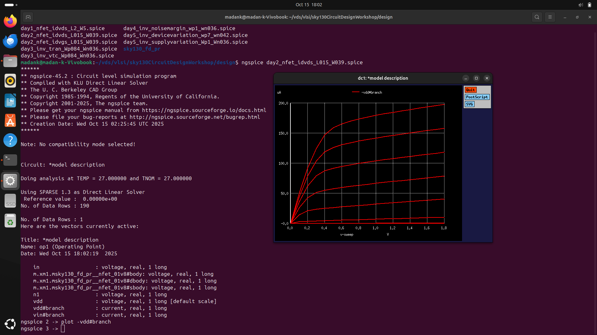

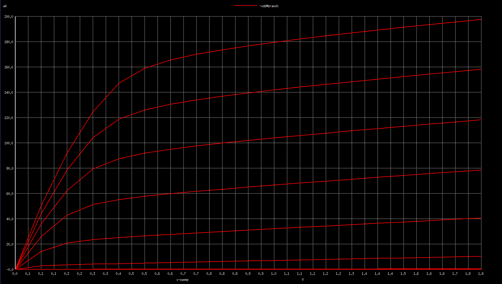

### Observation:
Here, The drain current (I<sub>D</sub>) of an NMOS transistor was observed as a function of the drain-to-source voltage (V<sub>DS</sub>) after reducing the channel length from 200 nm to 150 nm while keeping other parameters constant. The results show that with a shorter channel length, the device exhibits a higher drain current for the same applied V<sub>DS</sub>, indicating increased current drive capability. However, the transition from the linear to the saturation region becomes less distinct, and the I<sub>D</sub>–V<sub>DS</sub> curve shows early saturation. This behavior is attributed to short channel effects and velocity saturation, where the carriers attain their maximum velocity at lower electric fields. Consequently, the quadratic dependence of I<sub>D</sub> on V<sub>GS</sub> gradually shifts toward a more linear characteristic, reflecting the non-ideal behavior of scaled-down MOSFETs.

| **Before Scaling (L = 200 nm)** | **After Scaling (L = 150 nm)** |
|:-------------------------------:|:------------------------------:|
| 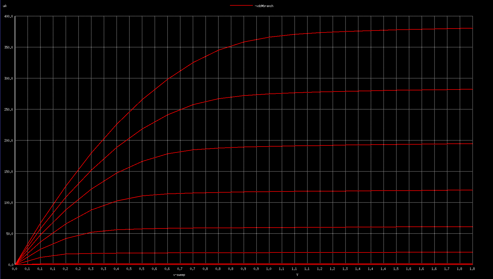 |  |

## Id vs Vin of NMOS After reducing Channel length (From 200nm to 150nm)

Similarly, Let us examine the behaviour of the Id current with respect to Vin after reducing the channel length (L) of the NMOS ans maintaining the same W/L ratio. Ideally, The drain current must be similar to the previous case (that is, the relationship should be quadratic). But the relationship between drain current and input voltage Vin is linear.

### SPICE Code

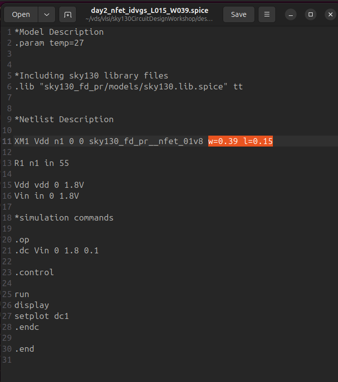

We have reduced the Length but maintained same W/L ratio by reducing width too.
Now let us plot the graph (Id vs Vds)

```
ngspice day2_nfet_idvgs_L015_W039.spice
plot -vdd#branch
```
### Plot

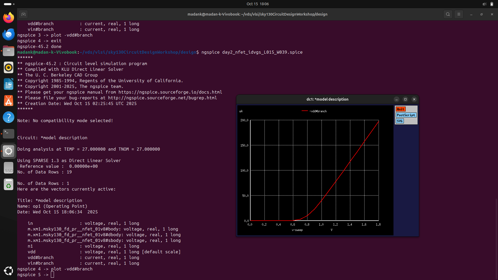

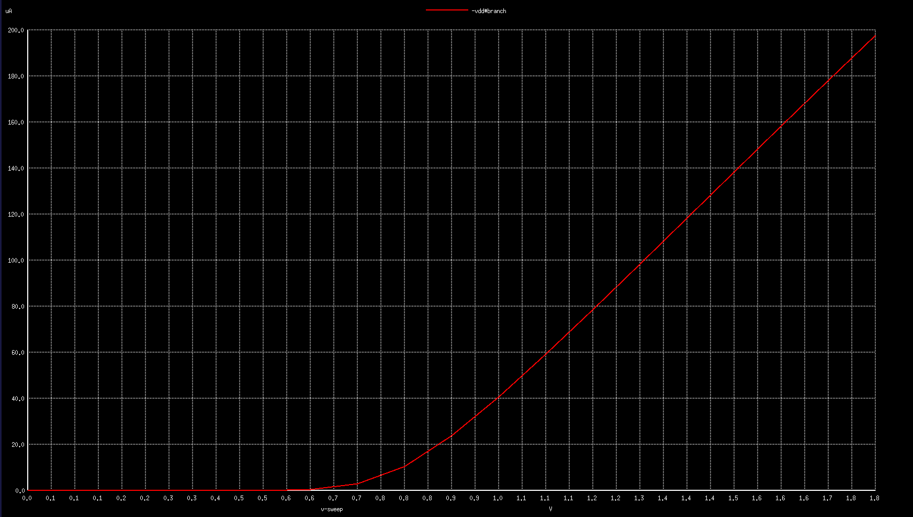

### Observation:

In this experiment, the drain current (I<sub>D</sub>) of an NMOS transistor was studied with respect to the input voltage (V<sub>in</sub>) after reducing the channel length (L) while keeping the width-to-length (W/L) ratio constant. Ideally, the drain current should follow a quadratic relationship with V<sub>in</sub>, similar to the long-channel case. However, the observed behavior shows a nearly linear dependence between I<sub>D</sub> and V<sub>in</sub>. This deviation arises due to short channel effects and velocity saturation, where the carriers reach their maximum drift velocity at lower electric fields, limiting the rate of increase in current. As a result, the device no longer exhibits the ideal square-law characteristic, and the current drive becomes less sensitive to increases in gate voltage.


| **Before Scaling (L = 200 nm)** | **After Scaling (L = 150 nm)** |
|:-------------------------------:|:------------------------------:|
| 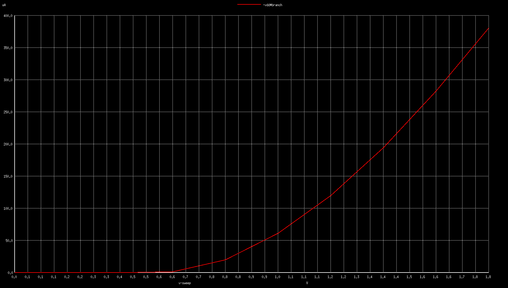 |  |


## CMOS inverter - Voltage Transfer Characteristics

The voltage transfer characteristics of a CMOS Inverter is a plot that shows the relationship between the output voltage ($V_{out}$) and the corresponding steady-state (DC) input voltage ($V_{in}$) of the inverter. It essentially maps every possible input voltage level to the resulting output voltage level, defining the inverter's voltage-level response.

### SPICE Code

day3_inv_vtc_Wp084_Wn036.spice

```
*Model Description
.param temp=27


*Including sky130 library files
.lib "sky130_fd_pr/models/sky130.lib.spice" tt


*Netlist Description


XM1 out in vdd vdd sky130_fd_pr__pfet_01v8 w=0.84 l=0.15
XM2 out in 0 0 sky130_fd_pr__nfet_01v8 w=0.36 l=0.15


Cload out 0 50fF

Vdd vdd 0 1.8V
Vin in 0 1.8V

*simulation commands

.op

.dc Vin 0 1.8 0.01

.control
run
setplot dc1
display
.endc

.end
```

let us plot the out vs in graph

```
ngspice day3_inv_vtc_Wp084_Wn036.spice
plot out vs in
```

### Plot

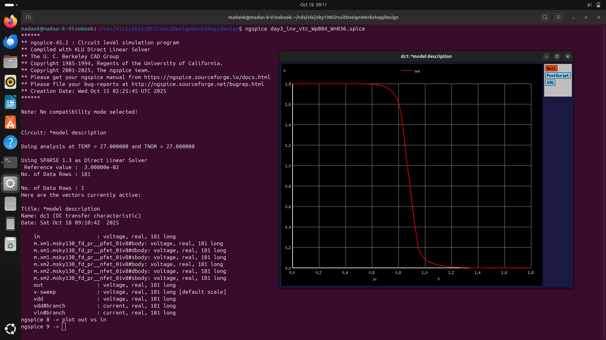


### Observation
Here, the output swings between 1.8 V, corresponding to $V_{dd}$, and 0 V ($V_{ss}$). The plot demonstrates the circuit's inverting function: when $V_{in}$ is low (near 0 V), $V_{out}$ is high (1.8 V), and conversely, when $V_{in}$ is high (near 1.8 V), $V_{out}$ is low (0 V). The transition between these high and low output states is exceptionally steep, indicating a high voltage gain in this region. This sharp switching occurs at a specific input voltage, the switching threshold ($V_M$), which is observed to be at approximately $V_{in} = 0.85$ V.

### Switching Threshold $$V_m$$

At 50% of the out voltage, find the corresponding in voltage. That is the switching Threshold. Or to find accurate Switching Threshold, Draw a line y=x and the point of intersection of the VTC curve and the line is the switching threshold.


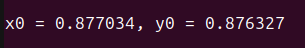

Switching threshold ($V_m$) = 0.87 V


### Switching Threshold $$V_m$$ and $$(\frac{W_p}{L_p})$$ : $$(\frac{W_n}{L_n})$$ Ratio

When the  $$V_m$$ and $$(\frac{W_p}{L_p})$$ : $$(\frac{W_n}{L_n})$$ Ratio is Increased The value of Switching threshold increases. This is observed by simulating in ngspice.

### SPICE Code


```
ngspice day3_inv_vtc_Wp168_Wn036.spice
plot out vs in
```

### Plot


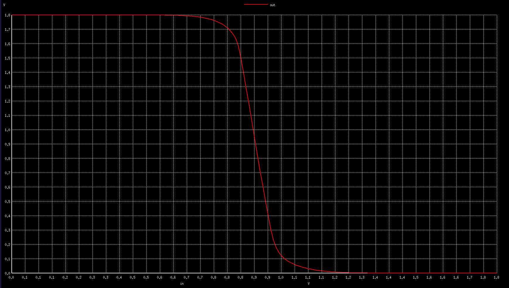

### Observation
Here, the width of the PMOS transistor is increased, and it can be noted that the switching threshold ($V_m$) has increased slightly from the previous design.

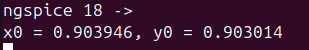

Switching threshold ($V_m$) = 0.90 V

Further increasing, 

### SPICE Code

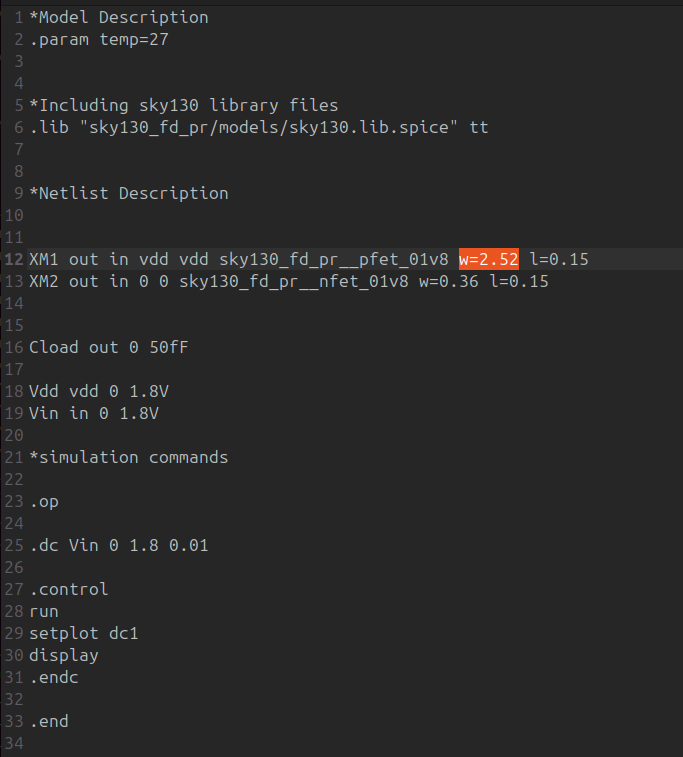

```
ngspice day3_inv_vtc_Wp252_Wn036.spice
plot out vs in
```

### Plot

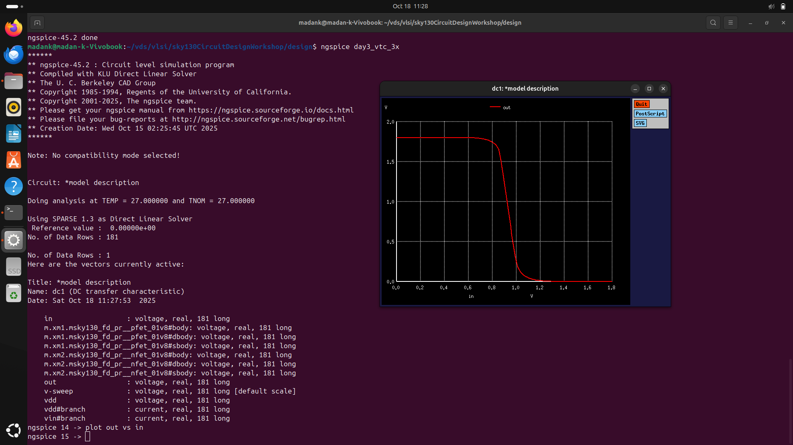

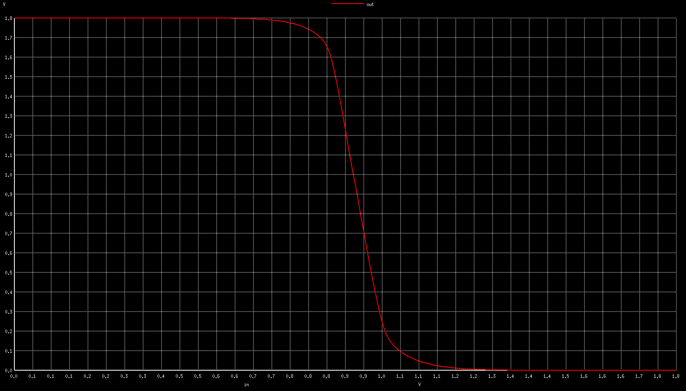

### Observation
Here, the width of the PMOS transistor is increased, and it can be noted that the switching threshold ($V_m$) has increased slightly from the previous design.

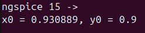

Switching threshold ($V_m$) = 0.93 V


