# Week 5 Task – OpenROAD Flow Setup and Floorplan + Placement

## OpenROAD Installation Guide

This document provides step-by-step instructions to **build and install OpenROAD locally** on your machine.


## Steps to Install OpenROAD

#### 1. Download the OpenROAD Repository

Clone the repository recursively to include submodules:

```bash
git clone --recursive https://github.com/The-OpenROAD-Project/OpenROAD.git
cd OpenROAD
```


#### 2. Install Dependencies

Run the OpenROAD dependency installer:

```bash
sudo ./etc/DependencyInstaller.sh
```

This will automatically install all necessary libraries and tools required for building OpenROAD.


#### 3. Build OpenROAD

Create a build directory and compile the tool:

```bash
mkdir build
cd build
cmake ..
make 
sudo make install
```

#### 4. Run OpenROAD

Once the installation is complete, you can launch the OpenROAD tool from the terminal:

```bash
openroad
```

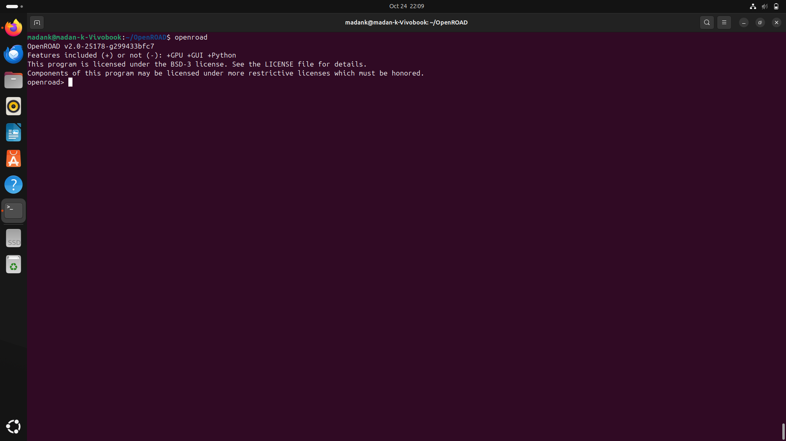


## Floor Planning and Placement

Let us demonstrate floor planning using the **`gcd_nangate45.v`** design provided as an example in the [OpenROAD GitHub repository](https://github.com/The-OpenROAD-Project/OpenROAD/test/gcd_nangate45.v).


The flow_helper.tcl script serves as a supporting utility in the OpenROAD design flow. It defines key helper procedures for reading technology and standard cell libraries, checking for macro cells, adjusting layer resistance and capacitance values, and setting timing constraints like input/output delays. This script ensures consistent environment setup across different stages of the flow.

#### flow_helper.tcl


<details> <summary> <strong> 👈 flow_helper.tcl  </strong> </summary>

```
# defaults
set slew_margin 0
set cap_margin 0
set power_corner "default"

proc read_libraries { } {
  global tech_lef std_cell_lef extra_lef
  global liberty_file liberty_files extra_liberty

  read_lef $tech_lef
  read_lef $std_cell_lef
  foreach file $extra_lef { read_lef $file }
  set corners [sta::corners]
  if { [llength $corners] > 1 } {
    foreach corner $corners {
      set corner_name [$corner name]
      set corner_index [lsearch $liberty_files $corner_name]
      if { $corner_index == -1 } {
        error "No liberty file in \$liberty_files for corner $corner_name."
      } else {
        set liberty_file [lindex $liberty_files [expr $corner_index + 1]]
        read_liberty -corner $corner_name $liberty_file
      }
    }
  } else {
    read_liberty $liberty_file
  }
  foreach file $extra_liberty { read_liberty $file }
}

proc have_macros { } {
  set db [::ord::get_db]
  set block [[$db getChip] getBlock]
  foreach inst [$block getInsts] {
    set inst_master [$inst getMaster]
    # BLOCK means MACRO cells
    if { [string match [$inst_master getType] "BLOCK"] } {
      return 1
    }
  }
  return 0
}

proc derate_layer_wire_rc { layer_name corner derate_factor } {
  set layer [[ord::get_db_tech] findLayer $layer_name]
  lassign [rsz::dblayer_wire_rc $layer] r c
  # ohm/meter -> kohm/micron
  set r_ui [expr $r * 1e-3 * 1e-6]
  # F/meter -> fF/micron
  set c_ui [expr $c * 1e+15 * 1e-6]
  set_layer_rc -layer $layer_name -corner $corner \
    -resistance [expr $r_ui * $derate_factor] \
    -capacitance [expr $c_ui * $derate_factor]
}

proc set_all_input_output_delays { { clk_period_factor .2 } } {
  set clk [lindex [all_clocks] 0]
  set period [get_property $clk period]
  set delay [expr $period * $clk_period_factor]
  set_input_delay $delay -clock $clk [delete_from_list [all_inputs] [all_clocks]]
  set_output_delay $delay -clock $clk [delete_from_list [all_outputs] [all_clocks]]
}

```

</details>


## Floor Planning

**Floor planning** is the process of defining the **chip’s physical layout** before placement and routing. It involves specifying:

* The overall **die and core dimensions**
* The **placement of macros**, I/O pins, and power grids
* **Keep-out regions** and **utilization areas** for standard cells

This step ensures an optimal physical structure for routing, timing, and power efficiency.


### Floor Planning Script

Here, The floor planning is executed using the `flow_floorplan.tcl` script, which is **derived from the master flow script** `flow.tcl` included in the OpenROAD repository.

The `flow_floorplan.tcl` script performs the following operations:

1. **Reads library and technology files** (LEF/Lib/SPEF).
2. **Reads synthesized Verilog** and links the design.
3. **Initializes the floorplan** by defining the die and core area.
4. **Applies macro placement** if macros are present.
5. **Inserts tap cells and end caps**.
6. **Generates a DEF file** after the floorplan is initialized.


<details> <summary><strong> 👈 flow_floorplan.tcl  </strong></summary>

```

# Assumes flow_helpers.tcl has been read.
read_libraries
read_verilog $synth_verilog
link_design $top_module
read_sdc $sdc_file

set_thread_count [cpu_count]
# Temporarily disable sta's threading due to random failures
sta::set_thread_count 1

utl::metric "IFP::ord_version" [ord::openroad_git_describe]
# Note that sta::network_instance_count is not valid after tapcells are added.
utl::metric "IFP::instance_count" [sta::network_instance_count]

initialize_floorplan -site $site \
  -die_area $die_area \
  -core_area $core_area

write_def gcd/post_floorplan.def
source $tracks_file

# remove buffers inserted by synthesis
remove_buffers

if { $pre_placed_macros_file != "" } {
  source $pre_placed_macros_file
}

# IO Placement		###
#place_pins -random -hor_layers $io_placer_hor_layer -ver_layers $io_placer_ver_layer
place_pins -hor_layers $io_placer_hor_layer -ver_layers $io_placer_ver_layer -annealing -min_distance 5

################################################################
# Macro Placement
if { [have_macros] } {
  lassign $macro_place_halo halo_x halo_y
  set report_dir [make_result_file ${design}_${platform}_rtlmp]
  rtl_macro_placer -halo_width $halo_x -halo_height $halo_y \
    -report_directory $report_dir
}

write_def gcd/post_macro_placement.tcl
################################################################
# Tapcell insertion
eval tapcell $tapcell_args ;# tclint-disable command-args

write_def gcd/post_tapcell.def
```

</details>

The TCL script used to execute the floor planning process is gcd_nangate45_copy.tcl

<details> <summary><strong> 👈 gcd_nangate45_copy.tcl  </strong></summary>
  
```
# gcd flow pipe cleaner
source "helpers.tcl"
source "flow_helpers.tcl"
source "Nangate45/Nangate45.vars"

set design "gcd"
set top_module "gcd"
set synth_verilog "gcd_nangate45.v"
set sdc_file "gcd_nangate45.sdc"
set die_area {0 0 100.13 100.8}
set core_area {10.07 11.2 90.25 91}

source flow_floorplan.tcl
```

</details>

#### Running the Floorplanning Flow

```
openroad -gui -log gcd_logfile.log gcd_nangate45_copy.tcl
```


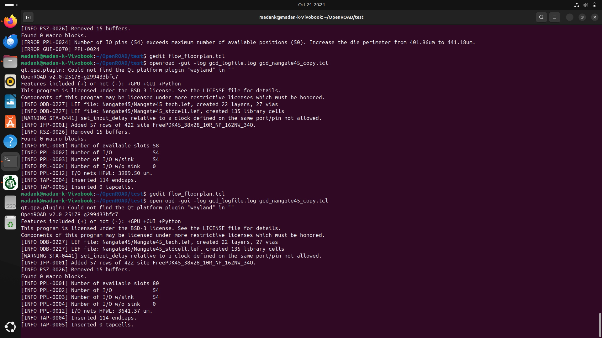

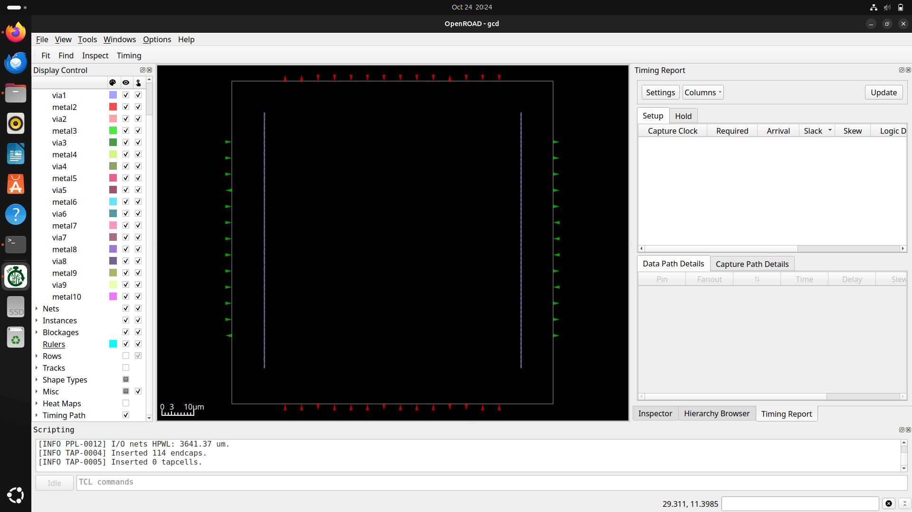

We can view the rows by toggling the "Rows" option.

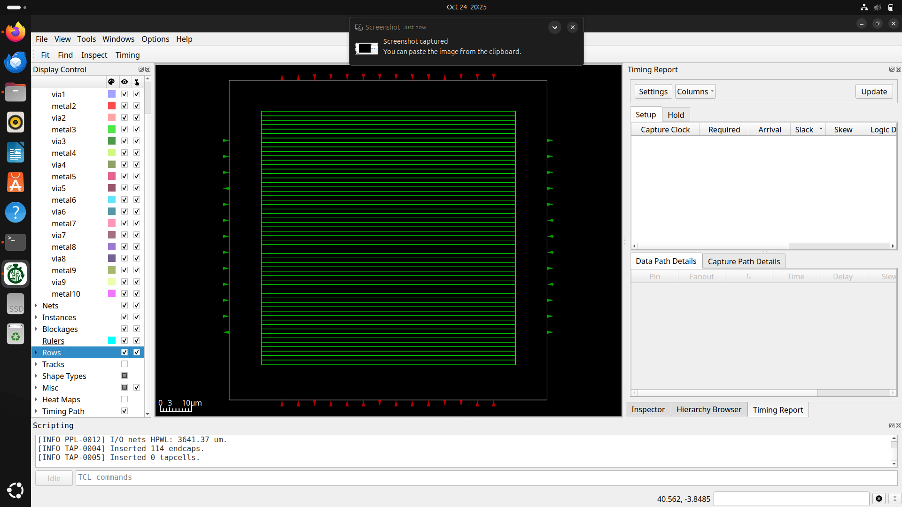

We can see the rows (Green-coloured) within which the cells will be assigned during the placement stage.

The Power Delivery Network (PDN) ensures a stable power and ground supply across the chip. It is implemented during floor planning using the flow_pdn.tcl script

<details> <summary><strong> 👈 flow_pdn.tcl  </strong></summary>
  
```
# Assumes flow_helpers.tcl has been read.
read_libraries
read_verilog $synth_verilog
link_design $top_module
read_sdc $sdc_file

set_thread_count [cpu_count]
# Temporarily disable sta's threading due to random failures
sta::set_thread_count 1

utl::metric "IFP::ord_version" [ord::openroad_git_describe]
# Note that sta::network_instance_count is not valid after tapcells are added.
utl::metric "IFP::instance_count" [sta::network_instance_count]

initialize_floorplan -site $site \
  -die_area $die_area \
  -core_area $core_area

write_def gcd/post_floorplan.def
source $tracks_file

# remove buffers inserted by synthesis
remove_buffers

if { $pre_placed_macros_file != "" } {
  source $pre_placed_macros_file
}

# IO Placement		###
#place_pins -random -hor_layers $io_placer_hor_layer -ver_layers $io_placer_ver_layer
place_pins -hor_layers $io_placer_hor_layer -ver_layers $io_placer_ver_layer -annealing -min_distance 5

################################################################
# Macro Placement
if { [have_macros] } {
  lassign $macro_place_halo halo_x halo_y
  set report_dir [make_result_file ${design}_${platform}_rtlmp]
  rtl_macro_placer -halo_width $halo_x -halo_height $halo_y \
    -report_directory $report_dir
}

write_def gcd/post_macro_placement.tcl
################################################################
# Tapcell insertion
eval tapcell $tapcell_args ;# tclint-disable command-args

write_def gcd/post_tapcell.def


# Power distribution network insertion
source $pdn_cfg
pdngen

write_def gcd/post_pdn.def
```

</details>

Then we can run the below script to perform PDN synthesis.

<details> <summary><strong> 👈 gcd_nangate45_copy.tcl  </strong></summary>
  
```
# gcd flow pipe cleaner
source "helpers.tcl"
source "flow_helpers.tcl"
source "Nangate45/Nangate45.vars"

set design "gcd"
set top_module "gcd"
set synth_verilog "gcd_nangate45.v"
set sdc_file "gcd_nangate45.sdc"
set die_area {0 0 100.13 100.8}
set core_area {10.07 11.2 90.25 91}

source flow_pdn.tcl

```
</details>


#### Running the PDN Flow

```
openroad -gui -log gcd_logfile.log gcd_nangate45_copy.tcl
```

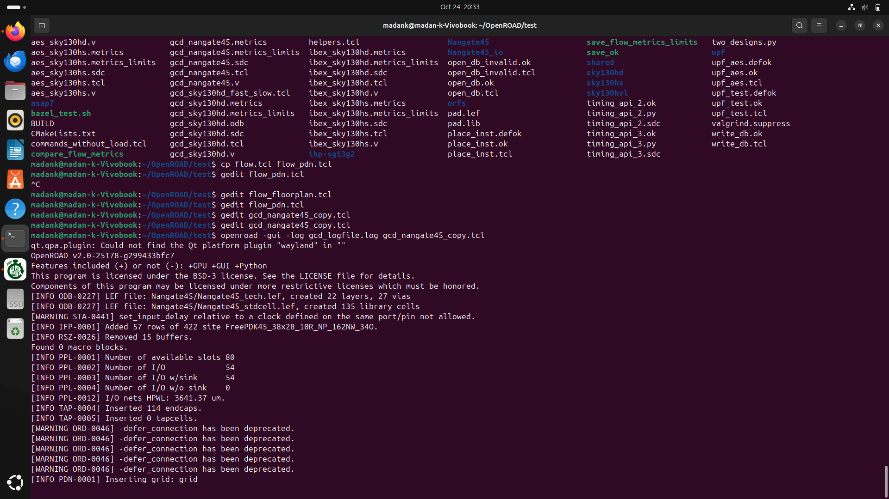

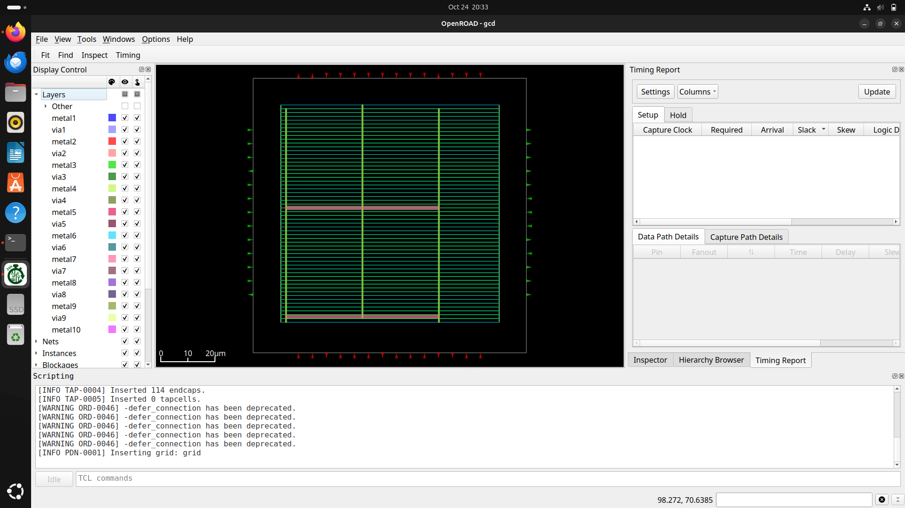

We can view the Power and Ground supply by toggling the "Power" and "Ground" option.

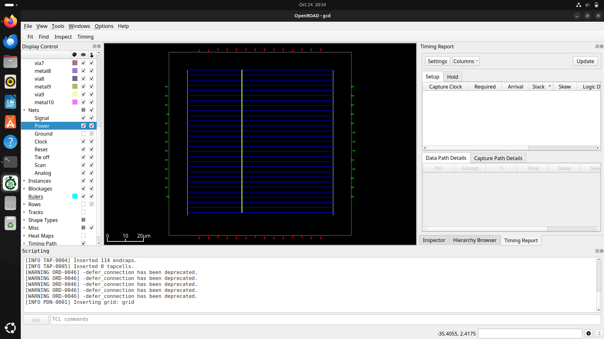

The power line is represented by blue colour as shown.

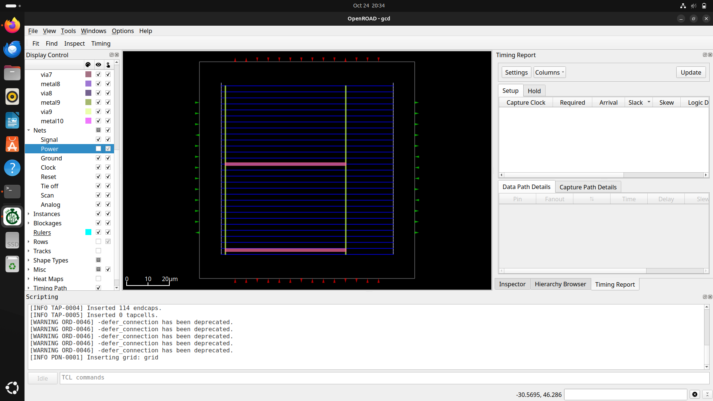

We can see the ground line in pink colour as it can be seen above.

## Placement - Global Placement

Now perform Global Placement, which is the process of determining the approximate locations of standard cells on the chip to minimize wirelength and congestion before detailed placement.
This step is executed using the script file flow_global_placement.tcl provided below.

<details> <summary><strong> 👈 flow_global_placement.tcl  </strong></summary>
  
```
# Assumes flow_helpers.tcl has been read.
read_libraries
read_verilog $synth_verilog
link_design $top_module
read_sdc $sdc_file

set_thread_count [cpu_count]
# Temporarily disable sta's threading due to random failures
sta::set_thread_count 1

utl::metric "IFP::ord_version" [ord::openroad_git_describe]
# Note that sta::network_instance_count is not valid after tapcells are added.
utl::metric "IFP::instance_count" [sta::network_instance_count]

initialize_floorplan -site $site \
  -die_area $die_area \
  -core_area $core_area

write_def gcd/post_floorplan.def
source $tracks_file

# remove buffers inserted by synthesis
remove_buffers

if { $pre_placed_macros_file != "" } {
  source $pre_placed_macros_file
}

# IO Placement		###
#place_pins -random -hor_layers $io_placer_hor_layer -ver_layers $io_placer_ver_layer
place_pins -hor_layers $io_placer_hor_layer -ver_layers $io_placer_ver_layer -annealing -min_distance 5

################################################################
# Macro Placement
if { [have_macros] } {
  lassign $macro_place_halo halo_x halo_y
  set report_dir [make_result_file ${design}_${platform}_rtlmp]
  rtl_macro_placer -halo_width $halo_x -halo_height $halo_y \
    -report_directory $report_dir
}

write_def gcd/post_macro_placement.tcl
################################################################
# Tapcell insertion
eval tapcell $tapcell_args ;# tclint-disable command-args

write_def gcd/post_tapcell.def


# Power distribution network insertion
source $pdn_cfg
pdngen

write_def gcd/post_pdn.def

################################################################
# Global placement

foreach layer_adjustment $global_routing_layer_adjustments {
  lassign $layer_adjustment layer adjustment
  set_global_routing_layer_adjustment $layer $adjustment
}
set_routing_layers -signal $global_routing_layers \
  -clock $global_routing_clock_layers
set_macro_extension 2

# Global placement skip IOs
global_placement -density $global_place_density \
  -pad_left $global_place_pad -pad_right $global_place_pad -skip_io

# IO Placement
place_pins -hor_layers $io_placer_hor_layer -ver_layers $io_placer_ver_layer

# Global placement with placed IOs and routability-driven
global_placement -routability_driven -density $global_place_density \
  -pad_left $global_place_pad -pad_right $global_place_pad

# checkpoint
set global_place_db [make_result_file ${design}_${platform}_global_place.db]
write_db $global_place_db

################################################################
# Repair max slew/cap/fanout violations and normalize slews
source $layer_rc_file
set_wire_rc -signal -layer $wire_rc_layer
set_wire_rc -clock -layer $wire_rc_layer_clk
set_dont_use $dont_use

estimate_parasitics -placement

repair_design -slew_margin $slew_margin -cap_margin $cap_margin

repair_tie_fanout -separation $tie_separation $tielo_port
repair_tie_fanout -separation $tie_separation $tiehi_port

```

</details>

run the below script gcd_nangate45_copy.tcl to perform global placement

<details> <summary><strong> 👈 gcd_nangate45_copy.tcl  </strong></summary>
  
```
# gcd flow pipe cleaner
source "helpers.tcl"
source "flow_helpers.tcl"
source "Nangate45/Nangate45.vars"

set design "gcd"
set top_module "gcd"
set synth_verilog "gcd_nangate45.v"
set sdc_file "gcd_nangate45.sdc"
set die_area {0 0 100.13 100.8}
set core_area {10.07 11.2 90.25 91}

source flow_global_placement.tcl
```

</details>

#### Running the Global Placement Flow

```
openroad -gui -log gcd_logfile.log gcd_nangate45_copy.tcl
```


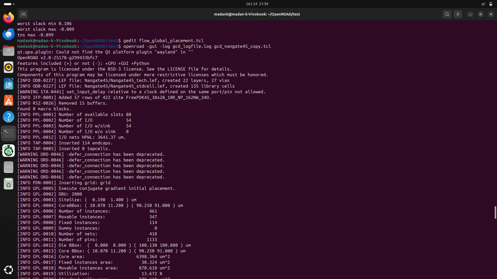

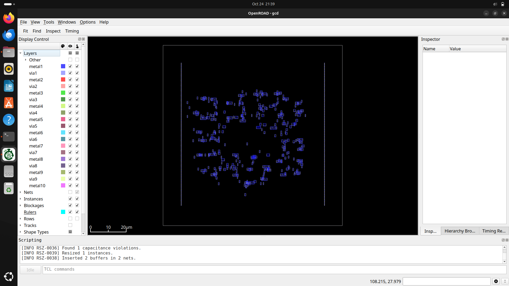

Enable the "Rows" son we can see the reference rows.

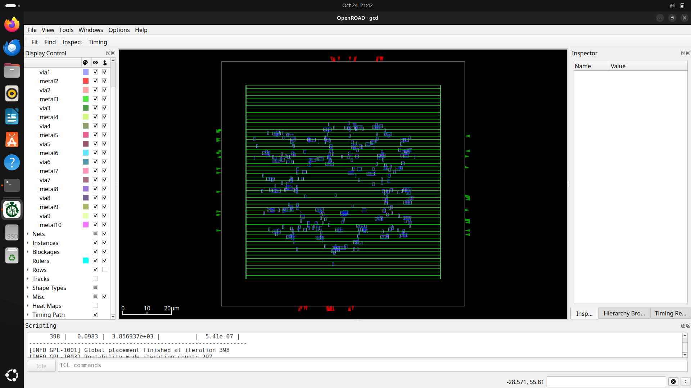

Thus, the rows (green-coloured) are visible after enabling the "Rows" button.

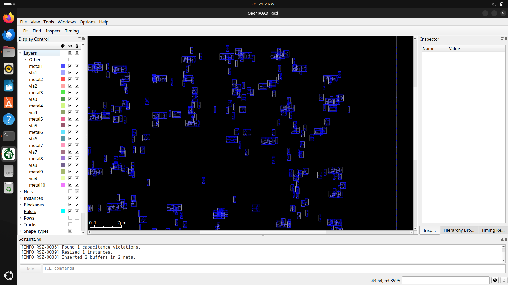

We can observe that the cells are not yet aligned properly and may even overlap with each other. This is acceptable at this stage, as global placement provides only an approximate placement to minimize wirelength and congestion. The exact alignment and legalization will be handled during the detailed placement stage.

## Placement - Detailed Placement

Now perform Detailed Placement, which refines the cell positions obtained from global placement to ensure legal, non-overlapping placements while optimizing for timing and routability.
This process is carried out using the flow_detailed_placement.tcl script.

<details> <summary><strong> 👈 flow_detailed_placement.tcl  </strong></summary>
  
```
# Assumes flow_helpers.tcl has been read.
read_libraries
read_verilog $synth_verilog
link_design $top_module
read_sdc $sdc_file

set_thread_count [cpu_count]
# Temporarily disable sta's threading due to random failures
sta::set_thread_count 1

utl::metric "IFP::ord_version" [ord::openroad_git_describe]
# Note that sta::network_instance_count is not valid after tapcells are added.
utl::metric "IFP::instance_count" [sta::network_instance_count]

initialize_floorplan -site $site \
  -die_area $die_area \
  -core_area $core_area

write_def gcd/post_floorplan.def
source $tracks_file

# remove buffers inserted by synthesis
remove_buffers

if { $pre_placed_macros_file != "" } {
  source $pre_placed_macros_file
}

# IO Placement		###
#place_pins -random -hor_layers $io_placer_hor_layer -ver_layers $io_placer_ver_layer
place_pins -hor_layers $io_placer_hor_layer -ver_layers $io_placer_ver_layer -annealing -min_distance 5

################################################################
# Macro Placement
if { [have_macros] } {
  lassign $macro_place_halo halo_x halo_y
  set report_dir [make_result_file ${design}_${platform}_rtlmp]
  rtl_macro_placer -halo_width $halo_x -halo_height $halo_y \
    -report_directory $report_dir
}

write_def gcd/post_macro_placement.tcl
################################################################
# Tapcell insertion
eval tapcell $tapcell_args ;# tclint-disable command-args

write_def gcd/post_tapcell.def


# Power distribution network insertion
source $pdn_cfg
pdngen

write_def gcd/post_pdn.def

################################################################
# Global placement

foreach layer_adjustment $global_routing_layer_adjustments {
  lassign $layer_adjustment layer adjustment
  set_global_routing_layer_adjustment $layer $adjustment
}
set_routing_layers -signal $global_routing_layers \
  -clock $global_routing_clock_layers
set_macro_extension 2

# Global placement skip IOs
global_placement -density $global_place_density \
  -pad_left $global_place_pad -pad_right $global_place_pad -skip_io

# IO Placement
place_pins -hor_layers $io_placer_hor_layer -ver_layers $io_placer_ver_layer

# Global placement with placed IOs and routability-driven
global_placement -routability_driven -density $global_place_density \
  -pad_left $global_place_pad -pad_right $global_place_pad

# checkpoint
set global_place_db [make_result_file ${design}_${platform}_global_place.db]
write_db $global_place_db

################################################################
# Repair max slew/cap/fanout violations and normalize slews
source $layer_rc_file
set_wire_rc -signal -layer $wire_rc_layer
set_wire_rc -clock -layer $wire_rc_layer_clk
set_dont_use $dont_use

estimate_parasitics -placement

repair_design -slew_margin $slew_margin -cap_margin $cap_margin

repair_tie_fanout -separation $tie_separation $tielo_port
repair_tie_fanout -separation $tie_separation $tiehi_port

##################################################################

set_placement_padding -global -left $detail_place_pad -right $detail_place_pad
detailed_placement

# post resize timing report (ideal clocks)
report_worst_slack -min -digits 3
report_worst_slack -max -digits 3
report_tns -digits 3
# Check slew repair
report_check_types -max_slew -max_capacitance -max_fanout -violators

utl::metric "RSZ::repair_design_buffer_count" [rsz::repair_design_buffer_count]
utl::metric "RSZ::max_slew_slack" [expr [sta::max_slew_check_slack_limit] * 100]
utl::metric "RSZ::max_fanout_slack" [expr [sta::max_fanout_check_slack_limit] * 100]
utl::metric "RSZ::max_capacitance_slack" [expr [sta::max_capacitance_check_slack_limit] * 100]

################################################################
# Detailed Placement

detailed_placement

# Capture utilization before fillers make it 100%
utl::metric "DPL::utilization" [format %.1f [expr [rsz::utilization] * 100]]
utl::metric "DPL::design_area" [sta::format_area [rsz::design_area] 0]

# checkpoint
set dpl_db [make_result_file ${design}_${platform}_dpl.db]
write_db $dpl_db

set verilog_file [make_result_file ${design}_${platform}.v]
write_verilog $verilog_file

```

</details>

run the below script gcd_nangate45_copy.tcl to perform detailed placement

<details> <summary><strong> 👈 gcd_nangate45_copy.tcl  </strong></summary>
  
```
# gcd flow pipe cleaner
source "helpers.tcl"
source "flow_helpers.tcl"
source "Nangate45/Nangate45.vars"

set design "gcd"
set top_module "gcd"
set synth_verilog "gcd_nangate45.v"
set sdc_file "gcd_nangate45.sdc"
set die_area {0 0 100.13 100.8}
set core_area {10.07 11.2 90.25 91}

source flow_detailed_placement.tcl
```

</details>


#### Running the Detailed Placement Flow

```
openroad -gui -log gcd_logfile.log gcd_nangate45_copy.tcl
```

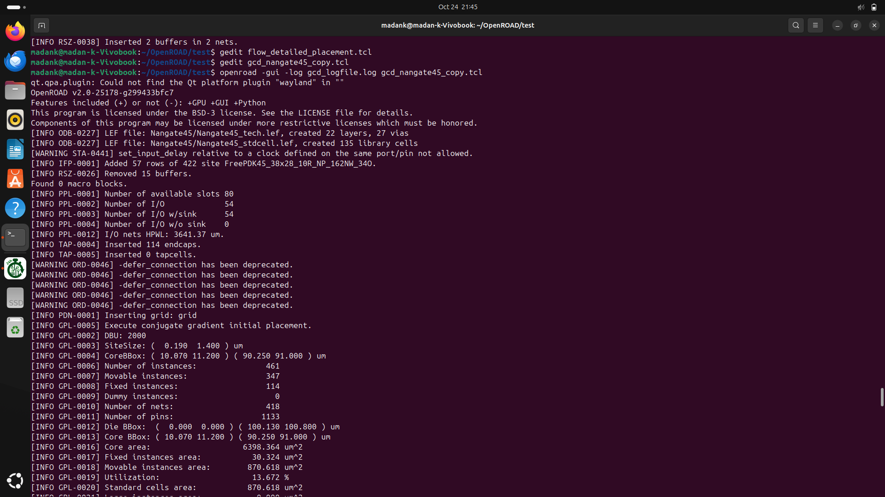

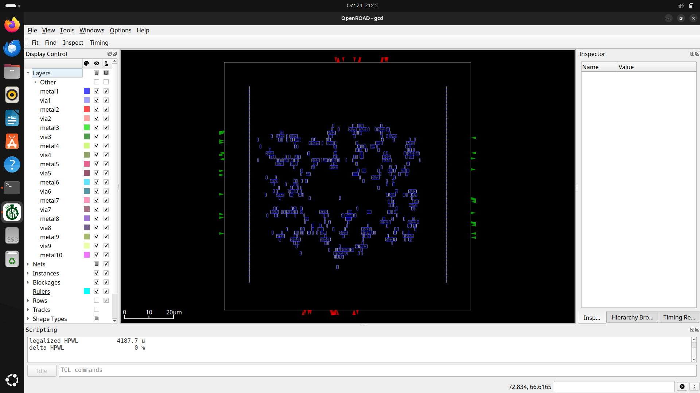

Enable the "Rows" son we can see the reference rows.

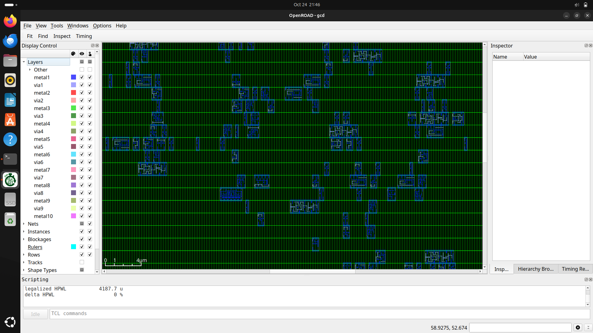

Here, the cells are properly aligned, unlike in global placement. They are non-overlapping and neatly arranged within the standard cell rows, ensuring a legal and optimized placement ready for the next stages of the physical design flow.

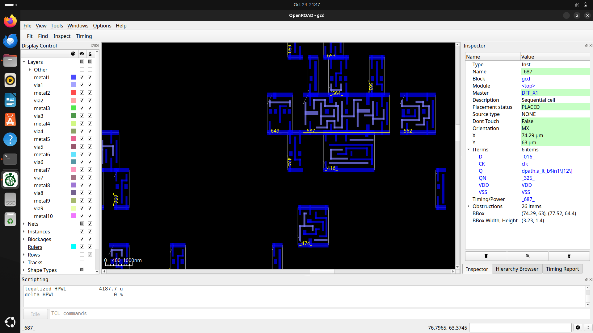

We can view the details of the cells that are placed in the placement stage, by clicking on them. The details appears in the right side as shown.
