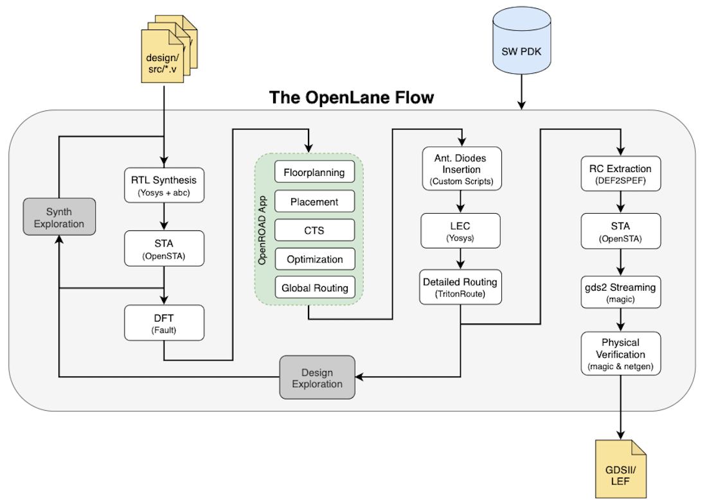
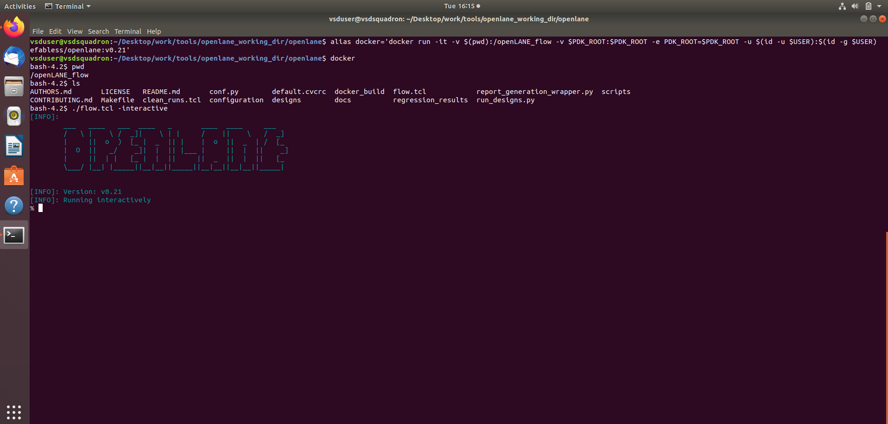
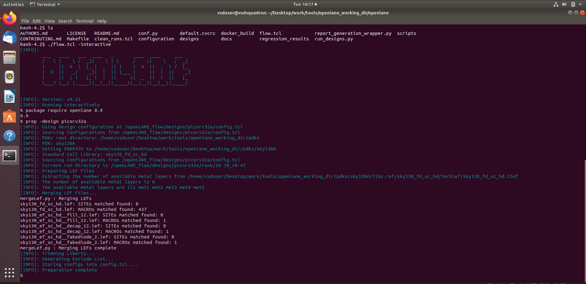
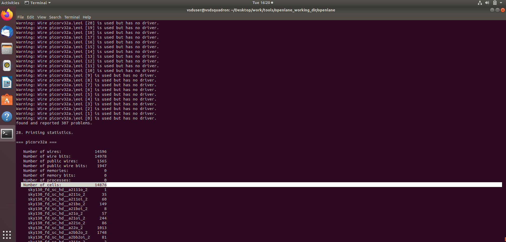
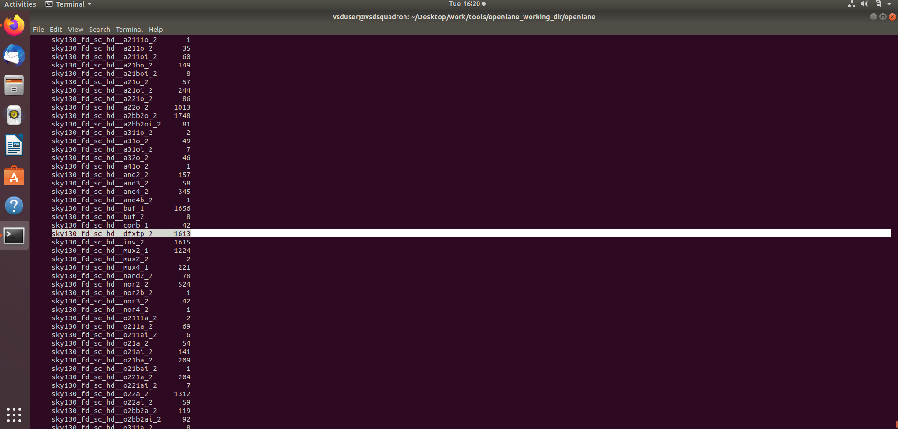
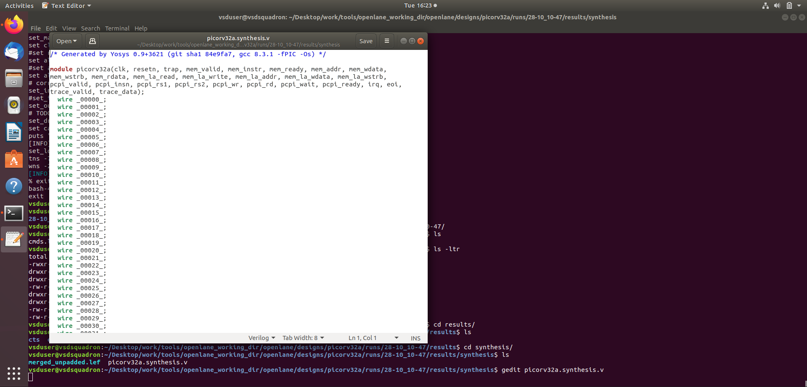
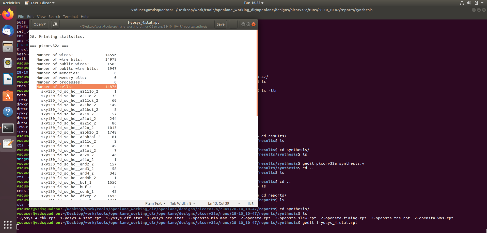
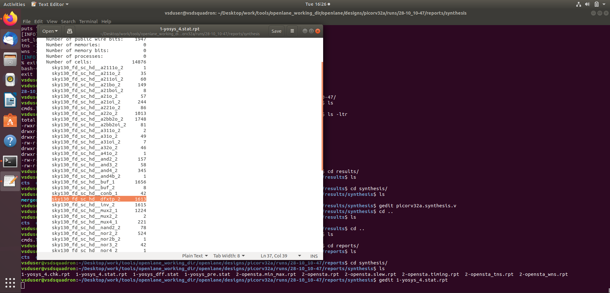

# WEEK 6 - DAY 1 - Inception of open-source EDA, OpenLANE and Sky130 PDK


## RTL to GDSII Flow (Simplified)

The RTL to GDSII flow represents the complete process of converting a hardware design described in RTL (Register Transfer Level) to a physical layout (GDSII format) that can be fabricated.

### Synthesis

The RTL code written in Verilog or VHDL is converted into a gate-level netlist using a standard cell library. This step performs logic optimization to meet area, power, and timing constraints.

### Floorplanning and Power Planning

In this stage, the placement of major functional blocks and IO pins is defined. Power planning involves creating a power distribution network (PDN) using power and ground rings and straps to ensure proper power delivery across the chip.

### Placement

Placement is done in two phases:

* **Global placement:** Cells are roughly positioned to minimize wirelength and congestion.
* **Detailed placement:** Cells are aligned to rows and placed legally without overlaps.

### Clock Tree Synthesis (CTS)

A clock distribution network is constructed to ensure minimal clock skew and balanced delays. Techniques such as H-tree and X-tree structures are commonly used to achieve uniform clock distribution.

### Routing

Routing connects the placed cells according to the netlist:

* **Global routing:** Determines approximate routing paths and layer usage.
* **Detailed routing:** Performs actual wire connections adhering to design rules.

### Signoff

Final verification before fabrication. It includes:

* **Design Rule Check (DRC):** Ensures layout follows manufacturing design rules.
* **Layout Versus Schematic (LVS):** Confirms the layout matches the logical design.
* **Static Timing Analysis (STA):** Verifies that timing constraints are met.


## OpenLANE ASIC Flow

OpenLANE is an open-source ASIC design flow that automates the process from RTL to GDSII using open-source tools.



source: https://openlane.readthedocs.io/en/latest/_images/flow_v1.png

### RTL Synthesis

RTL synthesis is performed using **Yosys** and **ABC**. This converts the RTL code into a gate-level netlist optimized for the target technology library.

### Static Timing Analysis (STA)

**OpenSTA** is used to perform timing analysis after synthesis to ensure that the design meets setup and hold time constraints.

### Design for Testability (DFT)

This step prepares the design for manufacturing tests. It includes:

* Scan chain insertion
* ATPG (Automatic Test Pattern Generation)
* Test pattern compaction
* Fault coverage and fault simulation

### Physical Implementation

Performed using **OpenROAD**, which includes several sub-steps:

* Floorplanning and power planning
* Insertion of decoupling capacitors and tap cells
* Placement (global and detailed)
* Clock Tree Synthesis (CTS)
* Routing using **TritonRoute**

During routing, **fake antenna diodes** are inserted to prevent the **antenna effect**, which occurs when long metal wires accumulate charge during fabrication and damage transistor gates.

### Logic Equivalence Checking

Performed using **Yosys** to verify that the synthesized netlist is functionally equivalent to the RTL description.

### RC Extraction

Extracts parasitic resistance (R) and capacitance (C) from the routed layout to enable more accurate timing analysis.

### Static Timing Analysis (Post-Layout)

Another round of timing analysis using **OpenSTA** after RC extraction to validate timing with parasitic effects included.

### Physical Verification

* **DRC (Design Rule Check)** using **Magic**
* **LVS (Layout vs Schematic)** using **Netgen**

### GDSII Streaming

Finally, the verified layout is converted into **GDSII** format using **Magic** for tape-out and fabrication.


## Steps to Invoke OpenLANE

Before starting, ensure that Docker and the required PDKs are installed and properly set up in your environment.

### Step 1: Change Directory

Move to the OpenLANE working directory where the OpenLANE setup and flow scripts are located.

```bash
cd ~/Desktop/work/tools/openlane_working_dir/openlane
```

This ensures that when Docker is launched, it mounts the current directory (`$(pwd)`) as the working directory inside the container.

### Step 2: Create an Alias for Docker

Define an alias that simplifies running the OpenLANE Docker container.

```bash
alias docker='docker run -it -v $(pwd):/openLANE_flow -v $PDK_ROOT:$PDK_ROOT -e PDK_ROOT=$PDK_ROOT -u $(id -u $USER):$(id -g $USER) efabless/openlane:v0.21'
```

Explanation of each flag:

* `-it` enables interactive terminal mode.
* `-v $(pwd):/openLANE_flow` mounts the current directory to the container, allowing file sharing.
* `-v $PDK_ROOT:$PDK_ROOT` mounts the directory containing the Process Design Kits (PDKs).
* `-e PDK_ROOT=$PDK_ROOT` sets the environment variable inside Docker so OpenLANE can access the PDK.
* `-u $(id -u $USER):$(id -g $USER)` runs Docker with the same user and group IDs to avoid permission issues.
* `efabless/openlane:v0.21` specifies the Docker image version of OpenLANE.


### Step 3: Launch Docker

Run the Docker alias created above to enter the OpenLANE environment.

```bash
docker
```

This command opens an interactive shell inside the OpenLANE Docker container.

### Step 4: Start OpenLANE Flow in Interactive Mode

Once inside Docker, start the OpenLANE flow using the `flow.tcl` script.

```
./flow.tcl -interactive
```



Now run the OpenLANE Flow Commands:

Load the OpenLANE Package

```bash
package require openlane 0.9
```

Prepare the Design

```bash
prep -design picorv32a
```



run synthesis

```bash
run_synthesis
```





We can see the cells synthesized in the print statistics area. As we can see, the number of cells synthesized and the number of flip flops synthesized can be observed

### Calculating Flop Ratio

The flop ratio provides an estimate of how sequential a design is by comparing the number of flip-flops (DFFs) to the total number of standard cells in the synthesized netlist.

It is calculated using the formula:

$$
\text{Flop Ratio} = \frac{\text{Number of D Flip-Flops}}{\text{Total Number of Cells}}
$$

A higher flop ratio indicates a design with more sequential logic, whereas a lower ratio suggests a design that is more combinational in nature.
In OpenLANE, this value can be observed in the synthesis report generated after running the `run_synthesis` command.

### Synthesized netlist and reports

The synthesized netlist can be seen in the  `~/Desktop/work/tools/openlane_working_dir/openlane/designs/picorv32a/runs/28-10_10-47/results/synthesis/` directory.

```
gedit picorv32a.synthesis.v
```



The reports of the `run_synthesis` can be seen in `~/Desktop/work/tools/openlane_working_dir/openlane/designs/picorv32a/runs/28-10_10-47/reports/synthesis` directory

```
gedit 1-yosys_4.stat.rpt
```




