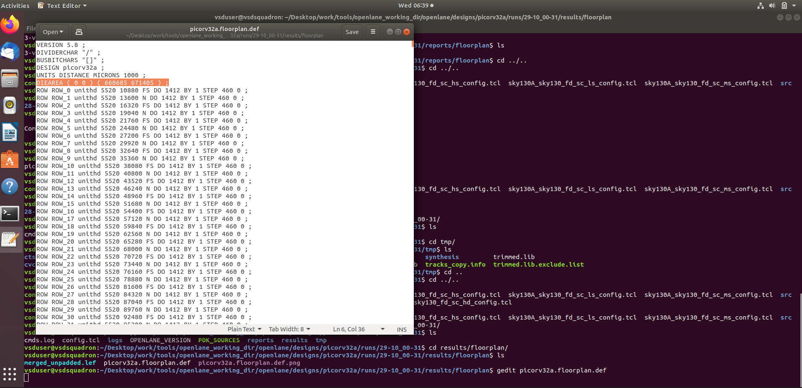
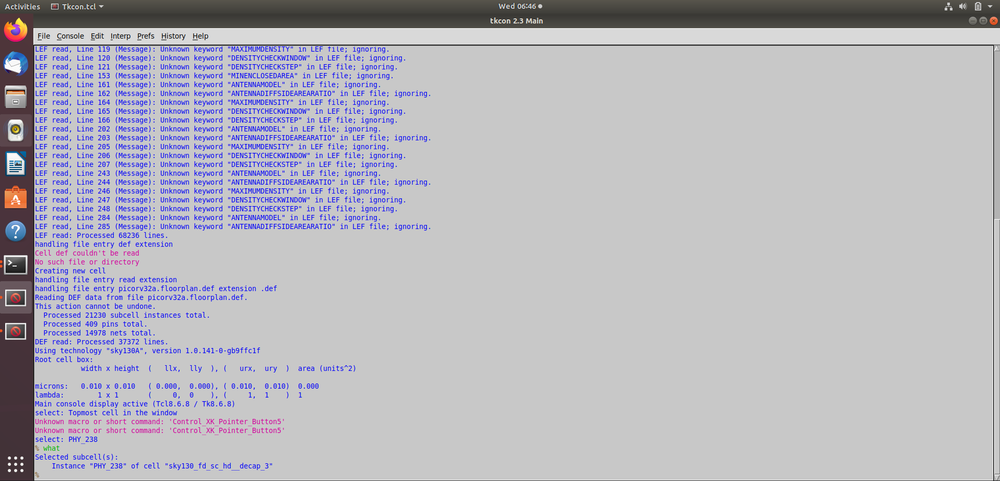

# Day 2 – WORK IN PROGRESS... 🏗️

This section explains the key concepts and commands used during the **floorplanning** stage of the ASIC design flow using OpenLANE.

### 1. Core and Die Dimensions

The floorplanning stage defines the physical dimensions of the chip’s **core** and **die**.

* **Utilization Factor**

  The ratio of the total area occupied by the synthesized netlist to the total available core area.

$$
\text{Utilization Factor} = \frac{\text{Area Occupied by Netlist}}{\text{Total Core Area}}
$$

* **Aspect Ratio**

  Defines the proportional relationship between the height and width of the core.

$$
\text{Aspect Ratio} = \frac{\text{Height}}{\text{Width}}
$$

These parameters directly affect the placement density and overall chip shape.


### 2. Pre-Placed Cells

Pre-placed cells are macros or blocks that are **manually placed** before automated placement and routing.
They include large memory blocks, analog IPs, or special cells whose locations must remain fixed for layout and performance reasons.


### 3. Decoupling Capacitors (Decaps)

Decoupling capacitors are inserted in the layout to stabilize the power supply and reduce voltage fluctuations.
They help to minimize **IR drop** and **supply noise**, ensuring a constant voltage level during switching activity of digital logic.

### 4. Power Planning

Power planning creates a network to distribute **VDD** and **VSS** across the chip efficiently.
A **mesh grid topology** is used to form power and ground rings and straps, which deliver uniform voltage across all regions of the chip.


### 5. Pin Placement

Pins define the physical interface between the chip and the outside world.
During this step, input and output pins are placed along the periphery of the die, considering routing feasibility and signal direction.


### 6. Logical Cell Placement Blockage

Placement blockages are defined to prevent automatic placement of standard cells in reserved areas.
For instance, the die’s periphery is often blocked to **reserve space for IO pins and routing channels**.

### Floorplanning Command

To perform floorplanning in OpenLANE interactive mode, run:

```tcl
run_floorplan
```


This command generates the floorplan, performs pin placement, tap cell insertion, and power grid setup.


### Output Files and Logs

After running floorplanning, check the following files:

**4-ioplacer.log**

```
gedit ~/Desktop/work/tools/openlane_working_dir/openlane/designs/picorv32a/runs/29-10_00-31/logs/floorplan/4-ioplacer.log
```


The number of layers, vias, created and the number of IO pins created as described in this file.

**config.tcl**

```
less ~/Desktop/work/tools/openlane_working_dir/openlane/designs/picorv32a/config.tcl 
```


**sky130A_sky130_fd_sc_hd_config.tcl**

```
less ~/Desktop/work/tools/openlane_working_dir/openlane/designs/picorv32a/sky130A_sky130_fd_sc_hd_config.tcl
```


As we can see, the core utilization area is configured to be 35 percent 

The priority for these configurations is:

flow.tcl < config.tcl < sky130A_sky130

**picorv32a.floorplan.def**

```
gedit ~/Desktop/work/tools/openlane_working_dir/openlane/designs/picorv32a/runs/29-10_00-31/results/floorplan/picorv32a.floorplan.def
```



   The DEF file shows the die area coordinates:

   ```
   UNITS DISTANCE MICRONS 1000;
   DIE AREA ( 0,0 ) to ( 660685 671405 ) ;
   ```

   Note: 1 micron = 1000 units

   $$
\text{Given: } (0, 0) \text{ to } (660685, 671405) \text{ units}
$$

$$
1~\text{micron} = 1000~\text{units}
$$

$$
\text{Width} = \frac{660685}{1000} = 660.685~\mu m
$$

$$
\text{Height} = \frac{671405}{1000} = 671.405~\mu m
$$

$$
\text{Die Area} = \text{Width} \times \text{Height}
$$

$$
\text{Die Area} = 660.685 \times 671.405 = 443{,}520.41~\mu m^2
$$


### Viewing the Layout in Magic

To open and visualize the floorplan using Magic, run:

```bash
magic -T ~/Desktop/work/tools/openlane_working_dir/pdks/sky130A/libs.tech/magic/sky130A.tech lef read ../../tmp/merged.lef def read picorv32a.floorplan.def &
```


### Magic Layout Navigation

Inside Magic:

* click `s` to Select a component
* click `v` to fit the layout to the screen
* So zoom, Left-click to start and right-click to end the zoom box, then press `z`


  
* To Identify a component, place the cursor above it, press `s`, then open the `tkcon` console and type:

  ```
  what
  ```
  


  This displays the selected component’s details.

### Observations in the Layout

* **Tap Cells:**
  Tap cells appear **diagonally equidistant** across the core region, ensuring proper substrate and well connections.


When we select the tapcells and see its details in the tkcon window:


* **Standard cells:**
  Zoom into the lower-left corner to observe the **standard cells** placed near the core boundary.


Let us zoom and observe the standard cells:


These standard cells will be placed properly during placement stage.

## Placement and Routing

This stage focuses on mapping the synthesized netlist to the physical layout by assigning exact locations to each standard cell and optimizing their arrangement for wire length, congestion, and signal integrity.


#### 1. Binding the Netlist with Physical Cells

During placement, the synthesized **netlist** (logical representation of the circuit) is bound to **physical standard cells** from the standard cell library.
Each logical instance in the netlist is assigned a specific physical cell that implements its function.


#### 2. Placement

The placement process determines the exact coordinates of each standard cell inside the chip’s core area.
It is performed in two stages:

* **Global placement:** Cells are placed approximately to minimize total wire length and congestion.
* **Detailed placement:** Adjusts the cells to legal positions aligned to placement rows without overlaps.


#### 3. Placement Optimization

After initial placement, optimization is carried out to improve circuit performance and layout quality.

* The tool estimates **wire length** and **capacitance** based on the current placement.
* To maintain **signal integrity**, **repeaters (buffers)** may be inserted to reduce delay and ensure proper signal propagation across long interconnects.

At this stage, we focus primarily on achieving **congestion-free placement**, while **timing optimization** will be addressed in later stages.

### Command to Run Placement

In the OpenLANE interactive shell, execute:

```tcl
run_placement
```


This command performs global and detailed placement, producing a placed DEF file and log files under the run directory.

### Viewing Placement in Magic

To visualize the placement result using **Magic**, run:

```bash
magic -T ~/Desktop/work/tools/openlane_working_dir/pdks/sky130A/libs.tech/magic/sky130A.tech lef read ../../tmp/merged.lef def read picorv32a.placement.def &
```

This opens the layout in Magic, allowing you to observe how standard cells are arranged inside the core region after placement.


As we can see, the standard cells are placed in the core. Selecting one of the standard cells and viewing the details in tkcon window using `what`


