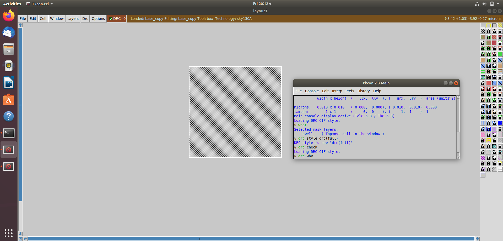

## Work in Progress... 🏗️

## IO Pin Configurations in OpenLANE

There are four possible configurations to place IO pins in a layout.
To visualize them, we first open the layout generated earlier in Magic.


```bash
cd ~/Desktop/work/tools/openlane_working_dir/openlane/designs/picorv32a/runs/29-10_00-31/results/floorplan

magic -T ~/Desktop/work/tools/openlane_working_dir/pdks/sky130A/libs.tech/magic/sky130A.tech lef read ../../tmp/merged.lef def read picorv32a.floorplan.def &
```


You can zoom and observe the IO cells by clicking `z`


In the file `floorplan.tcl` located in the `openlane/configurations/` directory, the parameter `FP_IO_MODE` determines the IO placement configuration.
It can take values such as 0, 1, 2, etc., corresponding to different pin arrangements.

After changing the value of `FP_IO_MODE` to 2, rerun the floorplan:

```
set ::env(FP_IO_MODE) 2
run_floorplan
```

Then, open the layout again in Magic to observe the new pin configuration:

```
cd ~/Desktop/work/tools/openlane_working_dir/openlane/designs/picorv32a/runs/30-10_11-30/results/floorplan
magic -T ~/Desktop/work/tools/openlane_working_dir/pdks/sky130A/libs.tech/magic/sky130A.tech lef read ../../tmp/merged.lef def read picorv32a.floorplan.def &
```


You can zoom and observe the IO cells by clicking `z`


As we can see, this configuration (FP_IO_MODE = 2) of IO cell placement is different from that of the first configuration (FP_IO_MODE = 1).


## 16-Mask CMOS Process


## 1. Substrate Preparation

* Use p-type silicon substrate
* High resistivity: approximately 5–50 Ω·cm
* Doping concentration: ( 10^{15},cm^{-3} ) (should be less than well doping)
* Crystal orientation: (100)


## 2. Creating Active Region for Transistors

* Grow silicon dioxide (~40 nm)
* Deposit silicon nitride (~80 nm)
* Apply photoresist layer (~1 µm)
* Perform masking and exposure using UV light (photolithography)
* Etch silicon nitride to expose selected areas
* Oxidize exposed silicon to form field oxide for isolation
* This process is known as **LOCOS (Local Oxidation of Silicon)**
* Remove silicon nitride to reveal the active regions


## 3. N-Well and P-Well Formation

* Apply photoresist
* Mask and expose the p-well areas
* Remove photoresist
* Perform ion implantation for p-well using **boron (~200 keV)**
* Repeat the process for n-well using **phosphorus**
* Perform high-temperature **drive-in diffusion** to achieve proper well depth and concentration


## 4. Gate Formation

* Apply photoresist and expose the p-well region using a gate mask
* Dope the p-well with **boron (~60 keV)** for shallow doping
* Repeat for n-well using **arsenic**
* Strip off the oxide layer using **HF etching**
* Deposit **polysilicon (~0.4 µm)** on the surface
* Dope polysilicon using **phosphorus or arsenic**
* Perform masking, exposure, and etching to define the gate structure


## 5. Lightly Doped Drain (LDD) Formation

* Consider **hot-electron** and **short-channel effects** before doping
* Perform photolithography to expose the p-well region
* Dope with **phosphorus** to create n- implants
* Repeat for n-well and dope with **boron** to form p- implants
* Deposit ~0.1 µm of silicon nitride or silicon dioxide
* Perform **plasma anisotropic etching** to create **sidewall spacers**


## 6. Source and Drain Formation

* Add a **screen oxide** to prevent channeling during implantation
* Perform photolithography to expose the p-well
* Dope p-well using **arsenic** to form n+ regions
* Expose the n-well and dope using **boron (~50 keV)** to form p+ regions
* Perform **annealing** at high temperature to activate dopants and repair lattice defects

## 7. Contact and Local Interconnect Formation

* Etch the thin oxide layer using **HF solution**
* Deposit **titanium (Ti)** using **sputtering** (Ar+ ions dislodge Ti atoms which settle on the wafer)
* Heat wafer to **650–700°C** to form:

  * **TiSi₂** (low-resistance contact)
  * **TiN** (local interconnect)
* Perform photolithography to expose contact regions
* Etch TiN using **RCA Cleaning solution** (DI water: 5 parts, NH₄OH: 1 part, H₂O₂: 1 part)
* Remove photoresist after cleaning


## 8. Higher Level Metal Formation

* Deposit **1 µm SiO₂** doped with phosphorus or boron
* Perform **CMP (Chemical Mechanical Polishing)** for planarization
* Perform photolithography to open vias (contact holes)
* Deposit ~10 nm **TiN** (adhesion + diffusion barrier)
* Blanket deposit **tungsten (W)** and perform CMP again
* Deposit **aluminium** for metal interconnects
* Perform photolithography and etch aluminium pattern
* Deposit another SiO₂ layer and perform CMP again
* Repeat patterning, deposit **tin (Sn)** for adhesion, followed by **tungsten (W)** for next interconnect layer
* Apply **Si₃N₄ dielectric** to protect the chip surface
* Use the final mask to drill vias for final contact connections


courtesy: https://vsdiat.vlsisystemdesign.com

## Lab Work: Layout Extraction and Simulation

### Get the `.mag` file for CMOS inverter

```bash
cd ~/Desktop/work/tools/openlane_working_dir/openlane/

git clone https://github.com/nickson-jose/vsdstdcelldesign.git
```

after getting the `.mag` file Layout in Magic, Let us view the cmos inverter layout using magic

```bash
# Opens the CMOS inverter layout in Magic using the Sky130 technology file
magic -T ./lib/sky130A.tech sky130_inv.mag &
```


**To inspect components:**

* Place the cursor over PMOS or NMOS
* Press `s` once to select a shape, or three times to select the entire connected components


* Open the **tkcon** window and type `what` to know the components:

```bash
what
```


Now, let us extract the layout information into a `.spice ` file.

### Extracting SPICE File

```bash
# Shows current working directory
pwd

#Extracts all connectivity and device information
extract all

# Sets capacitance and resistance extraction thresholds to 0 for complete extraction
ext2spice cthresh 0 rthresh 0

# Generates the SPICE netlist from the layout
ext2spice
```


now, `.spice` file is extracted from the CMOS layout 


sky130_inv.spice file:


### Simulation using ngspice

First we do certain modifications in the `.spice` file before performing simulation using ngspice.
we need to find the correct 'scale' value. we can find it by finding the scale value of the layout in magic.

Enable grid in Magic:

```
Window -> Grid On
```

Select a basic level box in the layout. Now in the tkcon window, type:

```bash
# Displays the dimensions of the selected area
box
```


Here, the box measures 0.010 x 0.010 um . So set the scale in the SPICE file as:

```
.scale 0.01u
```


* In `pshort.lib`, note that the PMOS model name is `pshort_model.0`
* Update the extracted SPICE file accordingly for PMOS and NMOS models
* The correct model names must match those in the library before simulation


## Performing Transient Simulation for extracted SPICE file

Perform transient analysis using the extracted SPICE file using ngspice. For that we need to modify the SPICE file to perform trans analysis,


### Rise Time:

Rise time is considered as the time taken for the output to transition from 20% to 80% of the Vdd during rising edge.

$$
t_{rise} = t_{20%} - t_{80%}
t_{rise} = 2.24 - 2.18
t_{rise} = 0.06
$$

Here,

* Vdd = 3.3V
* 20% level = 0.66 V
* 80% level = 2.64 V


### Fall Time:

Fall time is considered as the time taken for the output to transition from 80% to 20% of the Vdd during falling edge.

$$
t_{fall} = t_{80%} - t_{20%}
t_{fall} = 6.24 - 4.09
t_{fall} = 2.15
$$


Here,

* Vdd = 3.3V
* 20% level = 0.66 V
* 80% level = 2.64 V

### Rise Delay

Calculated between the 50% points of input and output when the output is rising:

For instance:

* Vdd = 3.3V
* 50% level = 1.65 V

  

$$
t_{rd} = t_{out,50%} - t_{in,50%}
t_{rd} = 2.25 - 2.15
t_{rd} = 0.06
$$


### fall Delay

Calculated between the 50% points of input and output when the output is falling:


For instance:

* Vdd = 3.3V
* 50% level = 1.65 V

  

$$
t_{fd} = t_{out,50%} - t_{in,50%}
t_{fd} = 6.21-6.15
t_{fd} = 0.06
$$


## Lab introduction to Magic tool options and DRC rules

Download the skywater `sky130A.tech` file from http://opencircuitdesign.com/open_pdks/archive/drc_tests.tgz

```bash
wget http://opencircuitdesign.com/open_pdks/archive/drc_tests.tgz

tar xfz drc_tests.tgz

cd drc_tests

ls -al

gvim .magicrc
```


Open Magic
```
magic -d XR &
```

in the tkcon window , load the 'poly' layout

```
load poly
```


### poly.9 - DRC violation not identified

in the poly.9 implementation, the distance between the leftmost ploy and the bottom most poly is calculated by selecting a box with the cursor, and typing `box` in tkcon.


The distance between these two poly is found to be 4.48 - 4.27 = 0.21 um

Let us check if the DRC rules allow this distance. let us go to: https://skywater-pdk.readthedocs.io/en/main/rules/periphery.html#poly


As we can see, the minimum distance between poly and other components should be 0.48 um. So let us do drc check to find whether this error is recognized or not.

```
drc check
drc why
```

It does not recognize any violations with poly. So the tech file is wrong and should be changed.

### Steps to alter the sky130A.tech file

The aliases for poly is found here:

`sky130A.tech` :


Change  the sky130A.tech file for poly.9


Now load the tech file in magic tkcon:

```
tech load sky130A
```


Now let us check for drc errors:

```
drc check
drc why
```
Now, The DRC violation is recognized by the tool.


### DRC Violation: Missing N-Well Tap (nwell.4)

According to **nwell.4** of the [SkyWater PDK rules](https://skywater-pdk.readthedocs.io/en/main/rules/periphery.html#nwell), all N-Wells must contain metal-contacted taps. Let us verify if the DRC check can identify this violation.


A single N-Well is placed and the DRC is executed in **full** mode to include **CIF checks** as well. Surprisingly, no DRC violations are reported, which indicates a possible issue in the check mechanism.




To fix this, we make modifications to our **sky130A.tech** library.


```
templayer nwell_tapped
bloat-all nsc nwell
```

This command creates a temporary layer `nwell_tapped` that identifies all the **tapped N-Wells**.

```
templayer nwell_untapped nwell
and-not nwell_tapped
```

This command creates a temporary layer `nwell_untapped` by removing the tapped N-Wells from the total set of N-Wells, leaving only **untapped N-Wells**.

Now, looking at the **NWELL** section of the technology file:


The code under the `variants (full)` section executes only when a **full DRC check** is performed, while the code under `variants *` runs during the **normal DRC check**.

Next, let us re-run the DRC check.


This time, we get a **DRC violation** when performing the **full DRC check**, correctly identifying untapped N-Wells as violations.

Finally, after **tapping the N-Well** using `nsubstratecontact`, we rerun the DRC check.


No **nwell.4 (missing tap)** violations are reported now, confirming that the fix works correctly.

