# WEEK 6 - Day 4 - Pre-layout timing analysis and importance of good clock tree

Let us check whether our inverter layout satisfies some conditions for good layout.

First, open the layout:

```tcl
cd Desktop/work/tools/openlane_working_dir/openlane/vsdstdcelldesign
magic -T ./lib/sky130A.tech sky130_inv.mag &
```


## Conditions for Good Layout

1. The input and output port of a standard cell must be between the vertical and horizontal grid lines.
2. The width of the standard cell must be an odd multiple of the horizontal grid value.
3. The height should be three times the vertical grid value.

The value of the vertical and horizontal grid can be determined from the **tracks.info** file located in the directory shown below:


From this **tracks.info** file, we can determine:

* Horizontal grid length = $$0.46,\mu m$$
* Vertical grid length = $$0.34,\mu m$$

So let us set  the grid accordingly in our layout

```
grid 0.46um 0.34um 0.23um 0.17um
```


### Condition 1 Check


Hence, it satisfies the first condition.


### Condition 2 Check


The width of the standard cell is:

$$
1.38,\mu m - 0.00,\mu m = 1.38,\mu m = 3 \times 0.46,\mu m
$$

Hence, it satisfies the second condition.

### Condition 3 Check


The height of the standard cell is:

$$
2.72,\mu m - 0.00,\mu m = 2.72,\mu m = 8 \times 0.34,\mu m
$$

Hence, it satisfies the third condition.


Now save the layout.

```tcl
# Command to save in tkcon window
save sky130_vsdinv.mag
```

Then exit:

```tcl
exit
```

Now open the saved layout:

```tcl
magic -T ./lib/sky130A.tech sky130_vsdinv.mag &
```


Then write the LEF file.
In tkcon window, type:

```tcl
lef write
```


LEF file is created:


## Using Custom Inverter in Picorv32a Synthesis and Layout

Now copy the `.lef` files to the `picorv32a/src/` directory.


```bash
cp sky130_vsdinv.lef ~/Desktop/work/tools/openlane_working_dir/openlane/designs/picorv32a/src/

cp libs/sky130_fd_sc_hd__* ~/Desktop/work/tools/openlane_working_dir/openlane/designs/picorv32a/src/
```

Now modify the `config.tcl` file to include all the necessary `.lib` files.  
Add this line:

```tcl
set ::env(LIB_SYNTH) "$::env(OPENLANE_ROOT)/designs/picorv32a/src/sky130_fd_sc_hd__typical.lib"
set ::env(LIB_FASTEST) "$::env(OPENLANE_ROOT)/designs/picorv32a/src/sky130_fd_sc_hd__fast.lib"
set ::env(LIB_SLOWEST) "$::env(OPENLANE_ROOT)/designs/picorv32a/src/sky130_fd_sc_hd__slow.lib"
set ::env(LIB_TYPICAL) "$::env(OPENLANE_ROOT)/designs/picorv32a/src/sky130_fd_sc_hd__typical.lib"
set ::env(EXTRA_LEFS) [glob $::env(OPENLANE_ROOT)/designs/$::env(DESIGN_NAME)/src/*.lef]
````

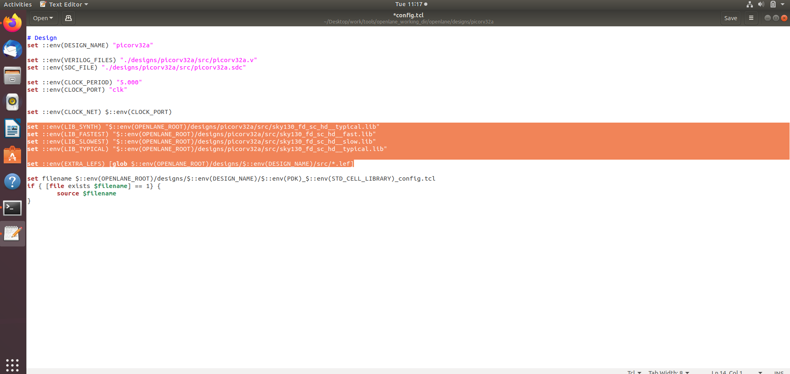

Now invoke OpenLane:

```tcl
cd ~/Desktop/work/tools/openlane_working_dir/openlane

alias docker='docker run -it -v $(pwd):/openLANE_flow -v $PDK_ROOT:$PDK_ROOT -e PDK_ROOT=$PDK_ROOT -u $(id -u $USER):$(id -g $USER) efabless/openlane:v0.21'

docker
```

Now in the bash shell, invoke OpenLane:

```tcl
./flow.tcl -interactive
```

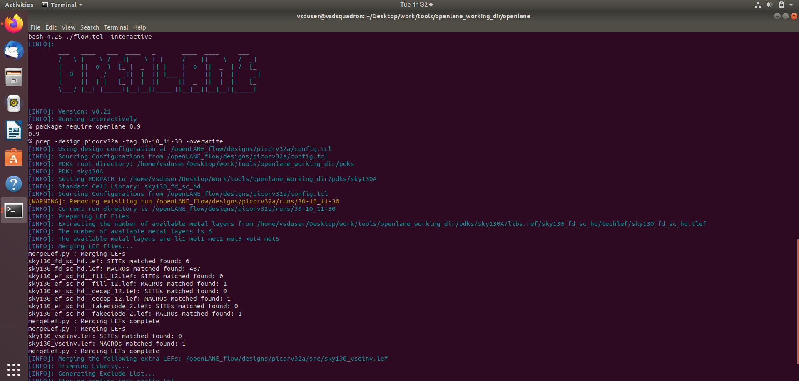

Then run:

```tcl
package require openlane 0.9

prep -design picorv32a -tag 30-10_11-30 -overwrite

set lefs [glob $::env(DESIGN_DIR)/src/*.lef]

add_lefs -src $lefs

run_synthesis
```

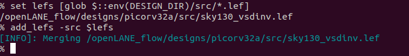

Now note that our custom inverter is used in the synthesis.

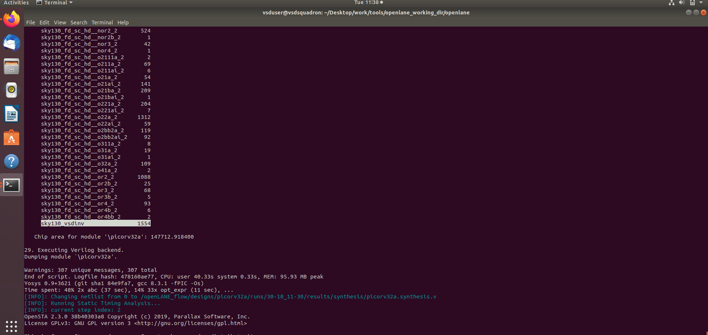

The chip area and the TNS can be seen:

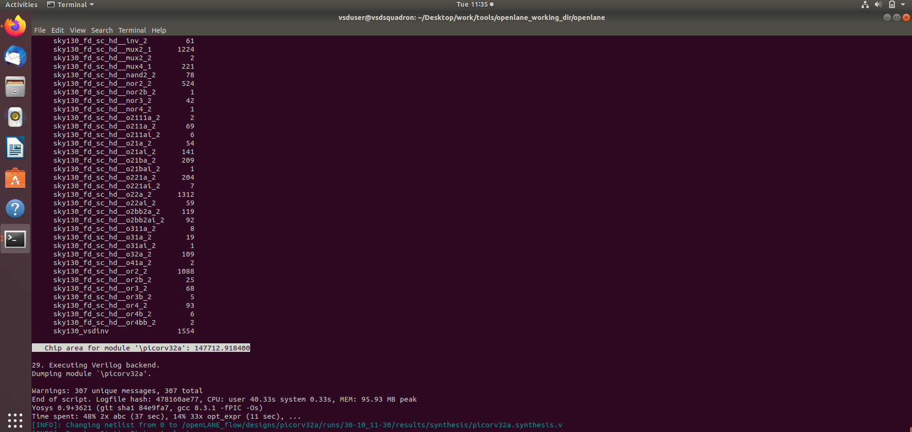

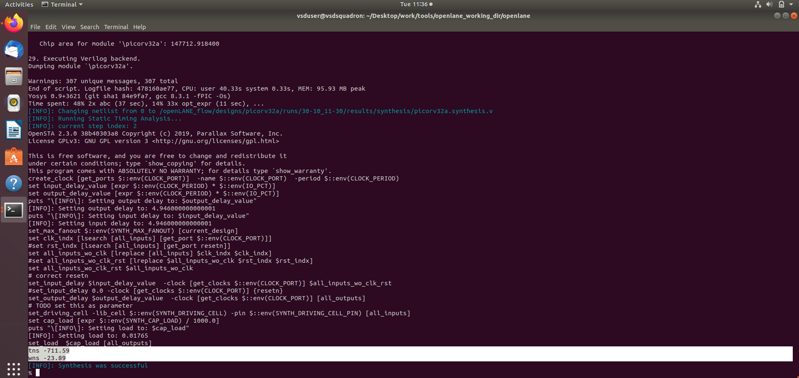

We got a negative slack which is bad.
Now let us improve timing by compromising the area. This can be done by changing a few parameters.
The details of these parameters can be seen in
`~/Desktop/work/tools/openlane_working_dir/openlane/configuration/` under `README.md`.

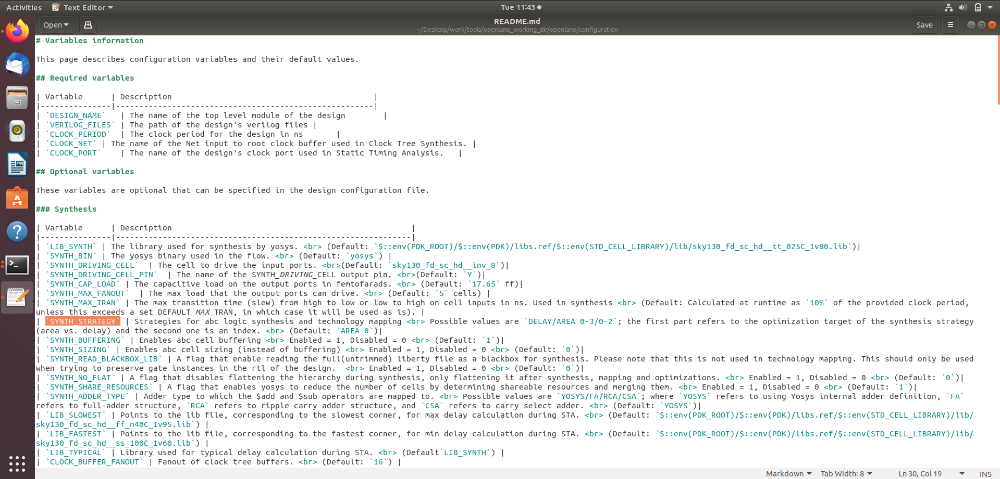

```bash
prep -design picorv32a -tag new -overwrite

set lefs [glob $::env(DESIGN_DIR)/src/*.lef]

add_lefs -src $lefs

echo $::env(SYNTH_STRATEGY)

set ::env(SYNTH_STRATEGY) "DELAY 3"

echo $::env(SYNTH_BUFFERING)

echo $::env(SYNTH_SIZING)

set ::env(SYNTH_SIZING) 1

echo $::env(SYNTH_DRIVING_CELL)
```

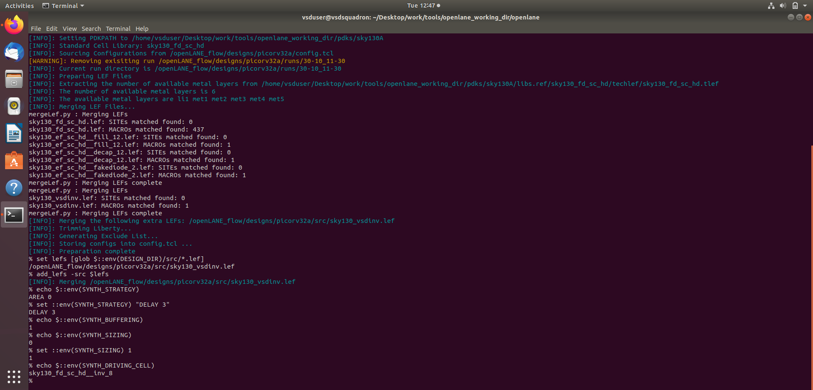

Now run synthesis:

```tcl
run_synthesis
```

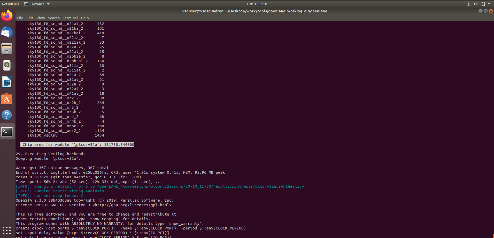

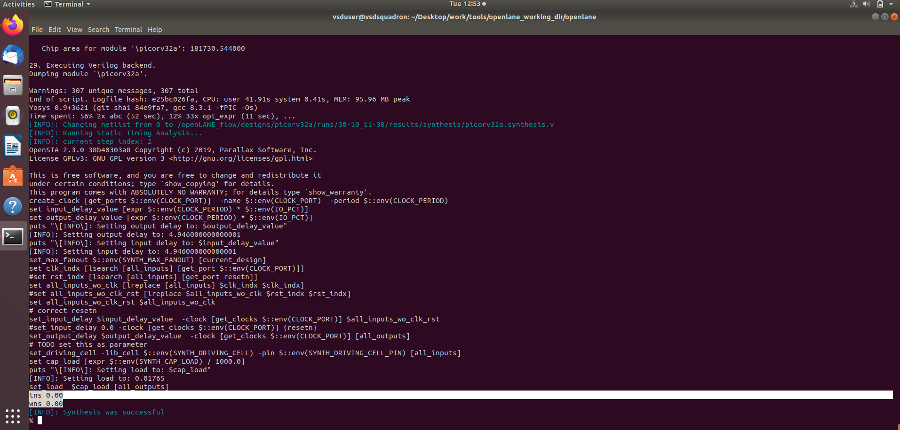

As we can see, The total negative slack is reduced and became 0. However the area in increased when compared to previously synthesized layout. Thus we trade area to improve the timing.

Area before = 1,47,712 units

Area after = 1,81,730 units

TNS before = -711.59

TNS after = 0

Now run the floorplan:

```tcl
run_floorplan
```

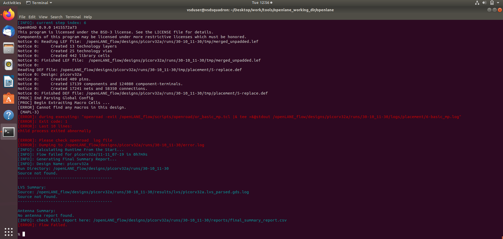

We get an error message when we run the `run_floorplan` command.
Let us use another command instead.
The details of other floorplan commands can be found in
`~/Desktop/work/tools/openlane_working_dir/openlane/docs/source/` directory under `OpenLANE_commands.md`.

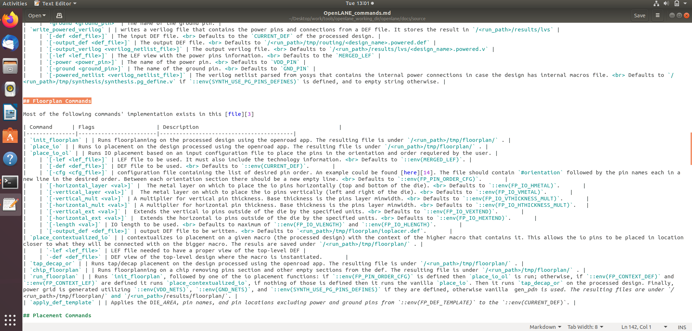

Let us run these alternate commands:

```tcl
init_floorplan
place_io
tap_decap_or
```


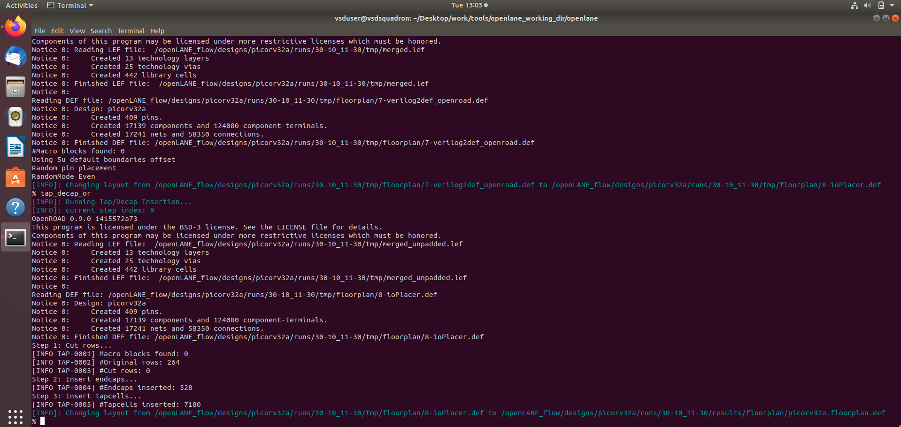

Now let us run placement:

```tcl
run_placement
```

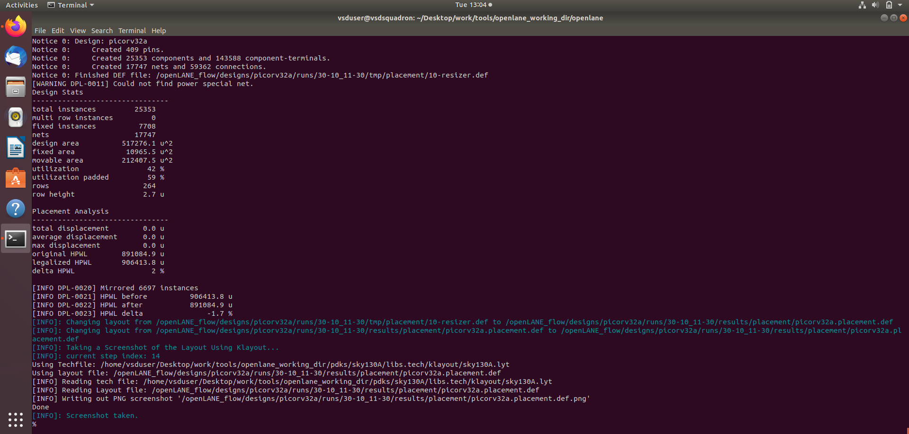

Now let us view the `picorv32a` layout using Magic:

```bash
cd ~/Desktop/work/tools/openlane_working_dir/openlane/designs/picorv32a/runs/new/results/placement/

magic -T ~/Desktop/work/tools/openlane_working_dir/pdks/sky130A/libs.tech/magic/sky130A.tech \
lef read ../../tmp/merged.lef def read picorv32a.placement.def &
```


Let us find our custom inverter in this layout:

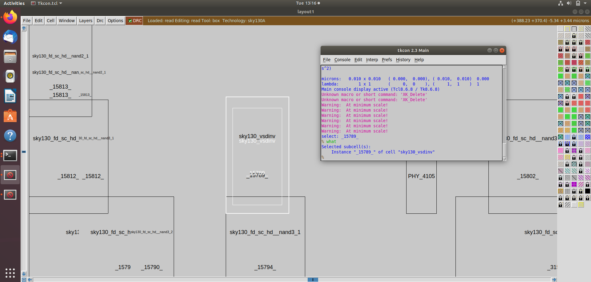

We can expand the view of this inverter using the `expand` command in the tkcon window:

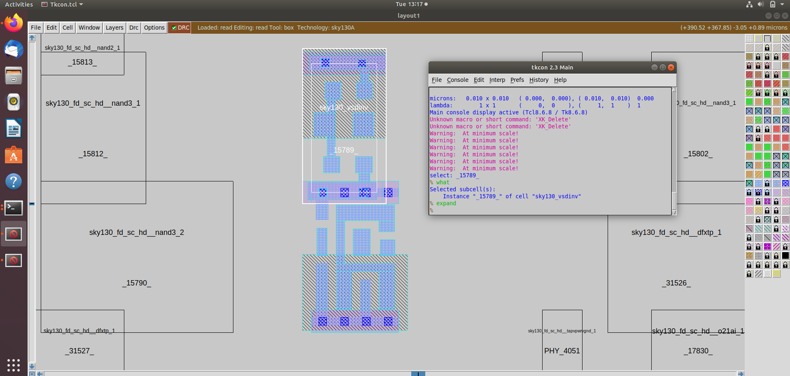


````markdown
# Timing Analysis with Ideal Clocks using OpenSTA

In this section, we will perform post-synthesis timing analysis using the OpenSTA tool, without any prior parameter changes. The goal is to understand timing performance and how various synthesis parameters or cell replacements can influence slack values.

To begin, launch the OpenLane Docker container and prepare the environment.

```bash
cd ~/Desktop/work/tools/openlane_working_dir/openlane

alias docker='docker run -it -v $(pwd):/openLANE_flow -v $PDK_ROOT:$PDK_ROOT -e PDK_ROOT=$PDK_ROOT \
-u $(id -u $USER):$(id -g $USER) efabless/openlane:v0.21'

docker
````

Once inside Docker, invoke OpenLane in interactive mode and set up the design environment.

```bash
./flow.tcl -interactive
package require openlane 0.9

prep -design picorv32a

set lefs [glob $::env(DESIGN_DIR)/src/*.lef]
add_lefs -src $lefs

set ::env(SYNTH_SIZING) 1
run_synthesis
```


Next, create the `pre_sta.conf` file under the `openlane/` directory to perform STA.

```tcl
set_cmd_units -time ns -capacitance pF -current mA -voltage V -resistance kOhm -distance um

read_liberty -max ~/Desktop/work/tools/openlane_working_dir/openlane/designs/picorv32a/src/sky130_fd_sc_hd__slow.lib
read_liberty -min ~/Desktop/work/tools/openlane_working_dir/openlane/designs/picorv32a/src/sky130_fd_sc_hd__fast.lib
read_verilog ~/Desktop/work/tools/openlane_working_dir/openlane/designs/picorv32a/runs/11-11_16-13/results/synthesis/picorv32a.synthesis.v
link_design picorv32a
read_sdc ~/Desktop/work/tools/openlane_working_dir/openlane/designs/picorv32a/src/my_base.sdc

report_checks -path_delay min_max -fields {slew trans net cap input_pin fanout}
report_tns
report_wns
```

Also, create `my_base.sdc` under `openlane/designs/picorv32a/src` directory.

```tcl
set ::env(CLOCK_PORT) clk
set ::env(CLOCK_PERIOD) 24.73
# set ::env(SYNTH_DRIVING_CELL) sky130_vsdinv
set ::env(SYNTH_DRIVING_CELL) sky130_fd_sc_hd__inv_8
set ::env(SYNTH_DRIVING_CELL_PIN) Y
set ::env(SYNTH_CAP_LOAD) 17.653
set ::env(IO_PCT) 0.2
set ::env(SYNTH_MAX_FANOUT) 6

create_clock [get_ports $::env(CLOCK_PORT)]  -name $::env(CLOCK_PORT)  -period $::env(CLOCK_PERIOD)
set input_delay_value [expr $::env(CLOCK_PERIOD) * $::env(IO_PCT)]
set output_delay_value [expr $::env(CLOCK_PERIOD) * $::env(IO_PCT)]
puts "\[INFO\]: Setting output delay to: $output_delay_value"
puts "\[INFO\]: Setting input delay to: $input_delay_value"

set_max_fanout $::env(SYNTH_MAX_FANOUT) [current_design]

set clk_indx [lsearch [all_inputs] [get_port $::env(CLOCK_PORT)]]
#set rst_indx [lsearch [all_inputs] [get_port resetn]]
set all_inputs_wo_clk [lreplace [all_inputs] $clk_indx $clk_indx]
#set all_inputs_wo_clk_rst [lreplace $all_inputs_wo_clk $rst_indx $rst_indx]
set all_inputs_wo_clk_rst $all_inputs_wo_clk


# correct resetn
set_input_delay $input_delay_value  -clock [get_clocks $::env(CLOCK_PORT)] $all_inputs_wo_clk_rst
#set_input_delay 0.0 -clock [get_clocks $::env(CLOCK_PORT)] {resetn}
set_output_delay $output_delay_value  -clock [get_clocks $::env(CLOCK_PORT)] [all_outputs]

# TODO set this as parameter
set_driving_cell -lib_cell $::env(SYNTH_DRIVING_CELL) -pin $::env(SYNTH_DRIVING_CELL_PIN) [all_inputs]
set cap_load [expr $::env(SYNTH_CAP_LOAD) / 1000.0]
puts "\[INFO\]: Setting load to: $cap_load"
set_load  $cap_load [all_outputs]
```

The load capacitance, fanout, and other parameters are determined from the
`sky130_fd_sc_hd__typical.lib` located under `openlane/vsdstdcelldesign/libs/` directory.

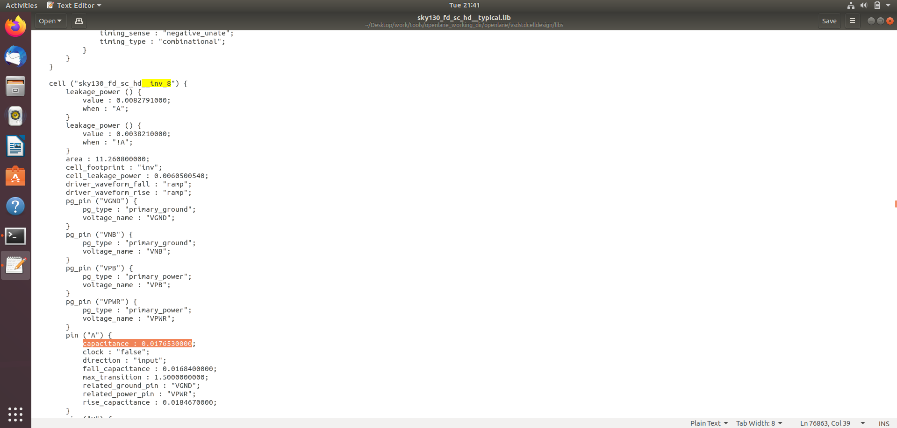

Now run OpenSTA to perform Static Timing Analysis (STA).

```bash
cd ~/Desktop/work/tools/openlane_working_dir/openlane
sta pre_sta.conf
```

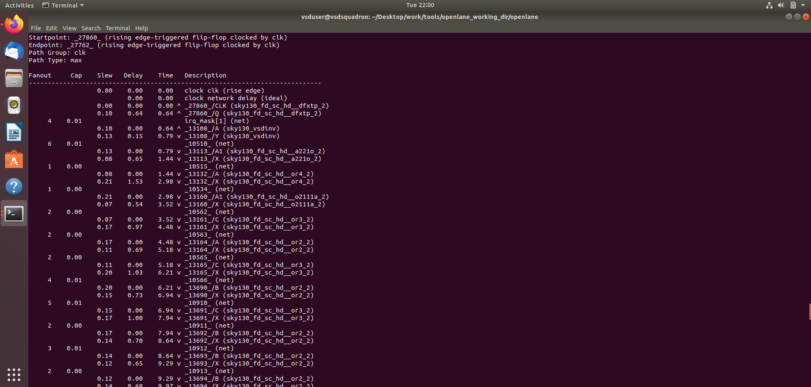
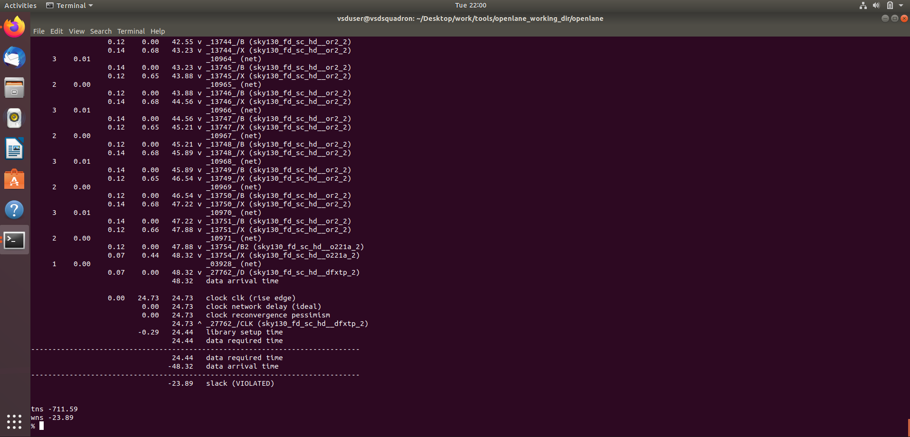

The TNS (Total Negative Slack) and WNS (Worst Negative Slack) are undesirable. Let us try to improve them by modifying synthesis parameters such as `SYNTH_MAX_FANOUT`.

Re-prepare the design with updated parameters.

```tcl
prep -design picorv32a -tag 11-11_16-13 -overwrite

set lefs [glob $::env(DESIGN_DIR)/src/*.lef]
add_lefs -src $lefs

# To set the value for SYNTH_SIZING
set ::env(SYNTH_SIZING) 1

# To set the value for SYNTH_MAX_FANOUT
set ::env(SYNTH_MAX_FANOUT) 4

# To check the current driving cell
echo $::env(SYNTH_DRIVING_CELL)

run_synthesis
```

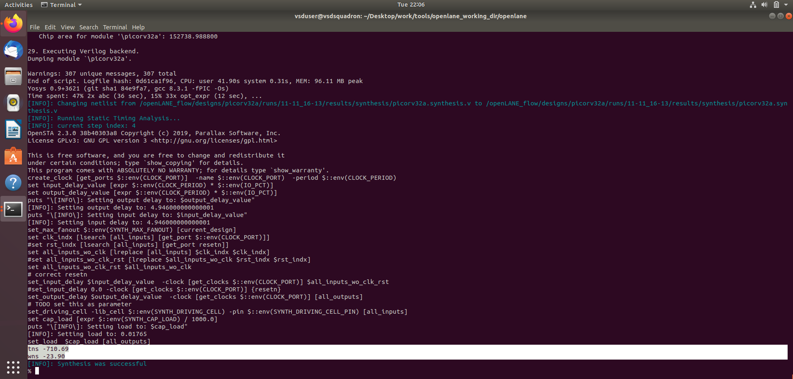

Now run STA again using OpenSTA in a new terminal.

```bash
cd ~/Desktop/work/tools/openlane_working_dir/openlane/
sta pre_sta.conf
```

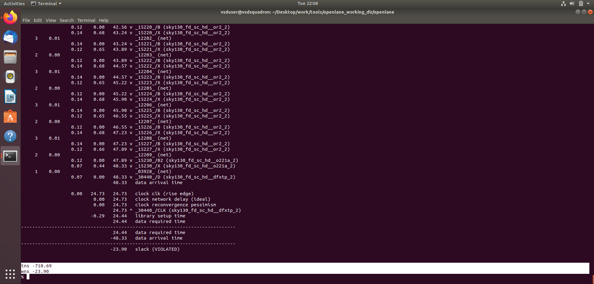

Even after changing the fanout, we still get negative slack. Let’s further optimize by replacing some cells that are underperforming.


For example, the cell `sky130_fd_sc_hd__or3_2` has a drive strength of 2 but drives 4 fanouts.
We will replace it with a stronger version.

```tcl
# To report connections of the given net
report_net -connections _11672_

# Replace with a cell of higher drive strength
replace_cell _14510_ sky130_fd_sc_hd__or3_4
```

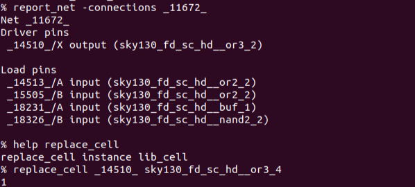

After replacement, report the new timing:

```tcl
report_checks -fields {net cap slew input_pins fanout} -digits 4
```


Still, there is negative slack. Let’s identify another problematic cell and replace it.

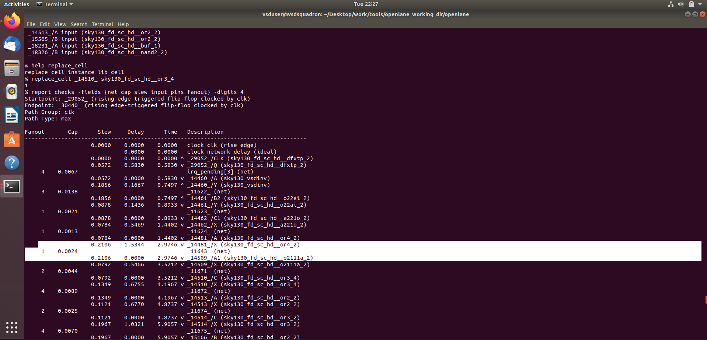

The cell `sky130_fd_sc_hd__or4_2` drives `sky130_fd_sc_hd__o2111a_2`, causing a large delay. Replace it with a stronger drive variant.

```tcl
# To report connections of the given net
report_net -connections _11643_

# Replace with cell of more driving strength
replace_cell _14481_ sky130_fd_sc_hd__or4_4
```

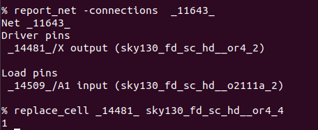

Now re-check timing:

```tcl
report_checks -fields {net cap slew input_pins fanout} -digits 4
```

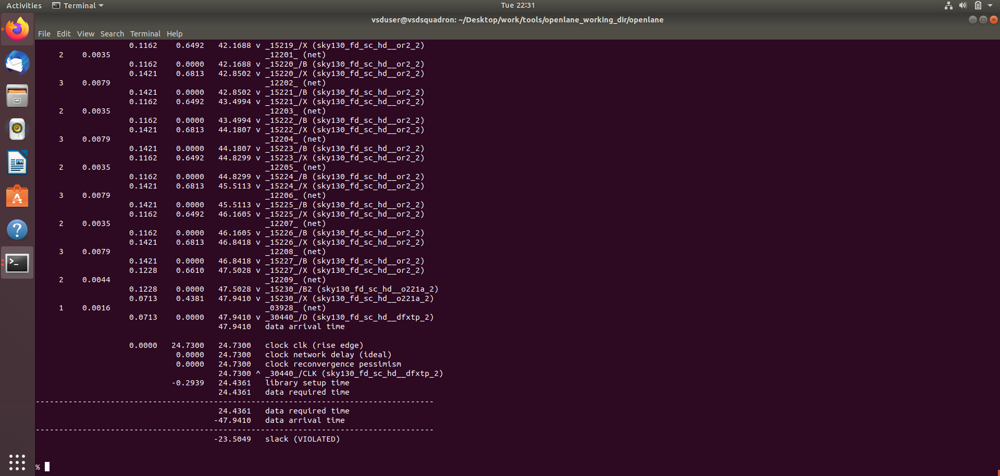

After this, negative slack still persists. Let us try one more cell replacement.

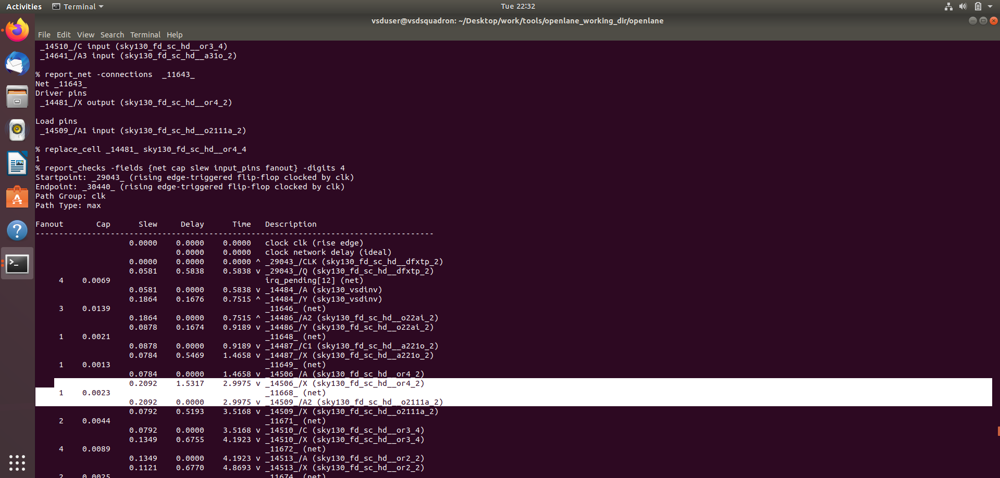

Again, consider another instance of `sky130_fd_sc_hd__or4_2` driving a delay-critical path. Replace it similarly:

```tcl
# To report connections of the given net
report_net -connections _11668_

# Replace with cell of higher drive strength
replace_cell _14506_ sky130_fd_sc_hd__or4_4
```

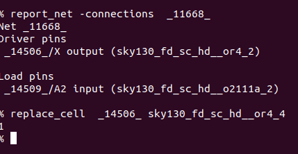

Check timing again:

```tcl
report_checks -fields {net cap slew input_pins fanout} -digits 4
```

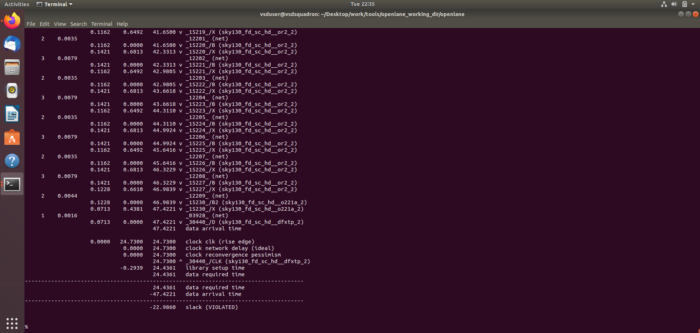

This time, the WNS shifted to a different path.
To check timing for the specific path we were previously optimizing, explicitly specify the start and end points:

```tcl
report_checks -from _29043_ -to _30440_ -through _14506_
```

Now let’s perform one more replacement to further minimize delay.

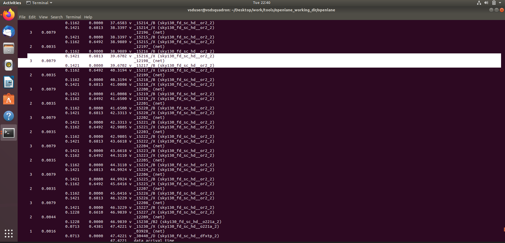

```tcl
# To report connections of the given net
report_net -connections _12198_

# Replace with cell of higher drive strength
replace_cell _15216_ sky130_fd_sc_hd__or2_4
```

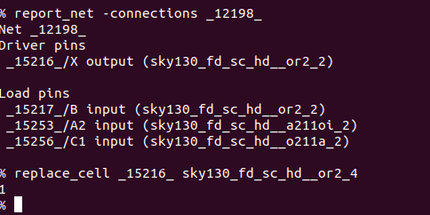

Then, recheck the timing again:

```tcl
report_checks -fields {net cap slew input_pins fanout} -digits 4
```

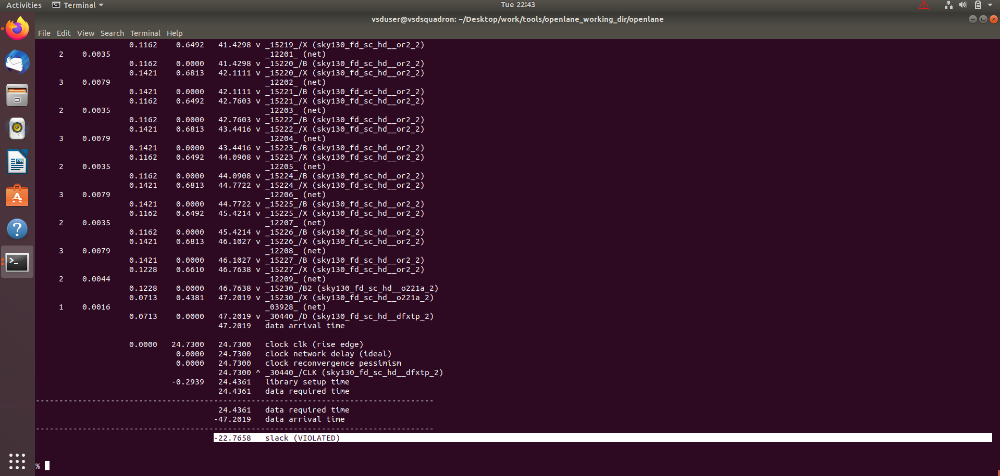

After this optimization, the WNS reduced from **-23.90** to **-22.7658**, an improvement of **1.1342 ns**.
This optimization was achieved through **ECO (Engineering Change Order)** changes.

To save this updated netlist, first make a backup of the old synthesis file and then write the new Verilog netlist.

```bash
cd ~/Desktop/work/tools/openlane_working_dir/openlane/designs/picorv32a/runs/11-11_16-13/results/synthesis/

cp picorv32a.synthesis.v picorv32a.synthesis_old.v
```

Now, in the OpenSTA shell, export the modified netlist:

```tcl
write_verilog ~/Desktop/work/tools/openlane_working_dir/openlane/designs/picorv32a/runs/11-11_16-13/results/synthesis/picorv32a.synthesis.v
exit
```

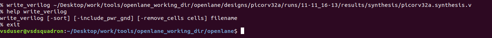

Finally, verify that the written Verilog file contains the replaced cells:

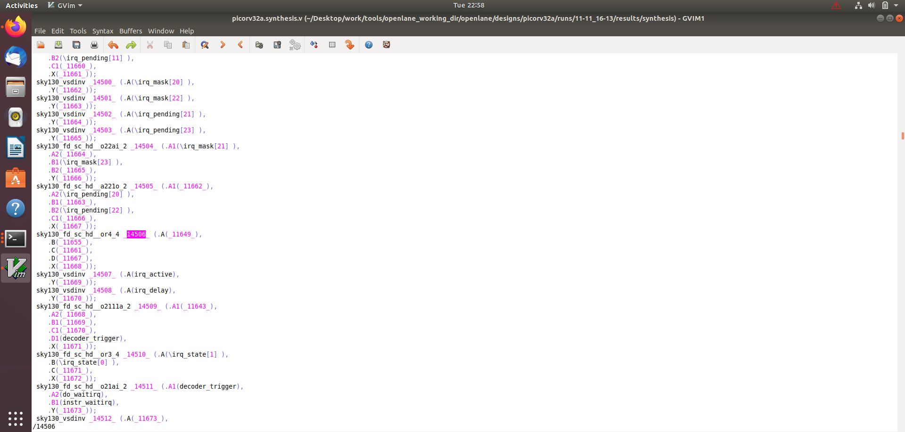

Yes, the modified Verilog netlist includes all the replaced cells, confirming that our ECO updates have been successfully reflected in the design.


## Perform Clock Tree Synthesis

Let’s now perform **Clock Tree Synthesis (CTS)**.
Before that, add the following lines to the `config.tcl` file under the `openlane/designs/picorv32a/` directory:

```
set ::env(CTS_SQR_CAP) 0.024   ;# Defines the unit square capacitance in pF/µm²
set ::env(CTS_SQR_RES) 0.075   ;# Defines the unit square resistance in kΩ/µm²
```

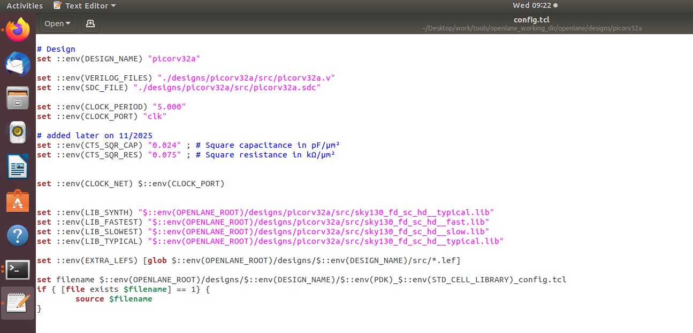

Now let’s perform CTS:

```
# Re-initialize the design to refresh updated environment variables
prep -design picorv32a -tag 11-11_16-13 -overwrite

# Include newly added LEF files in the OpenLANE flow
set lefs [glob $::env(DESIGN_DIR)/src/*.lef]

add_lefs -src $lefs

# Update synthesis strategy for better delay optimization
set ::env(SYNTH_STRATEGY) "DELAY 3"

# Enable gate sizing during synthesis
set ::env(SYNTH_SIZING) 1

# Run synthesis again with the updated configuration
run_synthesis
```

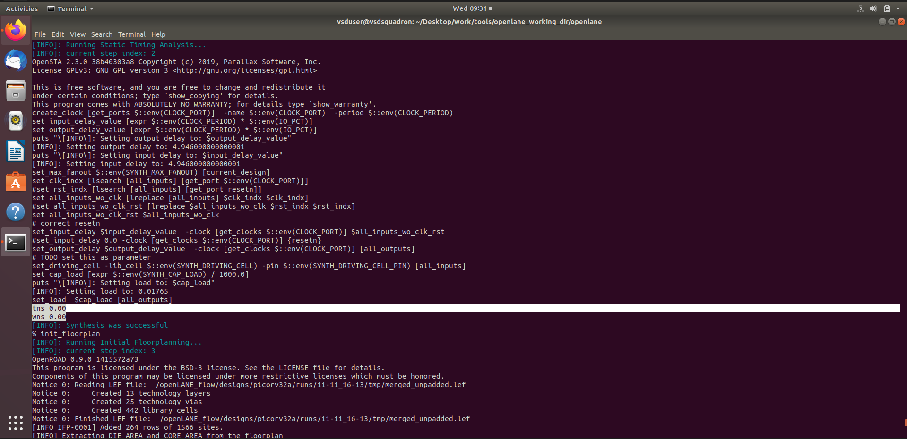

```
# The following commands are automatically executed during floorplan generation
init_floorplan
place_io
tap_decap_or

# Proceed to perform placement
run_placement
```

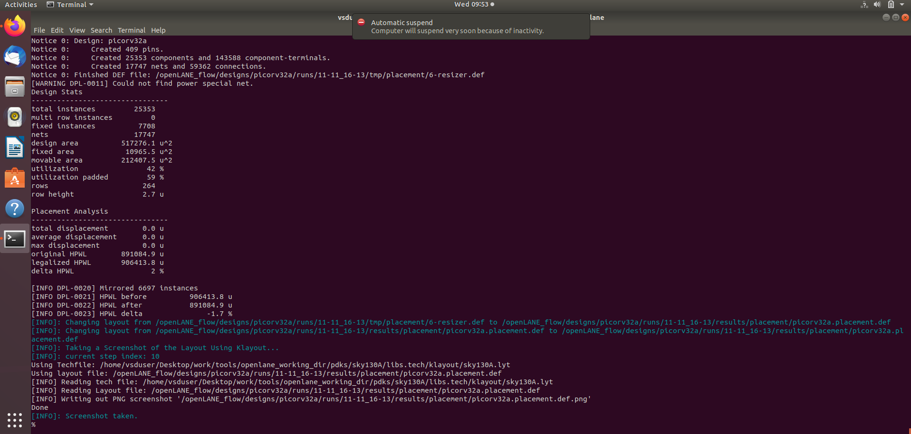

```
# If any variable conflict occurs, remove the CTS library environment variable
unset ::env(LIB_CTS)

# Once placement is done, execute clock tree synthesis
run_cts
```

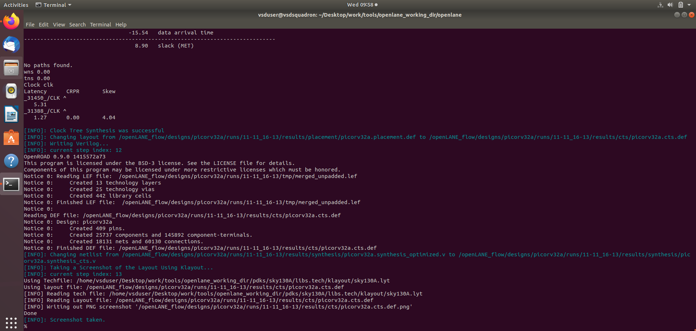

After this, check the `.cts` files in the `results/synthesis/` directory.

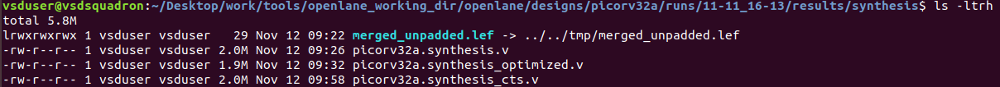

# Post-CTS Timing Analysis

Let’s now invoke **OpenROAD** and perform **timing analysis** using **OpenSTA**.

```
# Launch OpenROAD shell
openroad

# Load the LEF file into OpenROAD
read_lef /openLANE_flow/designs/picorv32a/runs/11-11_16-13/tmp/merged.lef

# Load the DEF file generated after CTS
read_def /openLANE_flow/designs/picorv32a/runs/11-11_16-13/results/cts/picorv32a.cts.def

# Create an OpenROAD database for the current design
write_db pico_cts.db

# Load the database into the OpenROAD environment
read_db pico_cts.db

# Read the Verilog netlist generated post CTS
read_verilog /openLANE_flow/designs/picorv32a/runs/11-11_16-13/results/synthesis/picorv32a.synthesis_cts.v

# Load the standard cell library
read_liberty $::env(LIB_SYNTH_COMPLETE)

# Link the design with the loaded library
link_design picorv32a

# Load the base SDC constraints
read_sdc /openLANE_flow/designs/picorv32a/src/my_base.sdc

# Set all available clocks to be treated as propagated
set_propagated_clock [all_clocks]

# To check details of timing report command
help report_checks
```

```
report_checks -path_delay min_max -fields {slew trans net cap input_pins} -format full_clock_expanded -digits 4
```

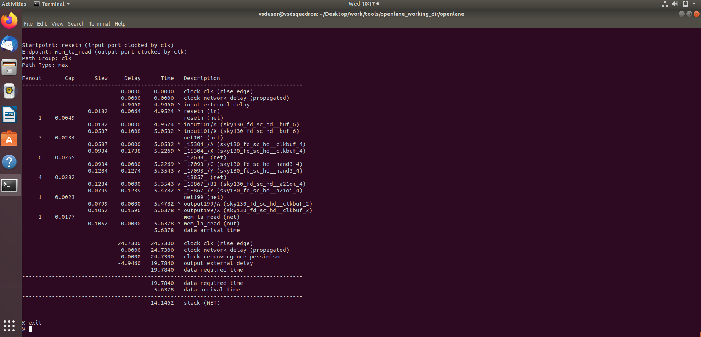

```
% report_checks -path_delay min_max -fields {slew trans net cap input_pins} -format full_clock_expanded -digits 4
Startpoint: _31002_ (rising edge-triggered flip-flop clocked by clk)
Endpoint: _30967_ (rising edge-triggered flip-flop clocked by clk)
Path Group: clk
Path Type: min

Fanout       Cap      Slew     Delay      Time   Description
-------------------------------------------------------------------------------------
                              0.0000    0.0000   clock clk (rise edge)
                              0.0000    0.0000   clock source latency
                    0.0225    0.0100    0.0100 ^ clk (in)
     1    0.0079                                 clk (net)
                    0.0225    0.0000    0.0100 ^ clkbuf_0_clk/A (sky130_fd_sc_hd__clkbuf_16)
                    0.0283    0.1016    0.1116 ^ clkbuf_0_clk/X (sky130_fd_sc_hd__clkbuf_16)
     2    0.0044                                 clknet_0_clk (net)
                    0.0283    0.0000    0.1116 ^ clkbuf_1_1_0_clk/A (sky130_fd_sc_hd__clkbuf_1)
                    0.0388    0.0697    0.1814 ^ clkbuf_1_1_0_clk/X (sky130_fd_sc_hd__clkbuf_1)
     1    0.0022                                 clknet_1_1_0_clk (net)
                    0.0388    0.0000    0.1814 ^ clkbuf_1_1_1_clk/A (sky130_fd_sc_hd__clkbuf_1)
                    0.0388    0.0734    0.2547 ^ clkbuf_1_1_1_clk/X (sky130_fd_sc_hd__clkbuf_1)
     1    0.0022                                 clknet_1_1_1_clk (net)
                    0.0388    0.0000    0.2547 ^ clkbuf_1_1_2_clk/A (sky130_fd_sc_hd__clkbuf_1)
                    0.0635    0.0910    0.3458 ^ clkbuf_1_1_2_clk/X (sky130_fd_sc_hd__clkbuf_1)
     2    0.0044                                 clknet_1_1_2_clk (net)
                    0.0635    0.0000    0.3458 ^ clkbuf_2_3_0_clk/A (sky130_fd_sc_hd__clkbuf_1)
                    0.0390    0.0811    0.4268 ^ clkbuf_2_3_0_clk/X (sky130_fd_sc_hd__clkbuf_1)
     1    0.0022                                 clknet_2_3_0_clk (net)
                    0.0390    0.0000    0.4268 ^ clkbuf_2_3_1_clk/A (sky130_fd_sc_hd__clkbuf_1)
                    0.0388    0.0734    0.5003 ^ clkbuf_2_3_1_clk/X (sky130_fd_sc_hd__clkbuf_1)
     1    0.0022                                 clknet_2_3_1_clk (net)
                    0.0388    0.0000    0.5003 ^ clkbuf_2_3_2_clk/A (sky130_fd_sc_hd__clkbuf_1)
                    0.0635    0.0910    0.5913 ^ clkbuf_2_3_2_clk/X (sky130_fd_sc_hd__clkbuf_1)
     2    0.0044                                 clknet_2_3_2_clk (net)
                    0.0635    0.0000    0.5913 ^ clkbuf_3_7_0_clk/A (sky130_fd_sc_hd__clkbuf_1)
                    0.0390    0.0811    0.6724 ^ clkbuf_3_7_0_clk/X (sky130_fd_sc_hd__clkbuf_1)
     1    0.0022                                 clknet_3_7_0_clk (net)
                    0.0390    0.0000    0.6724 ^ clkbuf_3_7_1_clk/A (sky130_fd_sc_hd__clkbuf_1)
                    0.0635    0.0911    0.7635 ^ clkbuf_3_7_1_clk/X (sky130_fd_sc_hd__clkbuf_1)
     2    0.0044                                 clknet_3_7_1_clk (net)
                    0.0635    0.0000    0.7635 ^ clkbuf_4_14_0_clk/A (sky130_fd_sc_hd__clkbuf_1)
                    0.0635    0.0987    0.8622 ^ clkbuf_4_14_0_clk/X (sky130_fd_sc_hd__clkbuf_1)
     2    0.0044                                 clknet_4_14_0_clk (net)
                    0.0635    0.0000    0.8622 ^ clkbuf_5_28_0_clk/A (sky130_fd_sc_hd__clkbuf_1)
                    0.0390    0.0811    0.9433 ^ clkbuf_5_28_0_clk/X (sky130_fd_sc_hd__clkbuf_1)
     1    0.0022                                 clknet_5_28_0_clk (net)
                    0.0390    0.0000    0.9433 ^ clkbuf_5_28_1_clk/A (sky130_fd_sc_hd__clkbuf_1)
                    0.5776    0.4454    1.3886 ^ clkbuf_5_28_1_clk/X (sky130_fd_sc_hd__clkbuf_1)
     7    0.0492                                 clknet_5_28_1_clk (net)
                    0.5776    0.0000    1.3886 ^ clkbuf_leaf_104_clk/A (sky130_fd_sc_hd__clkbuf_16)
                    0.0416    0.2342    1.6229 ^ clkbuf_leaf_104_clk/X (sky130_fd_sc_hd__clkbuf_16)
     2    0.0038                                 clknet_leaf_104_clk (net)
                    0.0416    0.0000    1.6229 ^ _31002_/CLK (sky130_fd_sc_hd__dfxtp_1)
                    0.0339    0.2909    1.9138 ^ _31002_/Q (sky130_fd_sc_hd__dfxtp_1)
     1    0.0018                                 alu_add_sub[26] (net)
                    0.0339    0.0000    1.9138 ^ _29511_/A1 (sky130_fd_sc_hd__mux2_2)
                    0.0322    0.1227    2.0364 ^ _29511_/X (sky130_fd_sc_hd__mux2_2)
     1    0.0017                                 alu_out[26] (net)
                    0.0322    0.0000    2.0364 ^ _30967_/D (sky130_fd_sc_hd__dfxtp_2)
                                        2.0364   data arrival time

                              0.0000    0.0000   clock clk (rise edge)
                              0.0000    0.0000   clock source latency
                    0.0225    0.0100    0.0100 ^ clk (in)
     1    0.0079                                 clk (net)
                    0.0225    0.0000    0.0100 ^ clkbuf_0_clk/A (sky130_fd_sc_hd__clkbuf_16)
                    0.0283    0.1016    0.1116 ^ clkbuf_0_clk/X (sky130_fd_sc_hd__clkbuf_16)
     2    0.0044                                 clknet_0_clk (net)
                    0.0283    0.0000    0.1116 ^ clkbuf_1_1_0_clk/A (sky130_fd_sc_hd__clkbuf_1)
                    0.0388    0.0697    0.1814 ^ clkbuf_1_1_0_clk/X (sky130_fd_sc_hd__clkbuf_1)
     1    0.0022                                 clknet_1_1_0_clk (net)
                    0.0388    0.0000    0.1814 ^ clkbuf_1_1_1_clk/A (sky130_fd_sc_hd__clkbuf_1)
                    0.0388    0.0734    0.2547 ^ clkbuf_1_1_1_clk/X (sky130_fd_sc_hd__clkbuf_1)
     1    0.0022                                 clknet_1_1_1_clk (net)
                    0.0388    0.0000    0.2547 ^ clkbuf_1_1_2_clk/A (sky130_fd_sc_hd__clkbuf_1)
                    0.0635    0.0910    0.3458 ^ clkbuf_1_1_2_clk/X (sky130_fd_sc_hd__clkbuf_1)
     2    0.0044                                 clknet_1_1_2_clk (net)
                    0.0635    0.0000    0.3458 ^ clkbuf_2_2_0_clk/A (sky130_fd_sc_hd__clkbuf_1)
                    0.0390    0.0811    0.4268 ^ clkbuf_2_2_0_clk/X (sky130_fd_sc_hd__clkbuf_1)
     1    0.0022                                 clknet_2_2_0_clk (net)
                    0.0390    0.0000    0.4268 ^ clkbuf_2_2_1_clk/A (sky130_fd_sc_hd__clkbuf_1)
                    0.0388    0.0734    0.5003 ^ clkbuf_2_2_1_clk/X (sky130_fd_sc_hd__clkbuf_1)
     1    0.0022                                 clknet_2_2_1_clk (net)
                    0.0388    0.0000    0.5003 ^ clkbuf_2_2_2_clk/A (sky130_fd_sc_hd__clkbuf_1)
                    0.0635    0.0910    0.5913 ^ clkbuf_2_2_2_clk/X (sky130_fd_sc_hd__clkbuf_1)
     2    0.0044                                 clknet_2_2_2_clk (net)
                    0.0635    0.0000    0.5913 ^ clkbuf_3_4_0_clk/A (sky130_fd_sc_hd__clkbuf_1)
                    0.0390    0.0811    0.6724 ^ clkbuf_3_4_0_clk/X (sky130_fd_sc_hd__clkbuf_1)
     1    0.0022                                 clknet_3_4_0_clk (net)
                    0.0390    0.0000    0.6724 ^ clkbuf_3_4_1_clk/A (sky130_fd_sc_hd__clkbuf_1)
                    0.0635    0.0911    0.7635 ^ clkbuf_3_4_1_clk/X (sky130_fd_sc_hd__clkbuf_1)
     2    0.0044                                 clknet_3_4_1_clk (net)
                    0.0635    0.0000    0.7635 ^ clkbuf_4_8_0_clk/A (sky130_fd_sc_hd__clkbuf_1)
                    0.0635    0.0987    0.8622 ^ clkbuf_4_8_0_clk/X (sky130_fd_sc_hd__clkbuf_1)
     2    0.0044                                 clknet_4_8_0_clk (net)
                    0.0635    0.0000    0.8622 ^ clkbuf_5_17_0_clk/A (sky130_fd_sc_hd__clkbuf_1)
                    0.0390    0.0811    0.9433 ^ clkbuf_5_17_0_clk/X (sky130_fd_sc_hd__clkbuf_1)
     1    0.0022                                 clknet_5_17_0_clk (net)
                    0.0390    0.0000    0.9433 ^ clkbuf_5_17_1_clk/A (sky130_fd_sc_hd__clkbuf_1)
                    1.0082    0.7429    1.6862 ^ clkbuf_5_17_1_clk/X (sky130_fd_sc_hd__clkbuf_1)
    11    0.0868                                 clknet_5_17_1_clk (net)
                    1.0082    0.0000    1.6862 ^ clkbuf_leaf_170_clk/A (sky130_fd_sc_hd__clkbuf_16)
                    0.0688    0.2991    1.9853 ^ clkbuf_leaf_170_clk/X (sky130_fd_sc_hd__clkbuf_16)
    12    0.0225                                 clknet_leaf_170_clk (net)
                    0.0688    0.0000    1.9853 ^ _30967_/CLK (sky130_fd_sc_hd__dfxtp_2)
                              0.0000    1.9853   clock reconvergence pessimism
                             -0.0254    1.9598   library hold time
                                        1.9598   data required time
-------------------------------------------------------------------------------------
                                        1.9598   data required time
                                       -2.0364   data arrival time
-------------------------------------------------------------------------------------
                                        0.0766   slack (MET)


Startpoint: resetn (input port clocked by clk)
Endpoint: mem_la_read (output port clocked by clk)
Path Group: clk
Path Type: max

Fanout       Cap      Slew     Delay      Time   Description
-------------------------------------------------------------------------------------
                              0.0000    0.0000   clock clk (rise edge)
                              0.0000    0.0000   clock network delay (propagated)
                              4.9460    4.9460 ^ input external delay
                    0.0182    0.0064    4.9524 ^ resetn (in)
     1    0.0049                                 resetn (net)
                    0.0182    0.0000    4.9524 ^ input101/A (sky130_fd_sc_hd__buf_6)
                    0.0587    0.1008    5.0532 ^ input101/X (sky130_fd_sc_hd__buf_6)
     7    0.0234                                 net101 (net)
                    0.0587    0.0000    5.0532 ^ _15304_/A (sky130_fd_sc_hd__clkbuf_4)
                    0.0934    0.1738    5.2269 ^ _15304_/X (sky130_fd_sc_hd__clkbuf_4)
     6    0.0265                                 _12638_ (net)
                    0.0934    0.0000    5.2269 ^ _17093_/C (sky130_fd_sc_hd__nand3_4)
                    0.1284    0.1274    5.3543 v _17093_/Y (sky130_fd_sc_hd__nand3_4)
     4    0.0282                                 _13857_ (net)
                    0.1284    0.0000    5.3543 v _18867_/B1 (sky130_fd_sc_hd__a21oi_4)
                    0.0799    0.1239    5.4782 ^ _18867_/Y (sky130_fd_sc_hd__a21oi_4)
     1    0.0023                                 net199 (net)
                    0.0799    0.0000    5.4782 ^ output199/A (sky130_fd_sc_hd__clkbuf_2)
                    0.1052    0.1596    5.6378 ^ output199/X (sky130_fd_sc_hd__clkbuf_2)
     1    0.0177                                 mem_la_read (net)
                    0.1052    0.0000    5.6378 ^ mem_la_read (out)
                                        5.6378   data arrival time

                             24.7300   24.7300   clock clk (rise edge)
                              0.0000   24.7300   clock network delay (propagated)
                              0.0000   24.7300   clock reconvergence pessimism
                             -4.9460   19.7840   output external delay
                                       19.7840   data required time
-------------------------------------------------------------------------------------
                                       19.7840   data required time
                                       -5.6378   data arrival time
-------------------------------------------------------------------------------------
                                       14.1462   slack (MET)

```

# Explore Post-CTS OpenROAD Timing Analysis (Removing a Clock Buffer Cell)

Next, let’s explore post-CTS timing by **removing the `sky130_fd_sc_hd__clkbuf_1` cell** from the clock buffer list variable `CTS_CLK_BUFFER_LIST`.

Run the following commands in the OpenLANE flow before performing CTS:

```
# Display the current list of clock buffers
echo $::env(CTS_CLK_BUFFER_LIST)

# Remove the first buffer ('sky130_fd_sc_hd__clkbuf_1') from the list
set ::env(CTS_CLK_BUFFER_LIST) [lreplace $::env(CTS_CLK_BUFFER_LIST) 0 0]

# Verify the updated buffer list
echo $::env(CTS_CLK_BUFFER_LIST)

# Display the currently active DEF file path
echo $::env(CURRENT_DEF)

# Set the current DEF file to use placement DEF
set ::env(CURRENT_DEF) /openLANE_flow/designs/picorv32a/runs/11-11_16-14/results/placement/picorv32a.placement.def
```

Now, perform CTS again:

```
run_cts
```

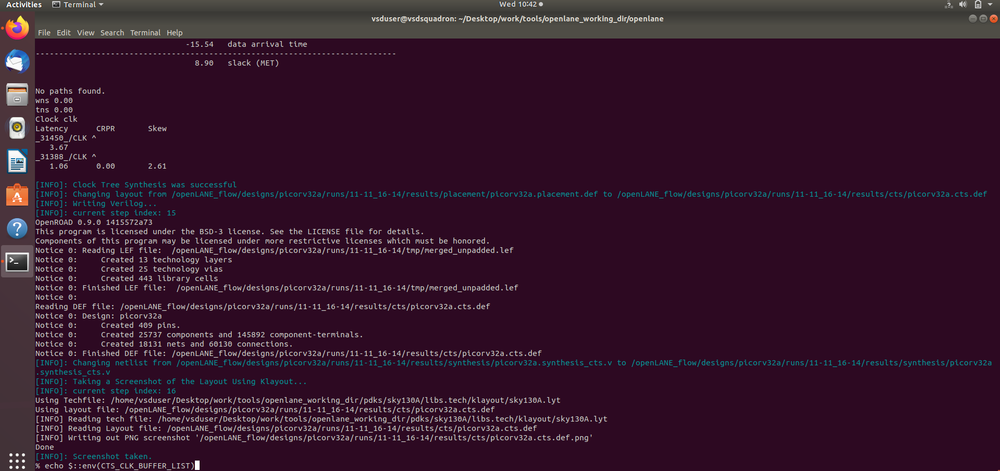

Then open OpenROAD:

```
# Display the clock buffer list currently used
echo $::env(CTS_CLK_BUFFER_LIST)

# Launch the OpenROAD tool
openroad

# Load the merged LEF file
read_lef /openLANE_flow/designs/picorv32a/runs/11-11_16-14/tmp/merged.lef

# Load the DEF file post CTS
read_def /openLANE_flow/designs/picorv32a/runs/11-11_16-14/results/cts/picorv32a.cts.def

# Create a new OpenROAD database
write_db pico_cts1.db

# Load the previously created database
read_db pico_cts.db

# Load the synthesized Verilog netlist
read_verilog /openLANE_flow/designs/picorv32a/runs/11-11_16-14/results/synthesis/picorv32a.synthesis_cts.v

# Load the corresponding standard cell library
read_liberty $::env(LIB_SYNTH_COMPLETE)

# Link design and library
link_design picorv32a

# Load the base SDC file
read_sdc /openLANE_flow/designs/picorv32a/src/my_base.sdc

# Treat all clocks as propagated
set_propagated_clock [all_clocks]
```

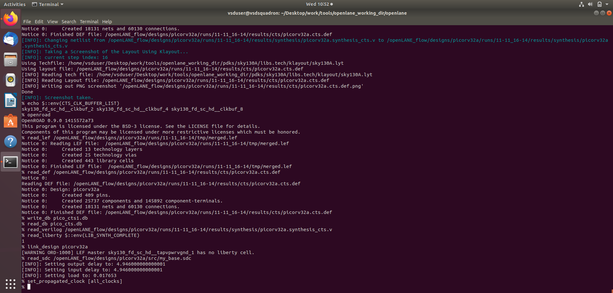

```
# Generate a detailed timing report for both minimum and maximum delay paths
report_checks -path_delay min_max -fields {slew trans net cap input_pins} -format full_clock_expanded -digits 4
```

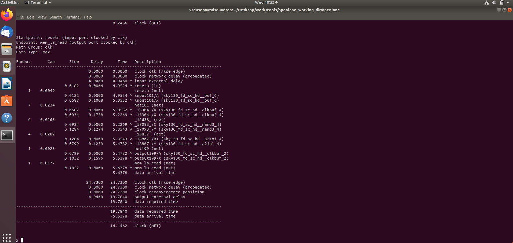

```
# Report skew values for hold analysis
report_clock_skew -hold

# Report skew values for setup analysis
report_clock_skew -setup

# Exit the OpenROAD environment
exit

# Display the current clock buffer list after CTS
echo $::env(CTS_CLK_BUFFER_LIST)
```

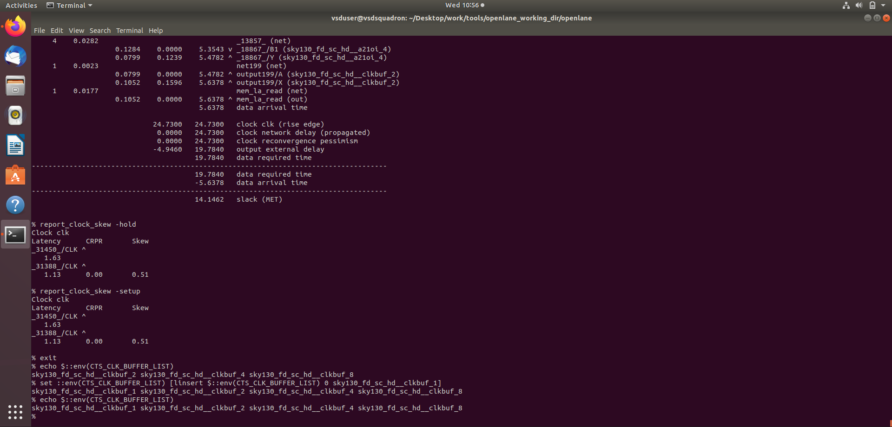


