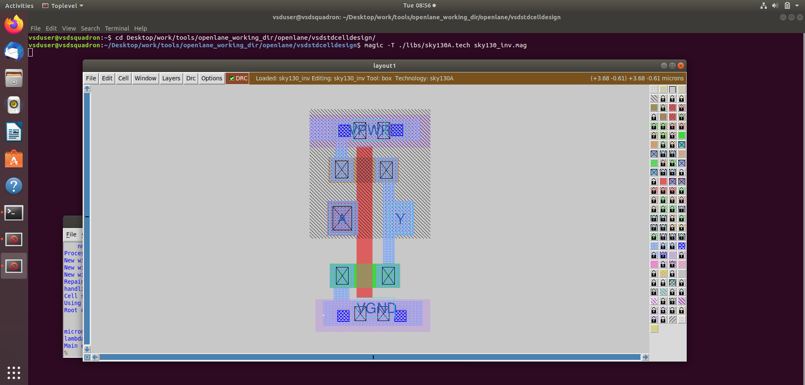
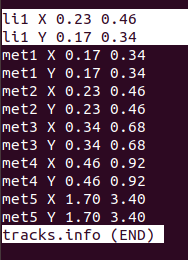
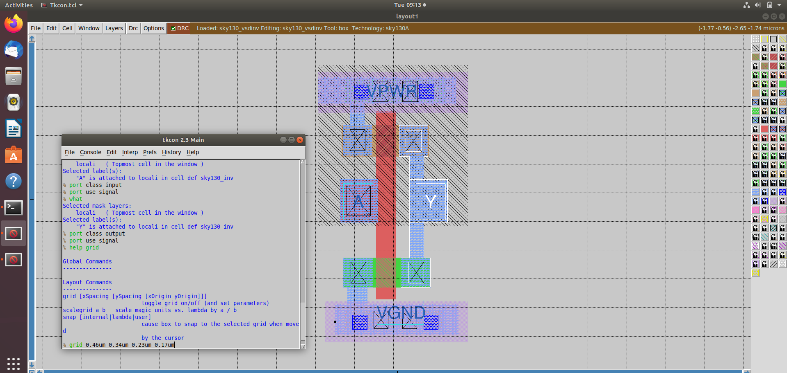
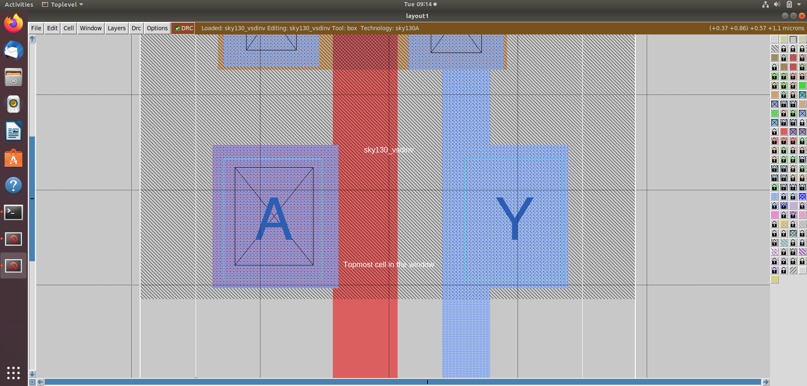
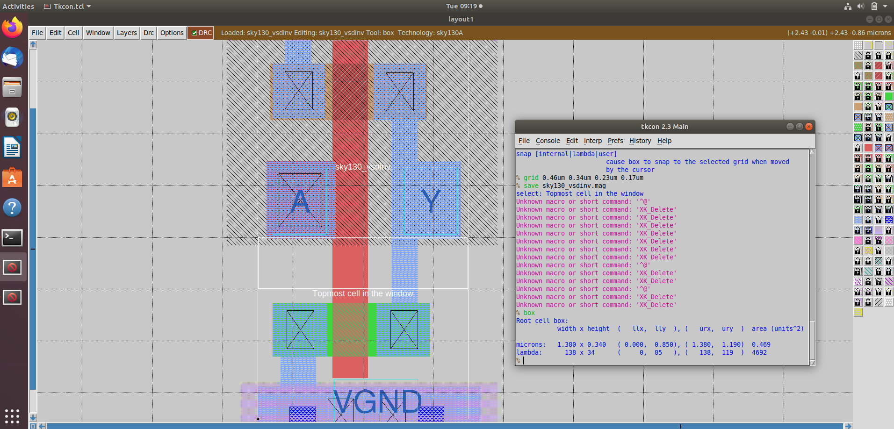
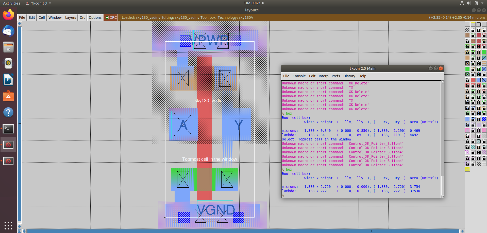
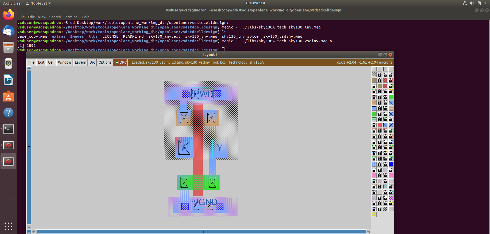
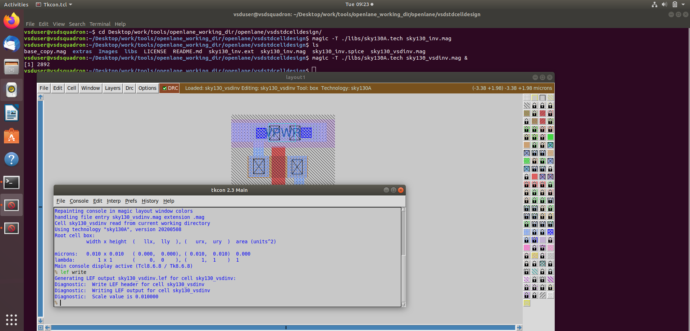
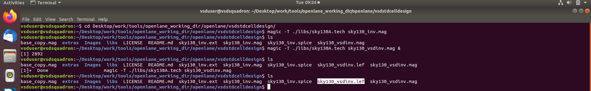

# Day 4 - Pre-layout timing analysis and importance of good clock tree

Let us check whether our inverter layout satisfies some conditions for good layout.

First, open the layout:

```tcl
cd Desktop/work/tools/openlane_working_dir/openlane/vsdstdcelldesign
magic -T ./lib/sky130A.tech sky130_inv.mag &
```



## Conditions for Good Layout

1. The input and output port of a standard cell must be between the vertical and horizontal grid lines.
2. The width of the standard cell must be an odd multiple of the horizontal grid value.
3. The height should be three times the vertical grid value.

The value of the vertical and horizontal grid can be determined from the **tracks.info** file located in the directory shown below:




From this **tracks.info** file, we can determine:

* Horizontal grid length = $$0.46,\mu m$$
* Vertical grid length = $$0.34,\mu m$$

So let us set  the grid accordingly in our layout




### Condition 1 Check



Hence, it satisfies the first condition.


### Condition 2 Check



The width of the standard cell is:
$$
1.38,\mu m - 0.00,\mu m = 1.38,\mu m = 3 \times 0.46,\mu m
$$

Hence, it satisfies the second condition.

### Condition 3 Check



The height of the standard cell is:
$$
2.72,\mu m - 0.00,\mu m = 2.72,\mu m = 8 \times 0.34,\mu m
$$

Hence, it satisfies the third condition.


Now save the layout.

```tcl
# Command to save in tkcon window
save sky130_vsdinv.mag
```

Then exit:

```tcl
exit
```

Now open the saved layout:

```tcl
# Command to open custom inverter layout in magic
magic -T ./lib/sky130A.tech sky130_vsdinv.mag &
```



Then write the LEF file.
In tkcon window, type:

```tcl
lef write
```



LEF file is created:


