# WEEK 6 - Day 5: Final Steps in RTL-to-GDS using TritonRoute and OpenSTA

## Detailed Routing Using TritonRoute

In this section, we will perform **detailed routing** using **TritonRoute** and analyze the results through Magic and OpenROAD.

```
# Display the current DEF file location being used by OpenLANE
echo $::env(CURRENT_DEF)

# Display the routing strategy value defined in configuration
echo $::env(ROUTING_STRATEGY)

# Execute the detailed routing process using TritonRoute engine
run_routing
```

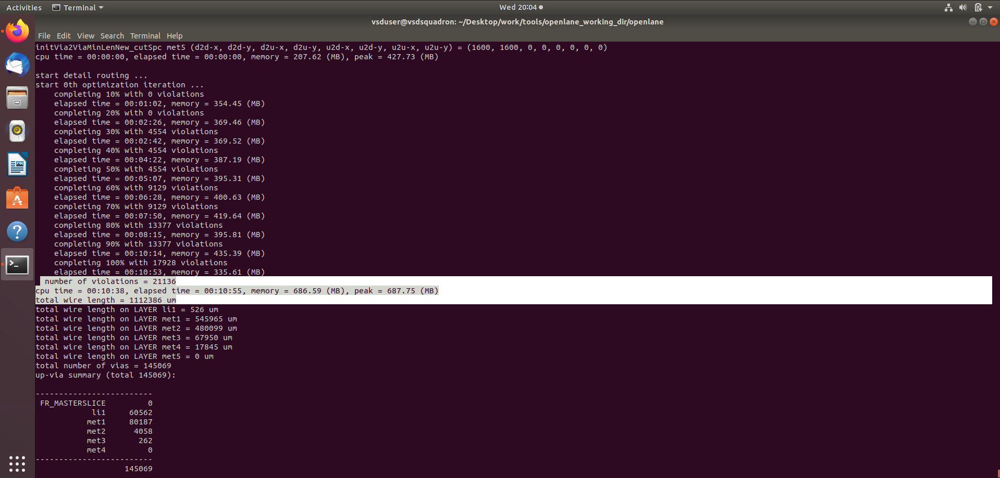

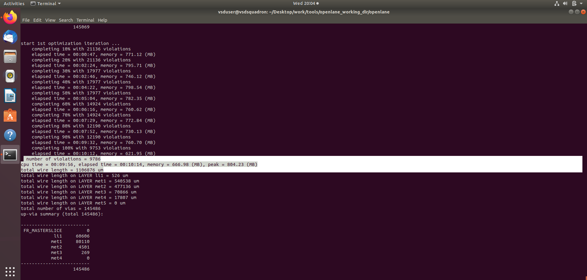

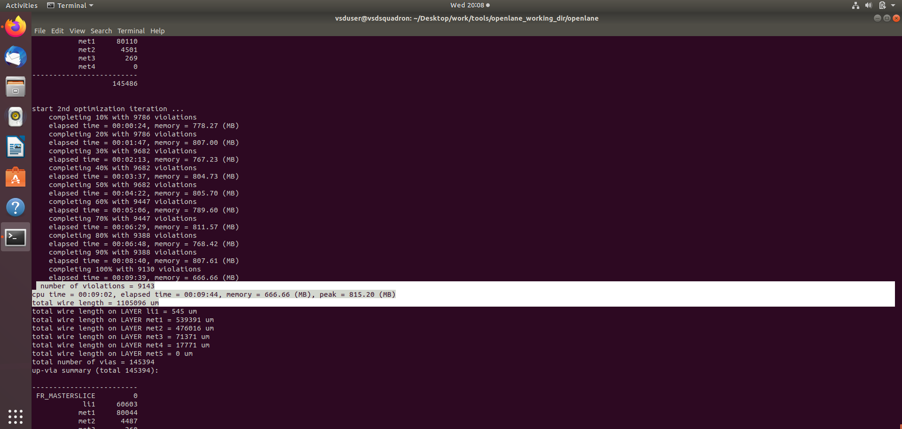

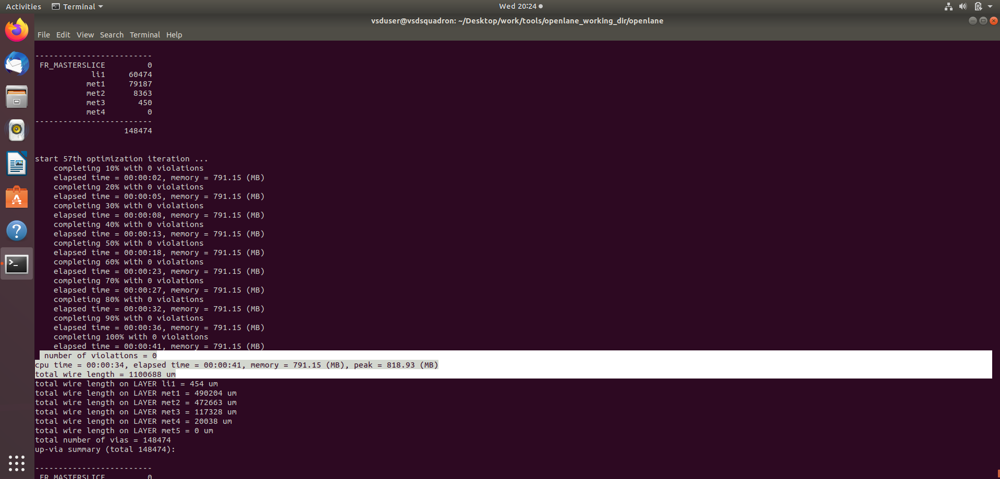

After each routing iteration, the total wire length and number of violations gradually decrease as the design becomes cleaner and more optimized.

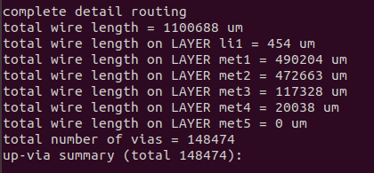

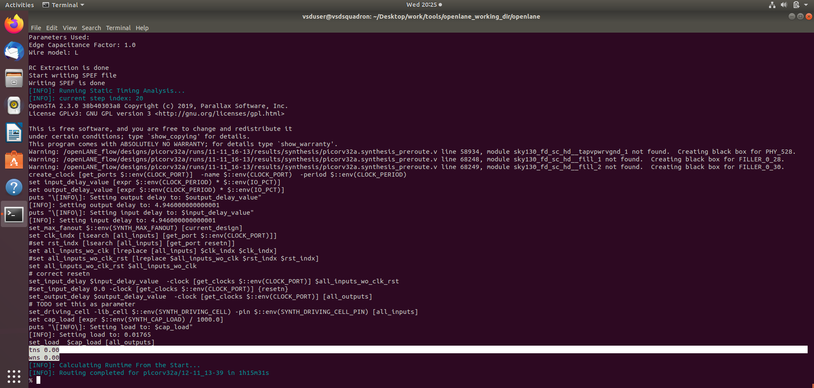

## Visualizing the Routed Layout in Magic

Once routing is completed, you can visualize the final routed layout in **Magic VLSI**.

```
# Navigate to the directory containing the routed DEF file
cd ~/Desktop/work/tools/openlane_working_dir/openlane/designs/picorv32a/runs/11-11_16-13/results/routing

# Launch Magic and load the routed DEF and technology LEF
magic -T ~/Desktop/work/tools/openlane_working_dir/pdks/sky130A/libs.tech/magic/sky130A.tech lef read ../../tmp/merged.lef def read picorv32a.def &
```

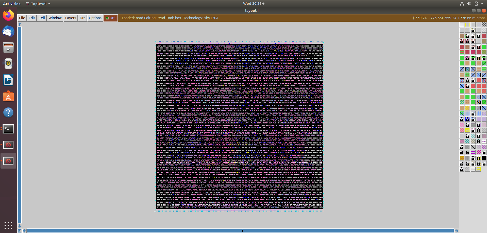

The above layout represents the design after performing detailed routing.
You can use zoom and pan tools within Magic to inspect the routed interconnections closely.

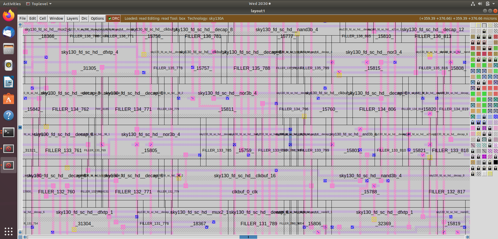

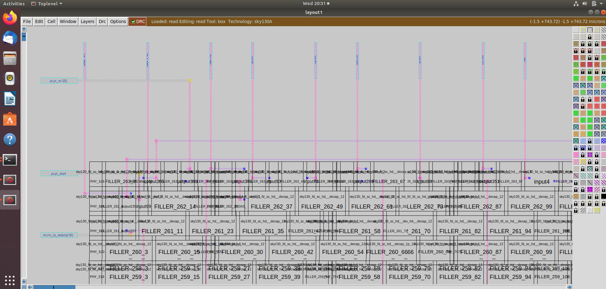

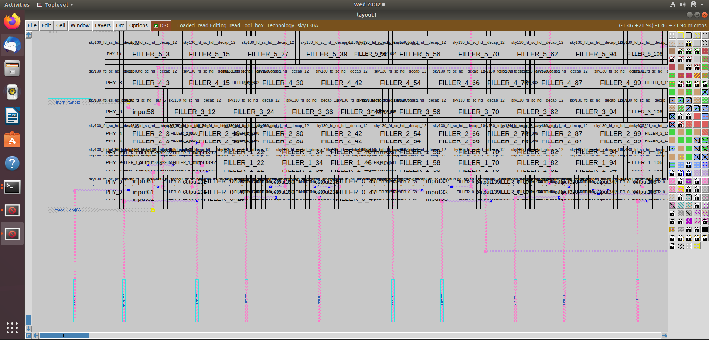

Next, let’s take a look at the **FastRoute guide** files available in the following directory:

`openlane/designs/picorv32a/runs/11-11_16-13/tmp/routing/`

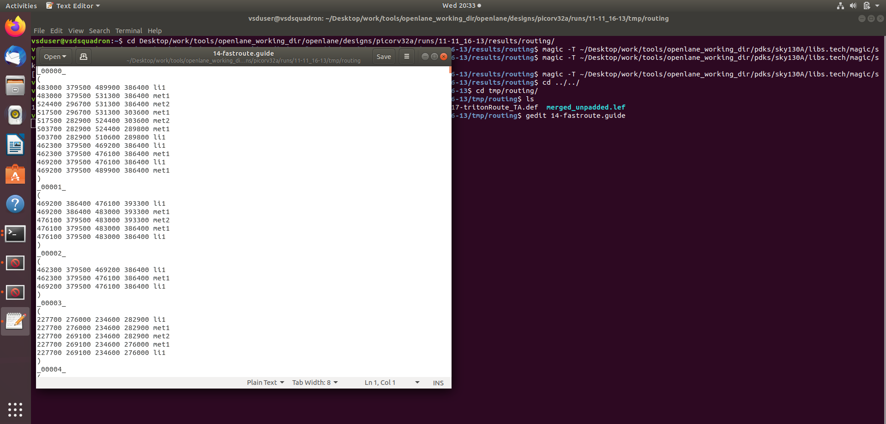

## Post-Routing Parasitic Extraction (SPEF Extraction)

After routing, we extract the **Standard Parasitic Exchange Format (SPEF)** file, which contains detailed parasitic capacitance and resistance values for accurate post-route timing analysis.

```
# Navigate to the directory containing the SPEF extractor
cd ~/Desktop/work/tools/openlane_working_dir/openlane/scripts/spef_extractor

# Execute the Python SPEF extraction script using merged LEF and routed DEF
python3 main.py -l ~/Desktop/work/tools/openlane_working_dir/openlane/designs/picorv32a/runs/11-11_16-13/tmp/merged.lef -d ~/Desktop/work/tools/openlane_working_dir/openlane/designs/picorv32a/runs/11-11_16-13/results/routing/picorv32a.def
```

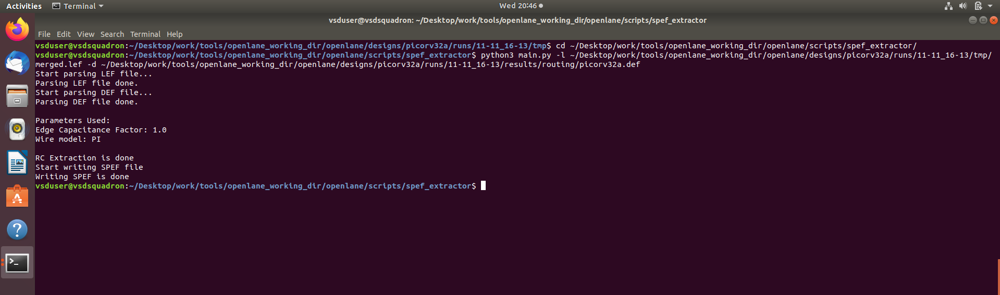

You can now view the generated `.spef` file inside:

`~/Desktop/work/tools/openlane_working_dir/openlane/designs/picorv32a/runs/11-11_16-13/results/routing/`

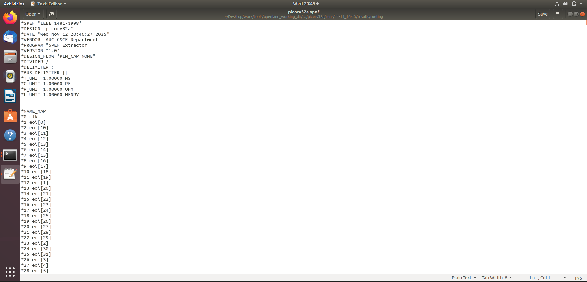

## Post-Routing OpenSTA Timing Analysis Using SPEF

Finally, we’ll perform **post-routing timing analysis** in **OpenROAD (OpenSTA)**, which uses the extracted parasitics to generate accurate setup and hold timing reports.

```
# Launch OpenROAD shell for timing analysis
openroad

# Load the technology and cell LEFs (used for layout geometry and standard cells)
read_lef /openLANE_flow/designs/picorv32a/runs/11-11_16-13/tmp/merged.lef

# Load the final routed DEF (includes interconnections and routing information)
read_def /openLANE_flow/designs/picorv32a/runs/11-11_16-13/results/routing/picorv32a.def

# Save OpenROAD database for reference or reuse
write_db pico_route.db

# Optionally reload the saved database
read_db pico_route.db

# Load the Verilog netlist generated after synthesis
read_verilog /openLANE_flow/designs/picorv32a/runs/11-11_16-13/results/synthesis/picorv32a.synthesis_preroute.v

# Load the complete Liberty timing models
read_liberty $::env(LIB_SYNTH_COMPLETE)

# Link the design’s top-level module with its corresponding libraries
link_design picorv32a

# Load the custom SDC file containing clock and timing constraints
read_sdc /openLANE_flow/designs/picorv32a/src/my_base.sdc

# Mark all defined clocks as propagated to include clock tree delays
set_propagated_clock [all_clocks]

# Load the extracted parasitic data for accurate delay calculations
read_spef /openLANE_flow/designs/picorv32a/runs/11-11_16-13/results/routing/picorv32a.spef
```

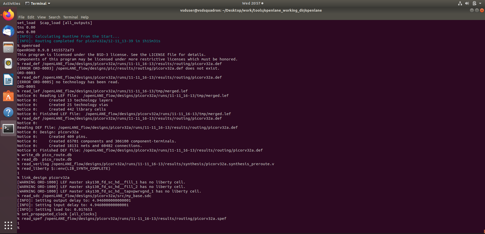

```
# Generate a timing report showing both setup and hold paths
report_checks -path_delay min_max -fields {slew trans net cap input_pins} -format full_clock_expanded -digits 4
```

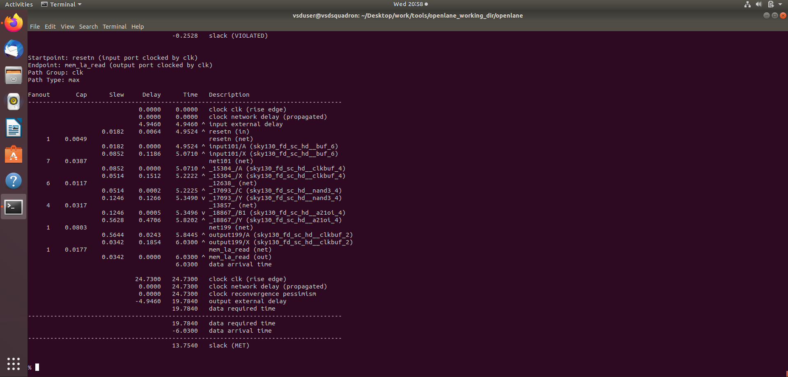

```
% report_checks -path_delay min_max -fields {slew trans net cap input_pins} -format full_clock_expanded -digits 4
Startpoint: _32088_ (rising edge-triggered flip-flop clocked by clk)
Endpoint: _32089_ (rising edge-triggered flip-flop clocked by clk)
Path Group: clk
Path Type: min

Fanout       Cap      Slew     Delay      Time   Description
-------------------------------------------------------------------------------------
                              0.0000    0.0000   clock clk (rise edge)
                              0.0000    0.0000   clock source latency
                    0.0225    0.0100    0.0100 ^ clk (in)
     1    0.0079                                 clk (net)
                    0.0225    0.0000    0.0100 ^ clkbuf_0_clk/A (sky130_fd_sc_hd__clkbuf_16)
                    0.0328    0.1071    0.1171 ^ clkbuf_0_clk/X (sky130_fd_sc_hd__clkbuf_16)
     2    0.0093                                 clknet_0_clk (net)
                    0.0328    0.0001    0.1171 ^ clkbuf_1_1_0_clk/A (sky130_fd_sc_hd__clkbuf_1)
                    0.1139    0.1259    0.2430 ^ clkbuf_1_1_0_clk/X (sky130_fd_sc_hd__clkbuf_1)
     1    0.0090                                 clknet_1_1_0_clk (net)
                    0.1139    0.0004    0.2434 ^ clkbuf_1_1_1_clk/A (sky130_fd_sc_hd__clkbuf_1)
                    0.1101    0.1465    0.3900 ^ clkbuf_1_1_1_clk/X (sky130_fd_sc_hd__clkbuf_1)
     1    0.0087                                 clknet_1_1_1_clk (net)
                    0.1101    0.0004    0.3904 ^ clkbuf_1_1_2_clk/A (sky130_fd_sc_hd__clkbuf_1)
                    0.0985    0.1372    0.5276 ^ clkbuf_1_1_2_clk/X (sky130_fd_sc_hd__clkbuf_1)
     2    0.0077                                 clknet_1_1_2_clk (net)
                    0.0985    0.0006    0.5282 ^ clkbuf_2_3_0_clk/A (sky130_fd_sc_hd__clkbuf_1)
                    0.1047    0.1387    0.6669 ^ clkbuf_2_3_0_clk/X (sky130_fd_sc_hd__clkbuf_1)
     1    0.0082                                 clknet_2_3_0_clk (net)
                    0.1047    0.0003    0.6672 ^ clkbuf_2_3_1_clk/A (sky130_fd_sc_hd__clkbuf_1)
                    0.1062    0.1414    0.8087 ^ clkbuf_2_3_1_clk/X (sky130_fd_sc_hd__clkbuf_1)
     1    0.0084                                 clknet_2_3_1_clk (net)
                    0.1062    0.0004    0.8090 ^ clkbuf_2_3_2_clk/A (sky130_fd_sc_hd__clkbuf_1)
                    0.1192    0.1510    0.9600 ^ clkbuf_2_3_2_clk/X (sky130_fd_sc_hd__clkbuf_1)
     2    0.0095                                 clknet_2_3_2_clk (net)
                    0.1192    0.0002    0.9602 ^ clkbuf_3_6_0_clk/A (sky130_fd_sc_hd__clkbuf_1)
                    0.0936    0.1363    1.0965 ^ clkbuf_3_6_0_clk/X (sky130_fd_sc_hd__clkbuf_1)
     1    0.0072                                 clknet_3_6_0_clk (net)
                    0.0936    0.0002    1.0968 ^ clkbuf_3_6_1_clk/A (sky130_fd_sc_hd__clkbuf_1)
                    0.1087    0.1402    1.2370 ^ clkbuf_3_6_1_clk/X (sky130_fd_sc_hd__clkbuf_1)
     2    0.0086                                 clknet_3_6_1_clk (net)
                    0.1087    0.0004    1.2373 ^ clkbuf_4_12_0_clk/A (sky130_fd_sc_hd__clkbuf_1)
                    0.0166    0.0744    1.3117 ^ clkbuf_4_12_0_clk/X (sky130_fd_sc_hd__clkbuf_1)
     2    0.0001                                 clknet_4_12_0_clk (net)
                    0.0166    0.0000    1.3117 ^ clkbuf_5_24_0_clk/A (sky130_fd_sc_hd__clkbuf_1)
                    0.0544    0.0784    1.3901 ^ clkbuf_5_24_0_clk/X (sky130_fd_sc_hd__clkbuf_1)
     1    0.0037                                 clknet_5_24_0_clk (net)
                    0.0544    0.0000    1.3901 ^ clkbuf_5_24_1_clk/A (sky130_fd_sc_hd__clkbuf_1)
                    0.1283    0.1435    1.5336 ^ clkbuf_5_24_1_clk/X (sky130_fd_sc_hd__clkbuf_1)
     9    0.0103                                 clknet_5_24_1_clk (net)
                    0.1283    0.0000    1.5336 ^ clkbuf_leaf_85_clk/A (sky130_fd_sc_hd__clkbuf_16)
                    0.0297    0.1418    1.6754 ^ clkbuf_leaf_85_clk/X (sky130_fd_sc_hd__clkbuf_16)
     9    0.0057                                 clknet_leaf_85_clk (net)
                    0.0297    0.0000    1.6754 ^ _32088_/CLK (sky130_fd_sc_hd__dfxtp_2)
                    0.0788    0.3531    2.0285 v _32088_/Q (sky130_fd_sc_hd__dfxtp_2)
     2    0.0292                                 pcpi_mul.active[0] (net)
                    0.0789    0.0021    2.0306 v _16809_/B (sky130_fd_sc_hd__and2_1)
                    0.0301    0.1596    2.1903 v _16809_/X (sky130_fd_sc_hd__and2_1)
     1    0.0018                                 _03729_ (net)
                    0.0301    0.0000    2.1903 v _32089_/D (sky130_fd_sc_hd__dfxtp_4)
                                        2.1903   data arrival time

                              0.0000    0.0000   clock clk (rise edge)
                              0.0000    0.0000   clock source latency
                    0.0225    0.0100    0.0100 ^ clk (in)
     1    0.0079                                 clk (net)
                    0.0225    0.0000    0.0100 ^ clkbuf_0_clk/A (sky130_fd_sc_hd__clkbuf_16)
                    0.0328    0.1071    0.1171 ^ clkbuf_0_clk/X (sky130_fd_sc_hd__clkbuf_16)
     2    0.0093                                 clknet_0_clk (net)
                    0.0328    0.0001    0.1172 ^ clkbuf_1_0_0_clk/A (sky130_fd_sc_hd__clkbuf_1)
                    0.1194    0.1297    0.2469 ^ clkbuf_1_0_0_clk/X (sky130_fd_sc_hd__clkbuf_1)
     1    0.0095                                 clknet_1_0_0_clk (net)
                    0.1194    0.0004    0.2473 ^ clkbuf_1_0_1_clk/A (sky130_fd_sc_hd__clkbuf_1)
                    0.1059    0.1451    0.3924 ^ clkbuf_1_0_1_clk/X (sky130_fd_sc_hd__clkbuf_1)
     1    0.0083                                 clknet_1_0_1_clk (net)
                    0.1059    0.0004    0.3928 ^ clkbuf_1_0_2_clk/A (sky130_fd_sc_hd__clkbuf_1)
                    0.0895    0.1299    0.5226 ^ clkbuf_1_0_2_clk/X (sky130_fd_sc_hd__clkbuf_1)
     2    0.0069                                 clknet_1_0_2_clk (net)
                    0.0895    0.0001    0.5228 ^ clkbuf_2_1_0_clk/A (sky130_fd_sc_hd__clkbuf_1)
                    0.1072    0.1381    0.6608 ^ clkbuf_2_1_0_clk/X (sky130_fd_sc_hd__clkbuf_1)
     1    0.0085                                 clknet_2_1_0_clk (net)
                    0.1072    0.0004    0.6612 ^ clkbuf_2_1_1_clk/A (sky130_fd_sc_hd__clkbuf_1)
                    0.1149    0.1481    0.8093 ^ clkbuf_2_1_1_clk/X (sky130_fd_sc_hd__clkbuf_1)
     1    0.0091                                 clknet_2_1_1_clk (net)
                    0.1149    0.0004    0.8097 ^ clkbuf_2_1_2_clk/A (sky130_fd_sc_hd__clkbuf_1)
                    0.1135    0.1493    0.9591 ^ clkbuf_2_1_2_clk/X (sky130_fd_sc_hd__clkbuf_1)
     2    0.0090                                 clknet_2_1_2_clk (net)
                    0.1135    0.0001    0.9591 ^ clkbuf_3_2_0_clk/A (sky130_fd_sc_hd__clkbuf_1)
                    0.0841    0.1280    1.0871 ^ clkbuf_3_2_0_clk/X (sky130_fd_sc_hd__clkbuf_1)
     1    0.0064                                 clknet_3_2_0_clk (net)
                    0.0841    0.0002    1.0873 ^ clkbuf_3_2_1_clk/A (sky130_fd_sc_hd__clkbuf_1)
                    0.0336    0.0830    1.1703 ^ clkbuf_3_2_1_clk/X (sky130_fd_sc_hd__clkbuf_1)
     2    0.0018                                 clknet_3_2_1_clk (net)
                    0.0336    0.0000    1.1703 ^ clkbuf_4_4_0_clk/A (sky130_fd_sc_hd__clkbuf_1)
                    0.1128    0.1255    1.2958 ^ clkbuf_4_4_0_clk/X (sky130_fd_sc_hd__clkbuf_1)
     2    0.0090                                 clknet_4_4_0_clk (net)
                    0.1128    0.0001    1.2959 ^ clkbuf_5_9_0_clk/A (sky130_fd_sc_hd__clkbuf_1)
                    0.0694    0.1173    1.4132 ^ clkbuf_5_9_0_clk/X (sky130_fd_sc_hd__clkbuf_1)
     1    0.0051                                 clknet_5_9_0_clk (net)
                    0.0694    0.0001    1.4133 ^ clkbuf_5_9_1_clk/A (sky130_fd_sc_hd__clkbuf_1)
                    1.0234    0.7670    2.1802 ^ clkbuf_5_9_1_clk/X (sky130_fd_sc_hd__clkbuf_1)
     9    0.0888                                 clknet_5_9_1_clk (net)
                    1.0234    0.0022    2.1824 ^ clkbuf_leaf_62_clk/A (sky130_fd_sc_hd__clkbuf_16)
                    0.0645    0.2955    2.4779 ^ clkbuf_leaf_62_clk/X (sky130_fd_sc_hd__clkbuf_16)
     8    0.0189                                 clknet_leaf_62_clk (net)
                    0.0645    0.0001    2.4780 ^ _32089_/CLK (sky130_fd_sc_hd__dfxtp_4)
                              0.0000    2.4780   clock reconvergence pessimism
                             -0.0350    2.4430   library hold time
                                        2.4430   data required time
-------------------------------------------------------------------------------------
                                        2.4430   data required time
                                       -2.1903   data arrival time
-------------------------------------------------------------------------------------
                                       -0.2528   slack (VIOLATED)


Startpoint: resetn (input port clocked by clk)
Endpoint: mem_la_read (output port clocked by clk)
Path Group: clk
Path Type: max

Fanout       Cap      Slew     Delay      Time   Description
-------------------------------------------------------------------------------------
                              0.0000    0.0000   clock clk (rise edge)
                              0.0000    0.0000   clock network delay (propagated)
                              4.9460    4.9460 ^ input external delay
                    0.0182    0.0064    4.9524 ^ resetn (in)
     1    0.0049                                 resetn (net)
                    0.0182    0.0000    4.9524 ^ input101/A (sky130_fd_sc_hd__buf_6)
                    0.0852    0.1186    5.0710 ^ input101/X (sky130_fd_sc_hd__buf_6)
     7    0.0387                                 net101 (net)
                    0.0852    0.0000    5.0710 ^ _15304_/A (sky130_fd_sc_hd__clkbuf_4)
                    0.0514    0.1512    5.2222 ^ _15304_/X (sky130_fd_sc_hd__clkbuf_4)
     6    0.0117                                 _12638_ (net)
                    0.0514    0.0002    5.2225 ^ _17093_/C (sky130_fd_sc_hd__nand3_4)
                    0.1246    0.1266    5.3490 v _17093_/Y (sky130_fd_sc_hd__nand3_4)
     4    0.0317                                 _13857_ (net)
                    0.1246    0.0005    5.3496 v _18867_/B1 (sky130_fd_sc_hd__a21oi_4)
                    0.5628    0.4706    5.8202 ^ _18867_/Y (sky130_fd_sc_hd__a21oi_4)
     1    0.0803                                 net199 (net)
                    0.5644    0.0243    5.8445 ^ output199/A (sky130_fd_sc_hd__clkbuf_2)
                    0.0342    0.1854    6.0300 ^ output199/X (sky130_fd_sc_hd__clkbuf_2)
     1    0.0177                                 mem_la_read (net)
                    0.0342    0.0000    6.0300 ^ mem_la_read (out)
                                        6.0300   data arrival time

                             24.7300   24.7300   clock clk (rise edge)
                              0.0000   24.7300   clock network delay (propagated)
                              0.0000   24.7300   clock reconvergence pessimism
                             -4.9460   19.7840   output external delay
                                       19.7840   data required time
-------------------------------------------------------------------------------------
                                       19.7840   data required time
                                       -6.0300   data arrival time
-------------------------------------------------------------------------------------
                                       13.7540   slack (MET)


```

