# WEEK 7 — BabySoC Physical Design & Post-Route SPEF Generation


## Installing OpenROAD-flow-scripts

Clone the repository and install all required dependencies:

```
git clone --recursive https://github.com/The-OpenROAD-Project/OpenROAD-flow-scripts
cd OpenROAD-flow-scripts
sudo ./setup.sh
./build_openroad.sh --local
```


> [!NOTE]
> 
> If you experience error while building OpenROAD-flow-scripts like this:
>
> 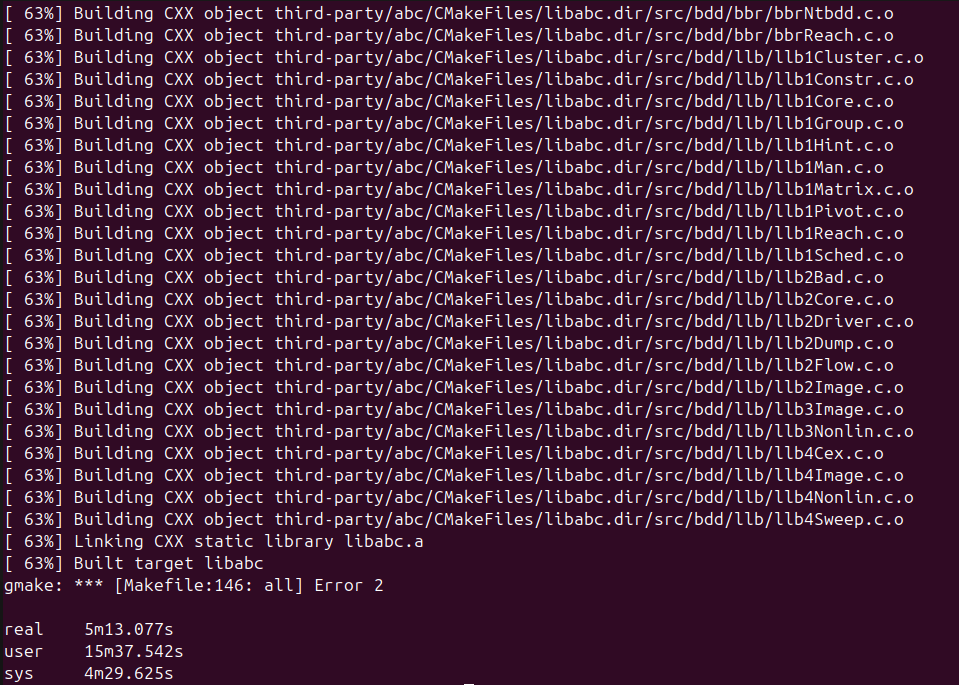
>
> Try building OpenROAD-flow-scripts with this command instead:
>
> ```bash
> ./build_openroad.sh --local --threads 1 --openroad-args "-DENABLE_TESTS=OFF"
> ```

After installation, verify the tools:

```
source ./env.sh
yosys -help
openroad -help
```


Build the flow infrastructure:

```
cd flow
make
```

To open the graphical interface in OpenROAD:

```
make gui_final
```


## Preparing the VSDBabySoC Environment

Move into:

```
cd ~/OpenROAD-flow-scripts/flow/designs/src/vsdbabysoc/
```

Copy the following Verilog and config files from your original VSDBABYSOC directory to the current directory:

* avsddac.v
* avsdpll.v
* clk_gate.v
* macro.cfg
* pin_order.cfg
* rvmyth.v
* rvmyth_gen.v
* testbench.rvmyth.post-routing.v
* testbench.v
* vsdbabysoc.v

Next, go to:

```
cd ~/OpenROAD-flow-scripts/flow/designs/sky130hd/
```

Copy these directories/files from the VSDBABYSOC source to current directory:

* gds/
* include/
* lef/
* lib/
* macro.cfg
* pin_order.cfg
* vsdbabysoc_synthesis.sdc


## Creating the config.mk File

Create a file named **config.mk** inside:

```
OpenROAD-flow-scripts/flow/designs/sky130hd/vsdbabysoc/
```

Add the following content:

```
export DESIGN_NICKNAME = vsdbabysoc
export DESIGN_NAME = vsdbabysoc
export PLATFORM    = sky130hd
export DESIGN_HOME = /home/madank/OpenROAD-flow-scripts/flow/designs

# redefine comments: specifying optional blackbox verilog
# export VERILOG_FILES_BLACKBOX = $(DESIGN_HOME)/src/$(DESIGN_NICKNAME)/IPs/*.v
# redefine comments: automatic discovery of verilog sources
# export VERILOG_FILES = $(sort $(wildcard $(DESIGN_HOME)/src/$(DESIGN_NICKNAME)/*.v))

# explicit source list for clarity
export VERILOG_FILES = $(DESIGN_HOME)/src/$(DESIGN_NICKNAME)/vsdbabysoc.v \
                       $(DESIGN_HOME)/src/$(DESIGN_NICKNAME)/rvmyth.v \
                       $(DESIGN_HOME)/src/$(DESIGN_NICKNAME)/clk_gate.v

export SDC_FILE      = $(DESIGN_HOME)/$(PLATFORM)/$(DESIGN_NICKNAME)/vsdbabysoc_synthesis.sdc

export vsdbabysoc_DIR = $(DESIGN_HOME)/$(PLATFORM)/$(DESIGN_NICKNAME)

export VERILOG_INCLUDE_DIRS = $(wildcard $(vsdbabysoc_DIR)/include/)

export ADDITIONAL_GDS  = $(wildcard $(vsdbabysoc_DIR)/gds/*.gds)
export ADDITIONAL_LEFS = $(wildcard $(vsdbabysoc_DIR)/lef/*.lef)

# clock configurations
export CLOCK_PORT = CLK
export CLOCK_NET  = $(CLOCK_PORT)

# pin and macro placement
export FP_PIN_ORDER_CFG = $(vsdbabysoc_DIR)/pin_order.cfg
export MACRO_PLACEMENT_CFG = $(vsdbabysoc_DIR)/macro.cfg

# floorplan and dimensions
export DIE_AREA   = 0 0 1600 1600
export CORE_AREA  = 20 20 1590 1590

# placement
export PLACE_PINS_ARGS = -exclude left:0-600 -exclude left:1000-1600 -exclude right:* -exclude top:* -exclude bottom:*

# timing adjustments
export TNS_END_PERCENT     = 100
export REMOVE_ABC_BUFFERS  = 1

# CTS tuning
export CTS_BUF_DISTANCE = 600
export SKIP_GATE_CLONING = 1

# magic options
export MAGIC_ZEROIZE_ORIGIN = 0
export MAGIC_EXT_USE_GDS    = 1

# export CORE_UTILIZATION=0.1  # Reduce this value to allow more whitespace for routing.
```


Move into OpenROAD-flow-scripts/flow:

```
cd OpenROAD-flow-scripts/flow
```


## Running RTL-to-GDSII Flow

### Synthesis

```
make DESIGN_CONFIG=./designs/sky130hd/vsdbabysoc/config.mk synth
```


Synthesis result netlist:


Synthesis statistics:


Check for synthesis issues:


## Floorplan

```
make DESIGN_CONFIG=./designs/sky130hd/vsdbabysoc/config.mk floorplan
```


View floorplan in GUI:

```
make DESIGN_CONFIG=./designs/sky130hd/vsdbabysoc/config.mk gui_floorplan
```


---

## Placement

```
make DESIGN_CONFIG=./designs/sky130hd/vsdbabysoc/config.mk place
```


Open placement GUI:

```
make DESIGN_CONFIG=./designs/sky130hd/vsdbabysoc/config.mk gui_place
```


To visualize density, enable **Placement Density** under Heat Maps:


Pin density can also be examined:


## Clock Tree Synthesis (CTS)

```
make DESIGN_CONFIG=./designs/sky130hd/vsdbabysoc/config.mk cts
```


View CTS in GUI:

```
make DESIGN_CONFIG=./designs/sky130hd/vsdbabysoc/config.mk gui_cts
```


Open **Clock Tree Viewer** through the GUI menu:


Inspect buffer properties:


Check setup timing details:


Hold timing details:


Slack histograms:


CTS report is available at:

```
OpenROAD-flow-scripts/flow/reports/sky130hd/vsdbabysoc/base/4_cts_final.rpt
```


## Routing

```
make DESIGN_CONFIG=./designs/sky130hd/vsdbabysoc/config.mk route
```


To visualize the routed layout using the GUI:

```
make DESIGN_CONFIG=./designs/sky130hd/vsdbabysoc/config.mk gui_route
```

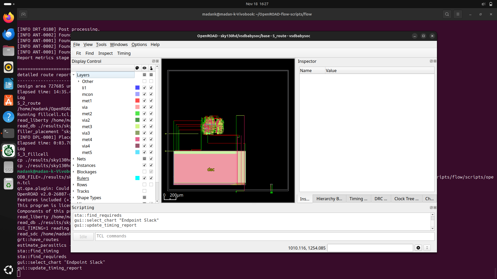

Inside the OpenROAD GUI, the routed nets can be inspected. Below is the view showing details for the `VCO_IN` net:

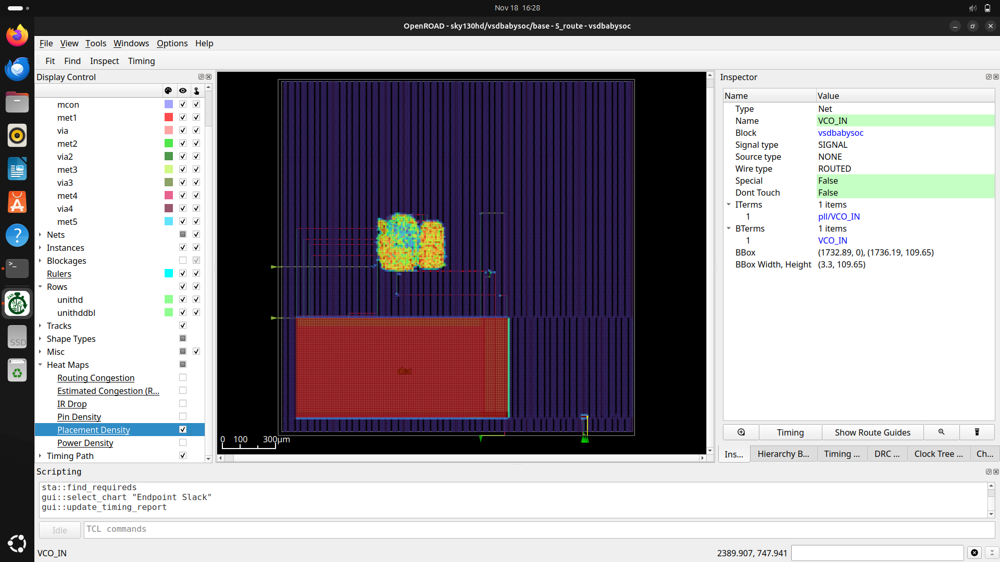

Routing congestion heatmaps can also be enabled to analyze congestion visually.

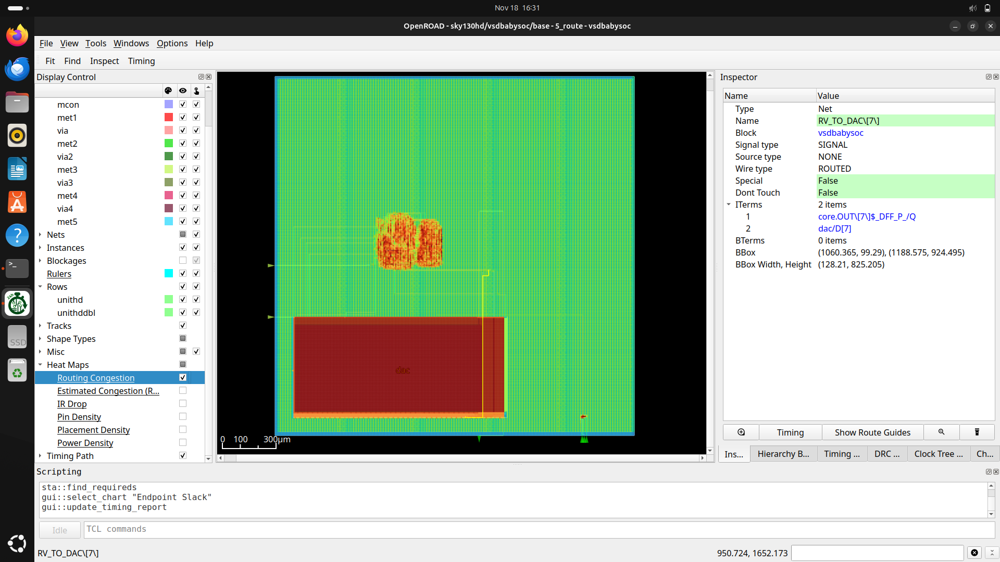

The routed clock net (`clknet`) is also visible in the routed design.

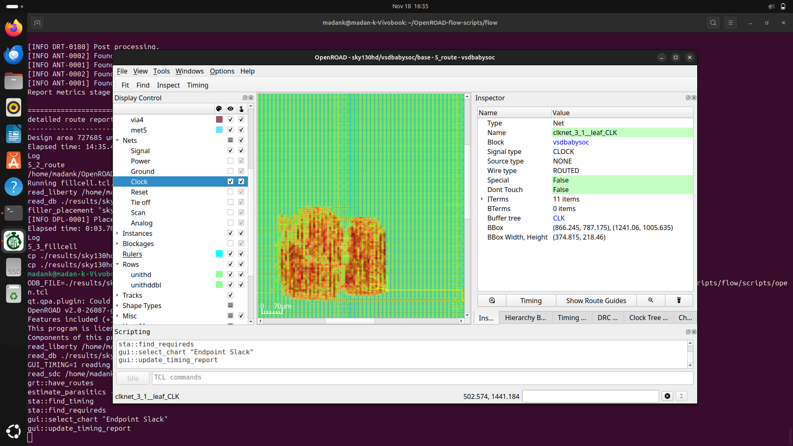

A closer look at a selected region is shown:

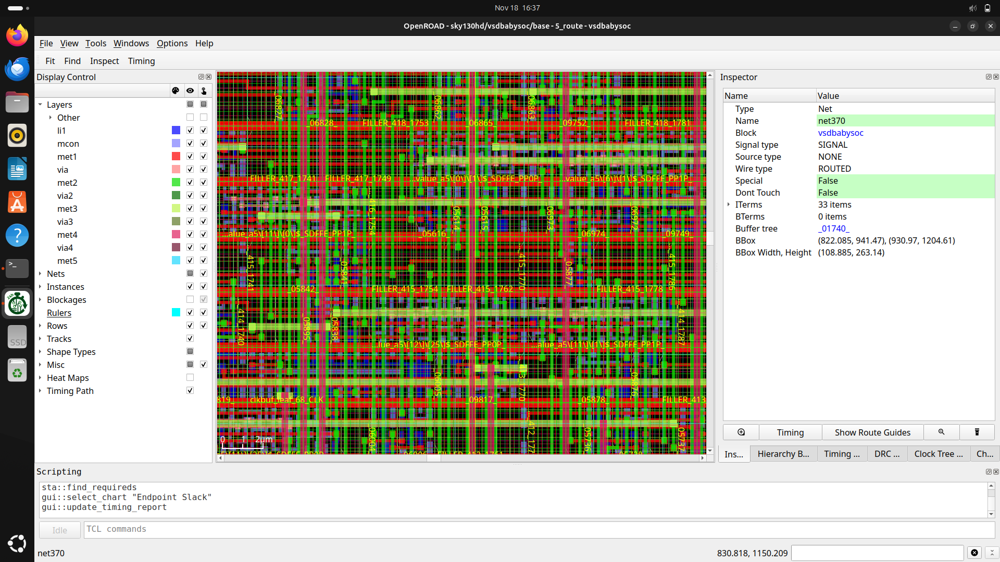

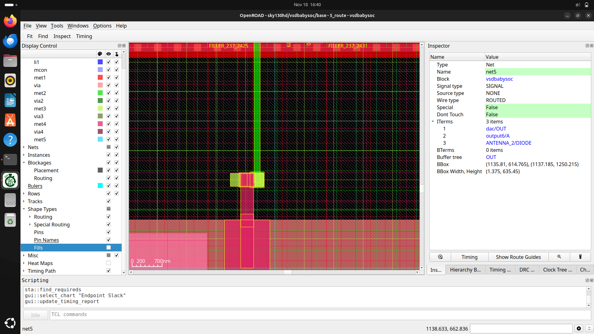

Timing results after routing can be observed using the following command inside the scripting terminal of the GUI:

```
report_checks
```

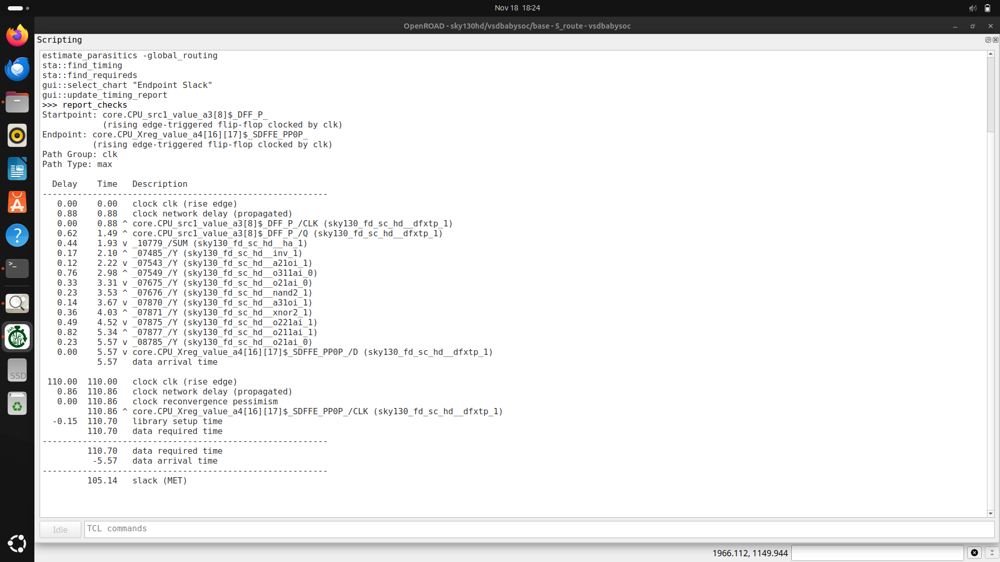

Generated logs for the routing stage are available under:

```
OpenROAD-flow-scripts/flow/logs/sky130hd/vsdbabysoc/base/
```

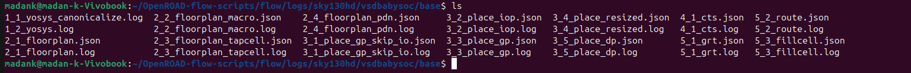


> [!NOTE]
> During routing, you may encounter an error similar to the one shown below:
> 
> 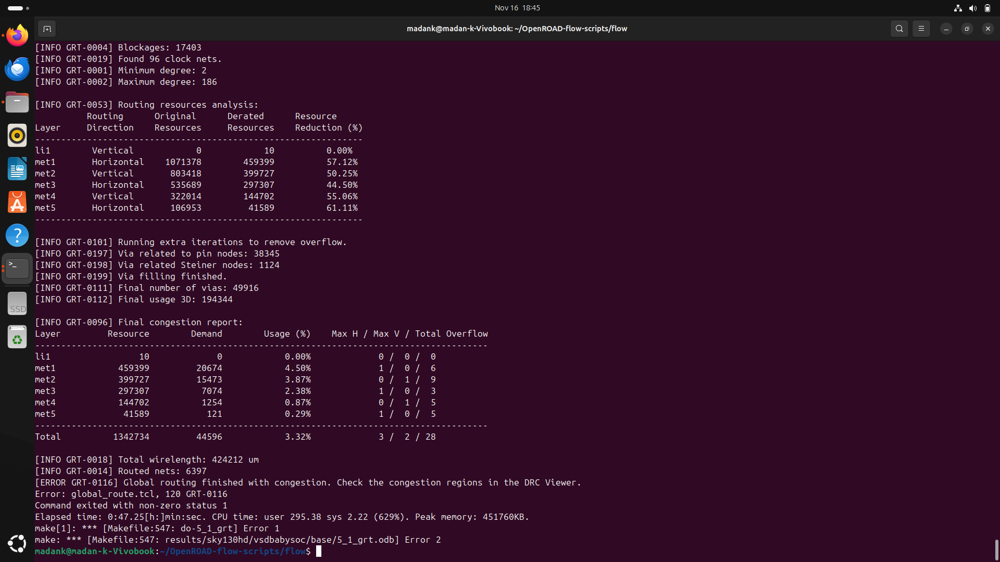
> 
> This indicates routing congestion during global routing.
>
> The cause of this congestion and the method to fix it are explained [HERE](#️-routing-congestion-problem)


# Creating the DEF File

A DEF (.def) file can be generated from the OpenROAD database (.odb). This helps in exporting the complete physical layout description.

```
cd ~/OpenROAD-flow-scripts
source env.sh

cd flow
openroad

read_db /home/madank/OpenROAD-flow-scripts/flow/results/sky130hd/vsdbabysoc/base/5_route.odb

write_def /home/madank/OpenROAD-flow-scripts/flow/results/sky130hd/vsdbabysoc/base/5_route.def
```


The created DEF file is shown here:

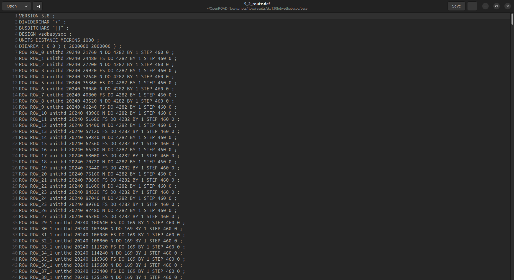

# Generating Post-Route SPEF File

A SPEF file captures the extracted parasitics (resistance, capacitance) of routed nets. It is essential for accurate post-route timing analysis.

Invoke OpenROAD:

```
cd ~/OpenROAD-flow-scripts
source env.sh
cd flow/
openroad
```

Load necessary LEF files:

```
read_lef /home/madank/OpenROAD-flow-scripts/flow/designs/sky130hd/vsdbabysoc/lef/sky130hd.lef
read_lef /home/madank/OpenROAD-flow-scripts/flow/designs/sky130hd/vsdbabysoc/lef/avsdpll.lef
read_lef /home/madank/OpenROAD-flow-scripts/flow/designs/sky130hd/vsdbabysoc/lef/avsddac.lef
```

Load the timing library file:

```
read_liberty /home/madank/OpenROAD-flow-scripts/flow/platforms/sky130hd/lib/sky130_fd_sc_hd__tt_025C_1v80.lib
```

Load the layout DEF:

```
read_def /home/madank/OpenROAD-flow-scripts/flow/results/sky130hd/vsdbabysoc/base/5_route.def
```

Before parasitic extraction, ensure the required models exist. Create the `external-resources/` directory inside `~/OpenROAD-flow-scripts/` and clone the open_pdks repository:

```
git clone https://github.com/RTimothyEdwards/open_pdks.git
```

Define the extraction model file.
(*rewritten comment → “Assigning the model file used for the selected process corner”*):

```
define_process_corner -ext_model_index 0 /home/madank/OpenROAD-flow-scripts/external-resources/open_pdks/sky130/openlane/rules.openrcx.sky130A.nom.calibre
```

Extract parasitics.
(*rewritten comment → “This performs RC extraction using the routed geometry”*):

```
extract_parasitics -ext_model_file /home/madank/OpenROAD-flow-scripts/external-resources/open_pdks/sky130/openlane/rules.openrcx.sky130A.nom.calibre
```

Write the SPEF file:

```
write_spef /home/madank/OpenROAD-flow-scripts/flow/designs/sky130hd/vsdbabysoc/vsdbabysoc.spef
```

Export the post-route Verilog netlist:

```
write_verilog /home/madank/OpenROAD-flow-scripts/flow/designs/sky130hd/vsdbabysoc/vsdbabysoc_post_place.v
```

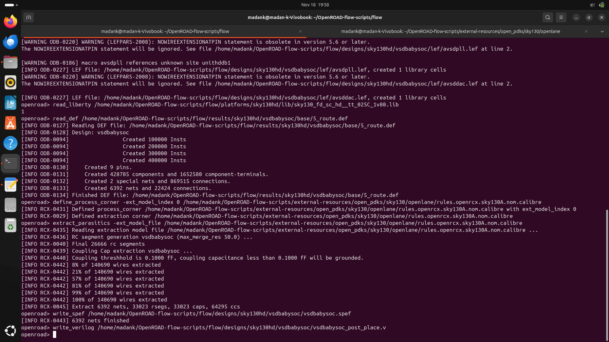

The final `OpenROAD-flow-scripts/flow/designs/sky130hd/vsdbabysoc/` directory structure after RC extraction looks as follows:


The generated SPEF file:

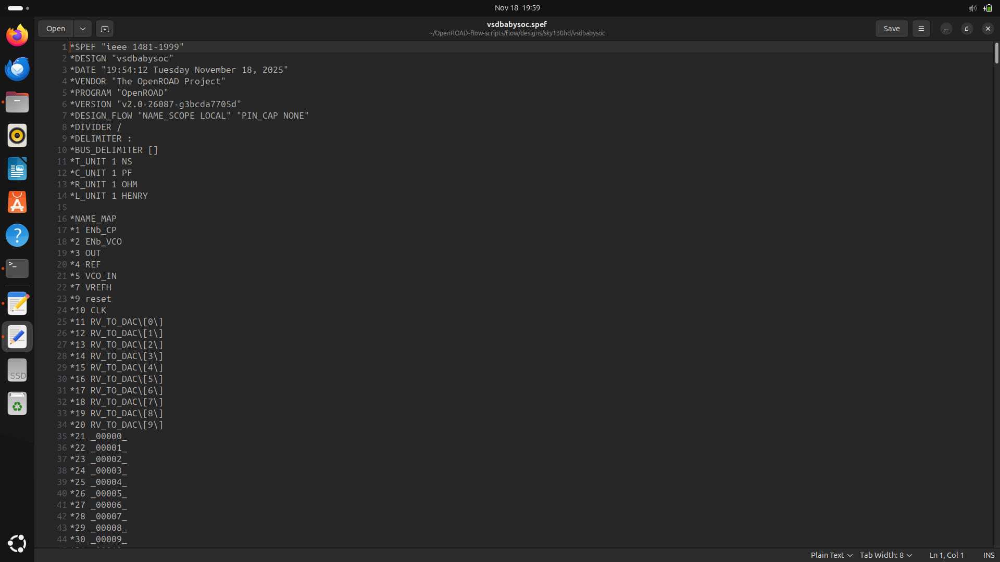

The generated Verilog netlist:

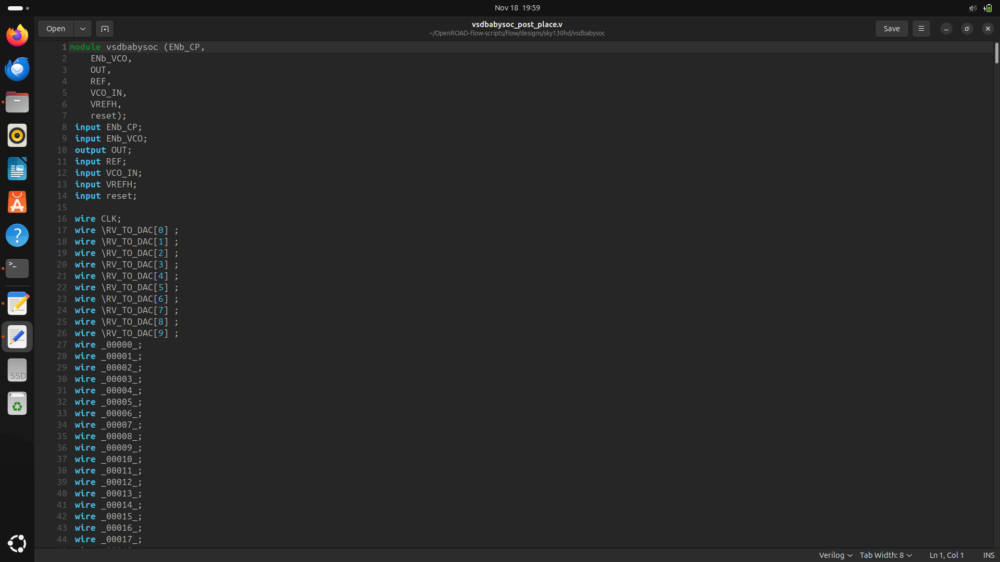


# ⚠️ Routing Congestion Problem

During the Physical Design of the VSDBabySoC, a routing congestion issue may occur during global routing, as shown below:


This error appears because the routing capacity at the DAC macro’s OUT port is 0, while the router needs a usage of 1, leading to overflow = 1.

> [!IMPORTANT]
> The congestion specifically occurs at the OUT port of the DAC macro.

Below is the congestion visualization from the DRC window of OpenROAD GUI:


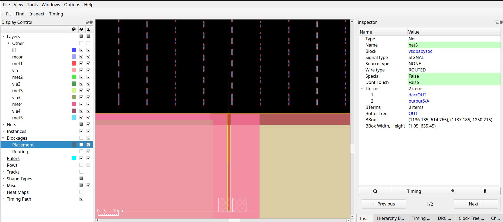

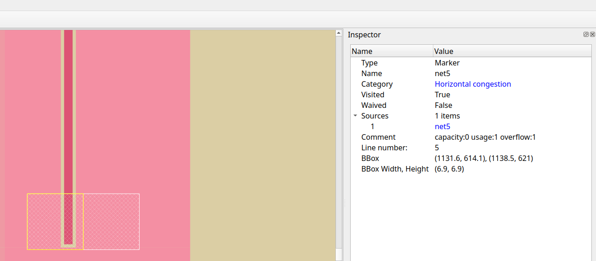

At the OUT port of the DAC, From these images, we observe:
- Capacity = 0
- Usage = 1
- Overflow = 1  


## Why is the Capacity 0 at the DAC OUT Port?

Looking into the `avsddac.lef` file, the OUT port is defined at the location shown here:

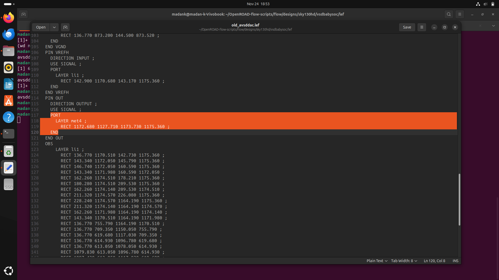

However, further down in the same LEF file, we see two obstruction layers (highlighted) that completely block the OUT port region:

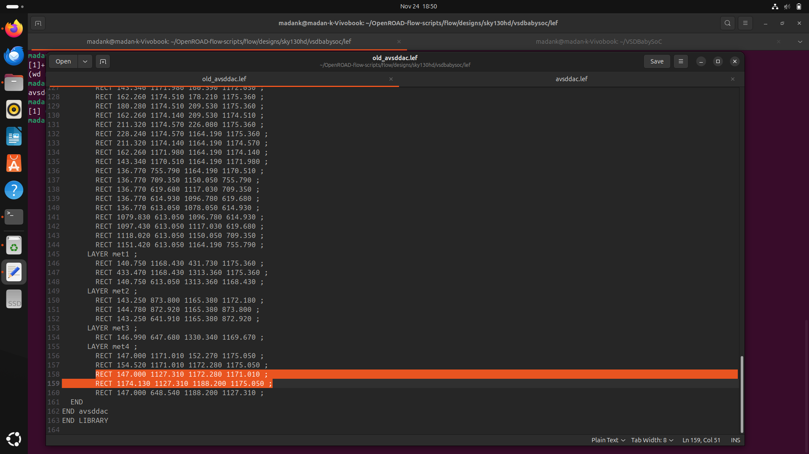

These obstructions prevent routing through that area, causing the congestion. So these Obstructions need to be cleared.

## Solution: Remove the Obstructions

After removing those obstructions, the OUT port becomes accessible:

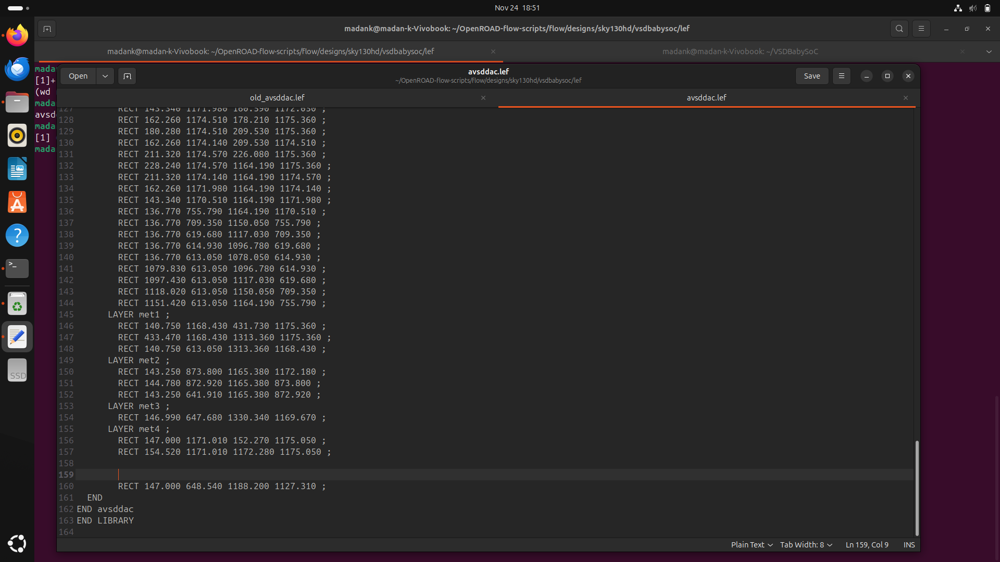

>[!NOTE]
>
> This fix typically resolves the congestion problem as it did for me.
>

## Additional Steps if Congestion Persists

### 1. Move Macros to a More Spaced Location

Create a `macro.tcl` file to manually specify macro placement:

```tcl
place_macro -macro_name dac -location {100.0 100.0}
place_macro -macro_name pll -location {1700.0 100.0}
````

### 2. Relax Constraints

Relaxing constraints gives more slack and allows the router to use additional routing resources:

```bash
# Increase clock period
create_clock [get_pins {pll/CLK}] -name clk -period 11.00
```

### 3. Create a Halo Around Macros

Halos prevent standard cells from being placed too close to macros, improving routability:

```bash
export MACRO_PLACE_HALO=40
```

### 4. Use Higher Metal Layers

Encourage the router to use higher metal layers by adjusting routing settings:

* `ROUTING_LAYER_ADJUSTMENT` (set this to a lower value to force the router to use higher metal layers. Default value is 0.5) 
* `MIN_ROUTING_LAYER` to define the minimum layer
* `MAX_ROUTING_LAYER` to define the maximum layer

### 5. Increase Core Area / Utilization

Expanding the core area provides more routing room. Adjust:

* `CORE_UTILIZATION`
* or `CORE_AREA`

### 6. Adjust IO Pin Placement

Relax IO pin placement to avoid congested regions:

* Modify the `PLACE_PINS_ARGS` variable to try different pin placements.

With these corrections and tuning strategies, routing congestion around the DAC OUT port can be eliminated most of the time, ensuring smooth global and detailed routing during the physical design flow.
