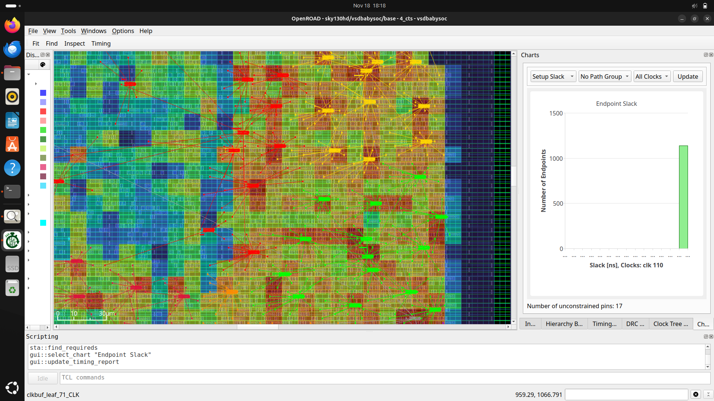

# WEEK 7 — BabySoC Physical Design & Post-Route SPEF Generation


## Installing OpenROAD-flow-scripts

Clone the repository and install all required dependencies:

```
git clone --recursive https://github.com/The-OpenROAD-Project/OpenROAD-flow-scripts
cd OpenROAD-flow-scripts
sudo ./setup.sh
./build_openroad.sh --local
```


After installation, verify the tools:

```
source ./env.sh
yosys -help
openroad -help
```


Build the flow infrastructure:

```
cd flow
make
```

To open the graphical interface in OpenROAD:

```
make gui_final
```


## Preparing the VSDBabySoC Environment

Move into:

```
cd ~/OpenROAD-flow-scripts/flow/designs/src/vsdbabysoc/
```

Copy the following Verilog and config files from your original VSDBABYSOC directory to the current directory:

* avsddac.v
* avsdpll.v
* clk_gate.v
* macro.cfg
* pin_order.cfg
* rvmyth.v
* rvmyth_gen.v
* testbench.rvmyth.post-routing.v
* testbench.v
* vsdbabysoc.v

Next, go to:

```
cd ~/OpenROAD-flow-scripts/flow/designs/sky130hd/
```

Copy these directories/files from the VSDBABYSOC source to current directory:

* gds/
* include/
* lef/
* lib/
* macro.cfg
* pin_order.cfg
* vsdbabysoc_synthesis.sdc


## Creating the config.mk File

Create a file named **config.mk** inside:

```
OpenROAD-flow-scripts/flow/designs/sky130hd/vsdbabysoc/
```

Add the following content:

```
export DESIGN_NICKNAME = vsdbabysoc
export DESIGN_NAME = vsdbabysoc
export PLATFORM    = sky130hd
export DESIGN_HOME = /home/madank/OpenROAD-flow-scripts/flow/designs

# redefine comments: specifying optional blackbox verilog
# export VERILOG_FILES_BLACKBOX = $(DESIGN_HOME)/src/$(DESIGN_NICKNAME)/IPs/*.v
# redefine comments: automatic discovery of verilog sources
# export VERILOG_FILES = $(sort $(wildcard $(DESIGN_HOME)/src/$(DESIGN_NICKNAME)/*.v))

# explicit source list for clarity
export VERILOG_FILES = $(DESIGN_HOME)/src/$(DESIGN_NICKNAME)/vsdbabysoc.v \
                       $(DESIGN_HOME)/src/$(DESIGN_NICKNAME)/rvmyth.v \
                       $(DESIGN_HOME)/src/$(DESIGN_NICKNAME)/clk_gate.v

export SDC_FILE      = $(DESIGN_HOME)/$(PLATFORM)/$(DESIGN_NICKNAME)/vsdbabysoc_synthesis.sdc

export vsdbabysoc_DIR = $(DESIGN_HOME)/$(PLATFORM)/$(DESIGN_NICKNAME)

export VERILOG_INCLUDE_DIRS = $(wildcard $(vsdbabysoc_DIR)/include/)

export ADDITIONAL_GDS  = $(wildcard $(vsdbabysoc_DIR)/gds/*.gds)
export ADDITIONAL_LEFS = $(wildcard $(vsdbabysoc_DIR)/lef/*.lef)

# clock configurations
export CLOCK_PORT = CLK
export CLOCK_NET  = $(CLOCK_PORT)

# pin and macro placement
export FP_PIN_ORDER_CFG = $(vsdbabysoc_DIR)/pin_order.cfg
export MACRO_PLACEMENT_CFG = $(vsdbabysoc_DIR)/macro.cfg

# floorplan and dimensions
export DIE_AREA   = 0 0 1600 1600
export CORE_AREA  = 20 20 1590 1590

# placement
export PLACE_PINS_ARGS = -exclude left:0-600 -exclude left:1000-1600 -exclude right:* -exclude top:* -exclude bottom:*

# timing adjustments
export TNS_END_PERCENT     = 100
export REMOVE_ABC_BUFFERS  = 1

# CTS tuning
export CTS_BUF_DISTANCE = 600
export SKIP_GATE_CLONING = 1

# magic options
export MAGIC_ZEROIZE_ORIGIN = 0
export MAGIC_EXT_USE_GDS    = 1

# export CORE_UTILIZATION=0.1  # Reduce this value to allow more whitespace for routing.
```


Move into OpenROAD-flow-scripts/flow:

```
cd OpenROAD-flow-scripts/flow
```


## Running RTL-to-GDSII Flow

### Synthesis

```
make DESIGN_CONFIG=./designs/sky130hd/vsdbabysoc/config.mk synth
```


Synthesis result netlist:


Synthesis statistics:


Check for synthesis issues:


## Floorplan

```
make DESIGN_CONFIG=./designs/sky130hd/vsdbabysoc/config.mk floorplan
```


View floorplan in GUI:

```
make DESIGN_CONFIG=./designs/sky130hd/vsdbabysoc/config.mk gui_floorplan
```


---

## Placement

```
make DESIGN_CONFIG=./designs/sky130hd/vsdbabysoc/config.mk place
```


Open placement GUI:

```
make DESIGN_CONFIG=./designs/sky130hd/vsdbabysoc/config.mk gui_place
```


To visualize density, enable **Placement Density** under Heat Maps:


Pin density can also be examined:


## Clock Tree Synthesis (CTS)

```
make DESIGN_CONFIG=./designs/sky130hd/vsdbabysoc/config.mk cts
```


View CTS in GUI:

```
make DESIGN_CONFIG=./designs/sky130hd/vsdbabysoc/config.mk gui_cts
```


Open **Clock Tree Viewer** through the GUI menu:


Inspect buffer properties:


Check setup timing details:


Hold timing details:


Slack histograms:




CTS report is available at:

```
OpenROAD-flow-scripts/flow/reports/sky130hd/vsdbabysoc/base/4_cts_final.rpt
```


## Routing

```
make DESIGN_CONFIG=./designs/sky130hd/vsdbabysoc/config.mk route
```


Routing completes the final step of the flow, generating DEF, GDS, SPEF, and timing reports.


### Debugging steps that I tried :

### Fix 1: Reduce core utilization

In config.mk, we currently commented out core utilization:

```
# export CORE_UTILIZATION=0.1
```

Uncomment it:

```
export CORE_UTILIZATION=0.25
```

(0.10 is too low, 0.25 is ideal for macro designs)

Lower density = more routing tracks = fewer congestion hotspots.

### Fix 2: Increase whitespace around macros

In the config.mk we have **no macro halo / channel spacing defined**.

Add this:

```
export MACRO_PLACE_CHANNEL = 20
export MACRO_PLACE_HALO = 20
```

This gives extra routing space.

If heavy congestion exists, use:

```
export MACRO_PLACE_CHANNEL = 40
export MACRO_PLACE_HALO = 30
```

### Fix 3: Disable pin exclusion rules (ours are too restrictive)

We currently have:

```
export PLACE_PINS_ARGS = -exclude left:0-600 -exclude left:1000-1600: -exclude right:* -exclude top:* -exclude bottom:*
```

This forces nearly ALL pins into a **tiny section** of LEFT side between 600–1000.

That is exactly where congestion happens (our bbox is around ~1000).

Remove this line completely:

```
# export PLACE_PINS_ARGS =
```

Let OpenROAD distribute pins naturally.

### Fix 4: Add routing guides to allow more layers

Add:

```
export GRT_ALLOW_CONGESTION = 1
export ROUTING_CORES = 4
export GRT_ADJUSTMENT = 0.3
```

If severe, reduce routing adjustment:

```
export GRT_ADJUSTMENT = 0.15
```

### Fix 5: Shift the DAC or RISC-V core macro slightly

If we manually placed macros in `macro.cfg`, shift them by 10–20um away from each other.
The congestion region tells us that our current macro placement creates a bottleneck.

This is expected to remove the congestion most of the time.
