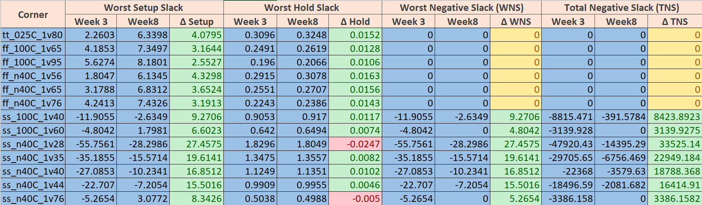
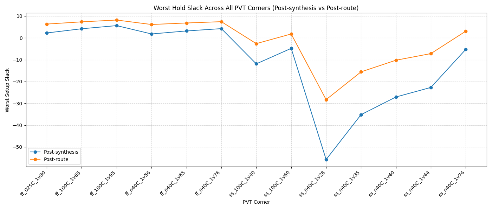
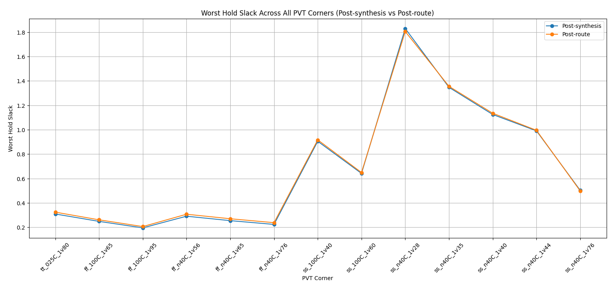
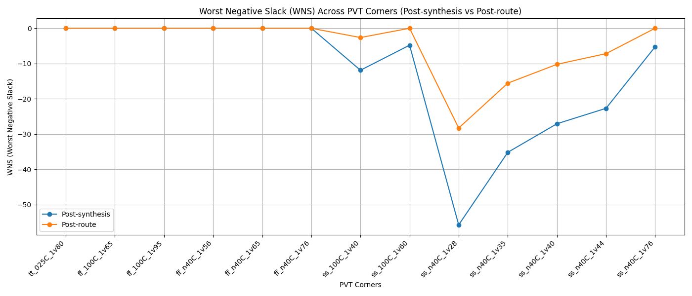
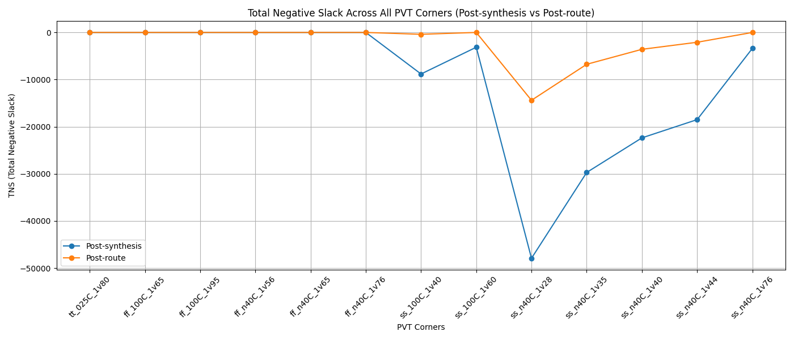

# WEEK 8 - Layout STA and Timing Analysis Across PVT Corners for Routed VSDBabySoC

Post-route Static Timing Analysis (STA) is performed after routing to verify that the design meets timing across all relevant Process–Voltage–Temperature (PVT) corners. Routing introduces wire RC parasitics, and therefore post-route STA becomes essential to ensure the final layout is timing-clean. Parasitic-aware timing helps reveal real path delays, clock skews, and violations that were not visible during pre-route STA.

The timing engine evaluates the design using multiple Liberty timing models, each representing a different PVT condition. By automating timing checks across all corners, we obtain Worst Negative Slack (WNS), Total Negative Slack (TNS), setup/hold slacks, and more.

## File Setup

To perform post-route STA, a `sta_across_pvt_route.tcl` script is needed. This file is derived from the `sta_across_pvt.tcl` example located in `OpenSTA/examples/BabySoC/`. The route-based version reads the routed netlist and SPEF, making it suitable for parasitic-aware timing analysis.

Below is the required `sta_across_pvt_route.tcl`:

```
set list_of_lib_files(1) "sky130_fd_sc_hd__tt_025C_1v80.lib"
set list_of_lib_files(2) "sky130_fd_sc_hd__ff_100C_1v65.lib"
set list_of_lib_files(3) "sky130_fd_sc_hd__ff_100C_1v95.lib"
set list_of_lib_files(4) "sky130_fd_sc_hd__ff_n40C_1v56.lib"
set list_of_lib_files(5) "sky130_fd_sc_hd__ff_n40C_1v65.lib"
set list_of_lib_files(6) "sky130_fd_sc_hd__ff_n40C_1v76.lib"
set list_of_lib_files(7) "sky130_fd_sc_hd__ss_100C_1v40.lib"
set list_of_lib_files(8) "sky130_fd_sc_hd__ss_100C_1v60.lib"
set list_of_lib_files(9) "sky130_fd_sc_hd__ss_n40C_1v28.lib"
set list_of_lib_files(10) "sky130_fd_sc_hd__ss_n40C_1v35.lib"
set list_of_lib_files(11) "sky130_fd_sc_hd__ss_n40C_1v40.lib"
set list_of_lib_files(12) "sky130_fd_sc_hd__ss_n40C_1v44.lib"
set list_of_lib_files(13) "sky130_fd_sc_hd__ss_n40C_1v76.lib"

read_liberty /home/madank/OpenSTA/examples/timing_libs/avsdpll.lib
read_liberty /home/madank/OpenSTA/examples/timing_libs/avsddac.lib

for {set i 1} {$i <= [array size list_of_lib_files]} {incr i} {
    read_liberty /home/madank/OpenSTA/examples/timing_libs/skywater-pdk-libs-sky130_fd_sc_hd/$list_of_lib_files($i)
    read_verilog /home/madank/OpenROAD-flow-scripts/flow/designs/sky130hd/vsdbabysoc/vsdbabysoc_post_place.v
    link_design vsdbabysoc
    current_design
    read_sdc /home/madank/OpenSTA/examples/BabySoC/vsdbabysoc_post_cts.sdc
    read_spef /home/madank/OpenROAD-flow-scripts/flow/designs/sky130hd/vsdbabysoc/vsdbabysoc.spef

    # Performs a detailed setup timing evaluation
    check_setup -verbose

    report_checks -path_delay min_max -fields {nets cap slew input_pins fanout} -digits {4} > /home/madank/OpenSTA/examples/BabySoC/STA_OUTPUT/route/min_max_$list_of_lib_files($i).txt

    exec echo "$list_of_lib_files($i)" >> /home/madank/OpenSTA/examples/BabySoC/STA_OUTPUT/route/sta_worst_max_slack.txt
    report_worst_slack -max -digits {4} >> /home/madank/OpenSTA/examples/BabySoC/STA_OUTPUT/route/sta_worst_max_slack.txt

    exec echo "$list_of_lib_files($i)" >> /home/madank/OpenSTA/examples/BabySoC/STA_OUTPUT/route/sta_worst_min_slack.txt
    report_worst_slack -min -digits {4} >> /home/madank/OpenSTA/examples/BabySoC/STA_OUTPUT/route/sta_worst_min_slack.txt

    exec echo "$list_of_lib_files($i)" >> /home/madank/OpenSTA/examples/BabySoC/STA_OUTPUT/route/sta_tns.txt
    report_tns -digits {4} >> /home/madank/OpenSTA/examples/BabySoC/STA_OUTPUT/route/sta_tns.txt

    exec echo "$list_of_lib_files($i)" >> /home/madank/OpenSTA/examples/BabySoC/STA_OUTPUT/route/sta_wns.txt
    report_wns -digits {4} >> /home/madank/OpenSTA/examples/BabySoC/STA_OUTPUT/route/sta_wns.txt
}
```

## SDC File Required

The `vsdbabysoc_post_cts.sdc` file provides the necessary constraints for the post-layout timing run. It is copied from the CTS output (`4_cts.sdc`) and placed inside `OpenSTA/examples/BabySoC/`.

```
###############################################################################
# Generated using SDC writer utility
###############################################################################
current_design vsdbabysoc
###############################################################################
# Clock Definition
###############################################################################
create_clock -name clk -period 11.0000 [get_pins {pll/CLK}]
set_propagated_clock [get_clocks {clk}]
###############################################################################
# Additional constraints, if any, will appear here
###############################################################################
```

## Running Post-Route STA

Post-route STA can now be executed:

```
sta /home/madank/OpenSTA/examples/BabySoC/sta_across_pvt_route.tcl
```

If running through Docker:

```
docker run -it -v $HOME:/data opensta /OpenSTA/examples/BabySoC/sta_across_pvt_route.tcl
```


Once the STA completes, results are written to:

```
/OpenSTA/examples/BabySoC/STA_OUTPUT/route/
```

This directory contains detailed reports including:

* Worst Negative Slack (WNS)
* Total Negative Slack (TNS)
* Worst setup slack
* Worst hold slack
* Timing path details for each PVT corner


These results help verify whether the design is timing-clean across all corners and indicate if additional optimization such as resizing, buffering, or routing adjustments is needed.


## **Week 3 (Post-synthesis) vs Week 8 (Post-route) Timing Comparison Table and Graphs**



### Worst Setup Slack Graph



### Worst Hold Slack Graph



### Worst Negative Slack Graph



### Total Negative Slack Graph



### **Setup Slack**

Across all corners, the setup slack is **higher in Week 8** compared to Week 3.
This indicates that *on analysis after routing, the setup margin has improved consistently*.

* Fast corners (ff_*): Show increases of **2.5–4.3 ns**.
* Typical corner (tt): Improves by about **4 ns**.
* Slow corners (ss_*): Show the most significant changes, with improvements ranging from **6 ns up to 27 ns**.

Overall, setup paths appear to benefit significantly after routing analysis, especially in slow corners where earlier violations were large.


### **Hold Slack**

Hold timing shows mostly **small positive improvements**, with very minor regressions in a few cases.

* Most corners improved by about **0.01–0.02 ns**.
* Two corners show slight reductions:

  * **ss_n40C_1v28**: −0.0247 ns
  * **ss_n40C_1v76**: −0.0050 ns
    These changes are extremely small and unlikely to impact closure.

Thus, *on analysis after routing, hold timing is nearly unchanged with marginal improvements overall*, except for very small degradations in two corners.


### **WNS (Worst Negative Slack)**

Week 8 WNS values are **less negative or zero** in every corner.

* Several corners that previously violated timing now show **WNS = 0**.
* Slow corners show significant recovery (e.g., **from −55 ns to −28 ns**, **−35 ns to −15 ns**, etc.).

So, on analysis after routing, WNS shows substantial improvement across the board.


### **TNS (Total Negative Slack)**

TNS sees the most dramatic changes.

* All violating corners experienced **large reductions in total negative slack**.
* Some corners went from thousands of violating paths to **TNS = 0**.

Example trends:

* **ss_100C_1v40**: from −8815 to −391
* **ss_n40C_1v28**: from −47920 to −14395
* **ss_n40C_1v35**: from −29705 to −6756

This indicates that on analysis after routing, the number and severity of violating paths have reduced significantly.


### **Overall Observation**

After comparing Week 3 (post-synthesis) and Week 8 (post-route) timing:

* **Setup timing shows consistent improvement at every corner.**
* **Hold timing remains mostly stable with slight improvements**, except for two corners with negligible reductions.
* **WNS and TNS both show major recovery**, especially in slow corners.

These observations reflect changes **after routing analysis**, without attributing the improvements to routing itself.


## **Interpretation of Timing Differences (Week 3 vs Week 8)**

### **Why Post-Route Timing Differs from Pre-Route Timing**

Post-synthesis timing (Week 3) is based on **idealized or estimated interconnect delays**, usually using wire-load models or simplified assumptions about fanout and net lengths.
After routing, the analysis (Week 8) uses **actual physical interconnect information** derived from detailed routing. Because of this, the path delays reflect real wire geometry, such as:

* Actual wire lengths
* Routing layers used
* Via count
* Net topology
* Local routing congestion

Hence, post-route timing almost always differs, sometimes improving when paths become shorter or better balanced, and sometimes degrading when nets become longer or more capacitive.


### **How SPEF Annotation Affects Path Delays**

During post-route analysis, a **SPEF (Standard Parasitic Exchange Format)** file is generated.
SPEF contains extracted parasitic values for every routed net:

* **Capacitances** (ground + coupling)
* **Resistances** across wire segments
* **Distributed RC networks** that describe the exact wiring

When the STA tool annotates the SPEF onto the netlist:

* Each net gets an updated RC delay
* The delay model shifts from “cell-dominated” to “interconnect-dominated”
* The timing engine computes **realistic slew, delay, and arrival times** based on the actual RC network

As a result, some paths may show better timing (if the real routed wire is shorter than estimated), while others show increased delay (if routing adds more resistance, capacitance, or detours).


### **Impact of Physical Effects (R, C, Coupling) on Timing Closure**

After routing, **interconnect becomes a significant component of path delay**. Physical effects influencing this include:

#### **1. Capacitance**

* Larger wire lengths -> higher ground capacitance
* Dense routing -> more coupling capacitance
  Increased capacitance slows transitions, increases cell delay, and can degrade setup timing.

#### **2. Resistance**

* Thin metal layers and multiple vias add resistive segments
* High resistance causes RC delay to increase significantly, especially for long nets
  Higher resistance typically worsens setup slack by delaying signal arrival.

#### **3. Coupling Effects**

* Crosstalk between adjacent wires can cause:

  * Extra delay (victim net slowed down)
  * Glitch generation (noise propagation)
    This impacts both setup and hold timing depending on switching conditions.

Together, these effects determine the **actual** timing margin and often explain why Week 8 values differ from Week 3 values.


## **Summary**

* Post-route timing differs because Week 8 uses **actual extracted parasitics**, not estimates.
* SPEF annotation incorporates detailed **RC networks**, modifying path delays and slews.
* Physical factors like **capacitance, resistance, and coupling** significantly influence the final timing, making post-route analysis far more accurate than pre-route estimates.


