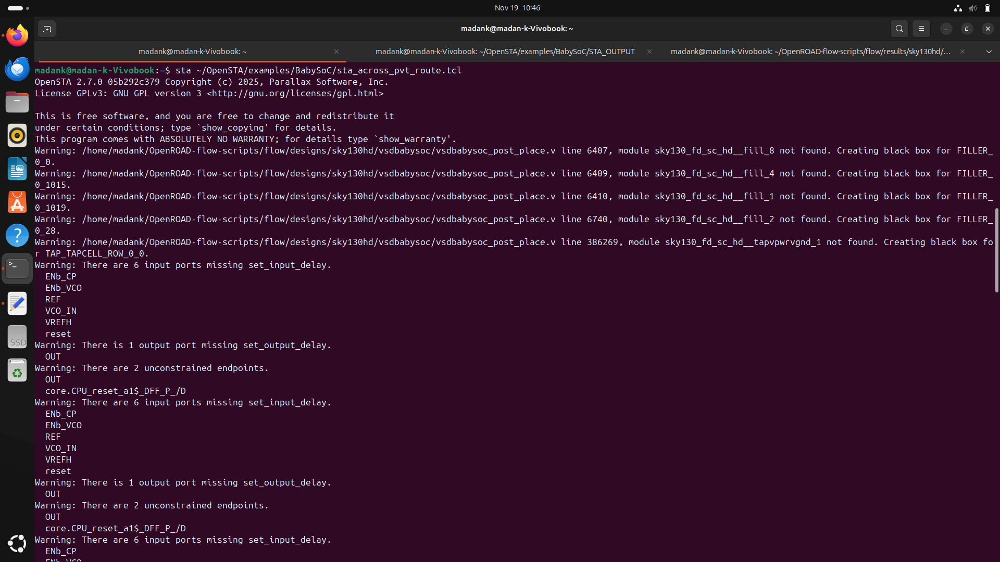
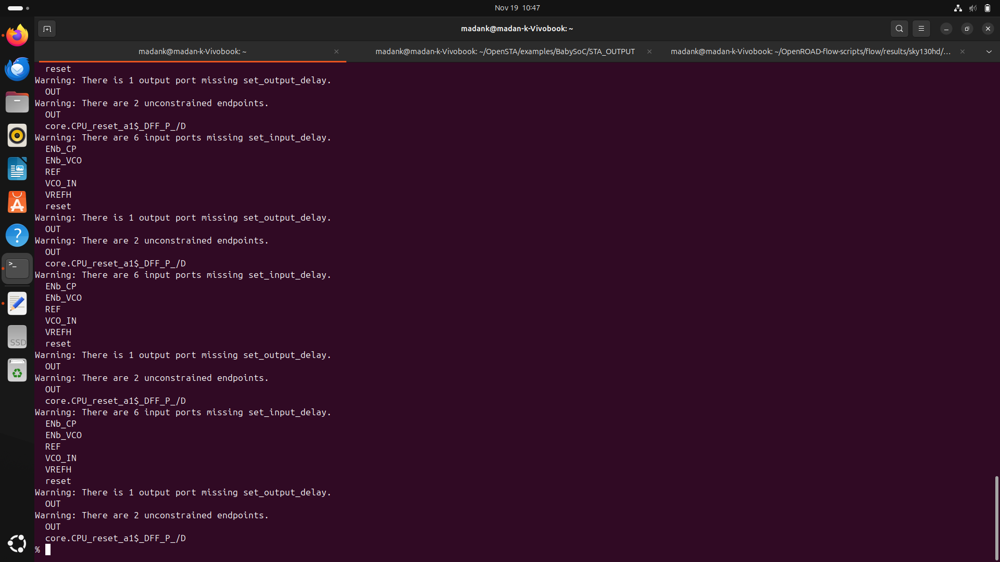
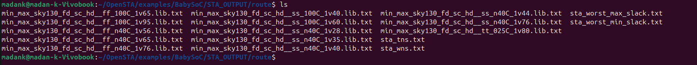

# WEEK 8 - Layout STA and Timing Analysis Across PVT Corners for Routed VSDBabySoC

Post-route Static Timing Analysis (STA) is performed after routing to verify that the design meets timing across all relevant Process–Voltage–Temperature (PVT) corners. Routing introduces wire RC parasitics, and therefore post-route STA becomes essential to ensure the final layout is timing-clean. Parasitic-aware timing helps reveal real path delays, clock skews, and violations that were not visible during pre-route STA.

The timing engine evaluates the design using multiple Liberty timing models, each representing a different PVT condition. By automating timing checks across all corners, we obtain Worst Negative Slack (WNS), Total Negative Slack (TNS), setup/hold slacks, and more.

## File Setup

To perform post-route STA, a `sta_across_pvt_route.tcl` script is needed. This file is derived from the `sta_across_pvt.tcl` example located in `OpenSTA/examples/BabySoC/`. The route-based version reads the routed netlist and SPEF, making it suitable for parasitic-aware timing analysis.

Below is the required `sta_across_pvt_route.tcl`:

```
set list_of_lib_files(1) "sky130_fd_sc_hd__tt_025C_1v80.lib"
set list_of_lib_files(2) "sky130_fd_sc_hd__ff_100C_1v65.lib"
set list_of_lib_files(3) "sky130_fd_sc_hd__ff_100C_1v95.lib"
set list_of_lib_files(4) "sky130_fd_sc_hd__ff_n40C_1v56.lib"
set list_of_lib_files(5) "sky130_fd_sc_hd__ff_n40C_1v65.lib"
set list_of_lib_files(6) "sky130_fd_sc_hd__ff_n40C_1v76.lib"
set list_of_lib_files(7) "sky130_fd_sc_hd__ss_100C_1v40.lib"
set list_of_lib_files(8) "sky130_fd_sc_hd__ss_100C_1v60.lib"
set list_of_lib_files(9) "sky130_fd_sc_hd__ss_n40C_1v28.lib"
set list_of_lib_files(10) "sky130_fd_sc_hd__ss_n40C_1v35.lib"
set list_of_lib_files(11) "sky130_fd_sc_hd__ss_n40C_1v40.lib"
set list_of_lib_files(12) "sky130_fd_sc_hd__ss_n40C_1v44.lib"
set list_of_lib_files(13) "sky130_fd_sc_hd__ss_n40C_1v76.lib"

read_liberty /home/madank/OpenSTA/examples/timing_libs/avsdpll.lib
read_liberty /home/madank/OpenSTA/examples/timing_libs/avsddac.lib

for {set i 1} {$i <= [array size list_of_lib_files]} {incr i} {
    read_liberty /home/madank/OpenSTA/examples/timing_libs/skywater-pdk-libs-sky130_fd_sc_hd/$list_of_lib_files($i)
    read_verilog /home/madank/OpenROAD-flow-scripts/flow/designs/sky130hd/vsdbabysoc/vsdbabysoc_post_place.v
    link_design vsdbabysoc
    current_design
    read_sdc /home/madank/OpenSTA/examples/BabySoC/vsdbabysoc_post_cts.sdc
    read_spef /home/madank/OpenROAD-flow-scripts/flow/designs/sky130hd/vsdbabysoc/vsdbabysoc.spef

    # Performs a detailed setup timing evaluation
    check_setup -verbose

    report_checks -path_delay min_max -fields {nets cap slew input_pins fanout} -digits {4} > /home/madank/OpenSTA/examples/BabySoC/STA_OUTPUT/route/min_max_$list_of_lib_files($i).txt

    exec echo "$list_of_lib_files($i)" >> /home/madank/OpenSTA/examples/BabySoC/STA_OUTPUT/route/sta_worst_max_slack.txt
    report_worst_slack -max -digits {4} >> /home/madank/OpenSTA/examples/BabySoC/STA_OUTPUT/route/sta_worst_max_slack.txt

    exec echo "$list_of_lib_files($i)" >> /home/madank/OpenSTA/examples/BabySoC/STA_OUTPUT/route/sta_worst_min_slack.txt
    report_worst_slack -min -digits {4} >> /home/madank/OpenSTA/examples/BabySoC/STA_OUTPUT/route/sta_worst_min_slack.txt

    exec echo "$list_of_lib_files($i)" >> /home/madank/OpenSTA/examples/BabySoC/STA_OUTPUT/route/sta_tns.txt
    report_tns -digits {4} >> /home/madank/OpenSTA/examples/BabySoC/STA_OUTPUT/route/sta_tns.txt

    exec echo "$list_of_lib_files($i)" >> /home/madank/OpenSTA/examples/BabySoC/STA_OUTPUT/route/sta_wns.txt
    report_wns -digits {4} >> /home/madank/OpenSTA/examples/BabySoC/STA_OUTPUT/route/sta_wns.txt
}
```

## SDC File Required

The `vsdbabysoc_post_cts.sdc` file provides the necessary constraints for the post-layout timing run. It is copied from the CTS output (`4_cts.sdc`) and placed inside `OpenSTA/examples/BabySoC/`.

```
###############################################################################
# Generated using SDC writer utility
###############################################################################
current_design vsdbabysoc
###############################################################################
# Clock Definition
###############################################################################
create_clock -name clk -period 11.0000 [get_pins {pll/CLK}]
set_propagated_clock [get_clocks {clk}]
###############################################################################
# Additional constraints, if any, will appear here
###############################################################################
```

## Running Post-Route STA

Post-route STA can now be executed:

```
sta /home/madank/OpenSTA/examples/BabySoC/sta_across_pvt_route.tcl
```

If running through Docker:

```
docker run -it -v $HOME:/data opensta /OpenSTA/examples/BabySoC/sta_across_pvt_route.tcl
```





Once the STA completes, results are written to:

```
/OpenSTA/examples/BabySoC/STA_OUTPUT/route/
```

This directory contains detailed reports including:

* Worst Negative Slack (WNS)
* Total Negative Slack (TNS)
* Worst setup slack
* Worst hold slack
* Timing path details for each PVT corner



These results help verify whether the design is timing-clean across all corners and indicate if additional optimization such as resizing, buffering, or routing adjustments is needed.
