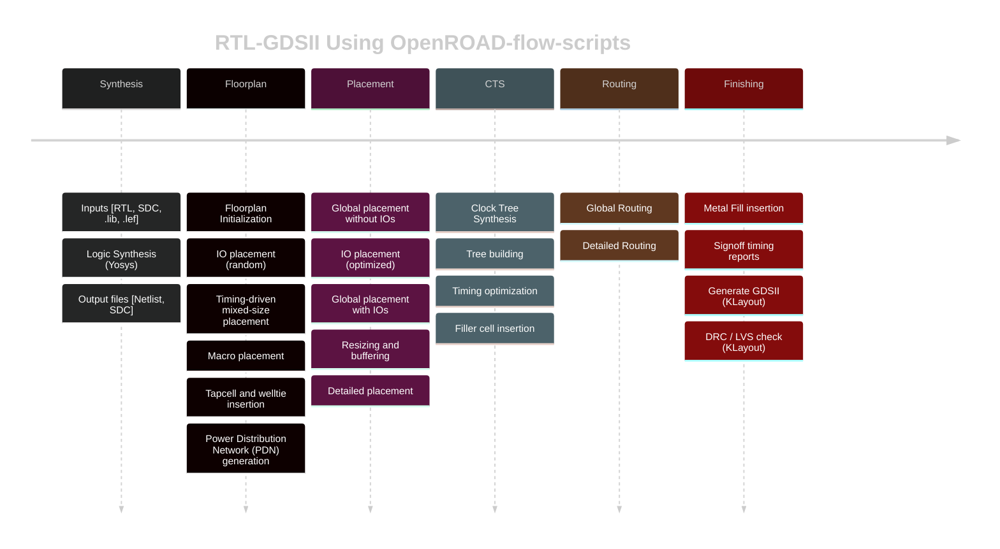

# VSDBabySoC Design Flow: From Definition and Architecture to Post-Layout routing.

VSDBabySoC is a compact yet powerful System-on-Chip that integrates a RISC-V CPU (RVMYTH), a PLL, and a DAC into a minimal, fully functional digital SoC architecture. This Document contains the entire flow from definition and architecture to post-layout routing of VSDBabySoC. 

# **Table of Contents**

- [VSDBabySoC](#vsdbabysoc)
  - [What is VSDBabySoC?](#what-is-vsdbabysoc)
  - [RVMYTH: RISC-V Based Processor](#rvmyth-risc-v-based-processor)
  - [AVSDDAC](#avsddac)
  - [AVSDPLL](#avsdpll)
- [Modeling of VSDBabySoC](#modelling-of-vsdbabysoc)
  - [TL-Verilog to Verilog Conversion](#tl-verilog-to-verilog-conversion)
  - [Simulation Using Iverilog and GTKWave](#simulation-using-iverilog-and-gtkwave)
  - [Signal Overview](#signal-overview)
- [Post-Synthesis (Gate-Level) Simulation of VSDBabySoC](#post-synthesis-gate-level-simulation-of-vsdbabysoc)
  - [Workflow Overview](#workflow-overview)
  - [Yosys Synthesis Flow](#yosys-synthesis-flow)
  - [Simulation Flow for VSDBabySoC (GLS)](#simulation-flow-for-vsdbabysoc-gls)
  - [Comparison: Pre-Synthesis vs Post-Synthesis Simulation](#comparison-pre-synthesis-vs-post-synthesis-simulation)
- [Post-Synthesis Static Timing Analysis (STA) using OpenSTA](#post-synthesis-static-timing-analysis-sta-using-opensta)
  - [Installing OpenSTA](#installing-opensta)
  - [Directory Structure](#directory-structure)
  - [Running Min/Max Timing Check](#running-minmax-timing-check)
  - [Fixing avsdpll.lib Syntax Error](#fixing-avsdplllib-syntax-error)
  - [PVT Corner Analysis for VSDBabySoC](#pvt-corner-analysis-for-vsdbabysoc)
- [Physical Design of VSDBabySoC](#physical-design-of-vsdbabysoc)
  - [Installing OpenROAD-flow-scripts](#installing-openroad-flow-scripts)
  - [Files Required Before Starting Physical Design](#files-required-before-starting-physical-design)
  - [Performing Physical Design](#performing-physical-design)
    - [Synthesis](#synthesis)
    - [Floorplan](#floorplan)
    - [Placement](#placement)
    - [Clock Tree Synthesis (CTS)](#clock-tree-synthesis-cts)
    - [Routing](#routing)
  - [Creating Post-Route DEF File](#creating-post-route-def-file)
  - [Generating Post-Route SPEF File](#generating-post-route-spef-file)
- [Post-route STA of VSDBabySoC](#post-route-sta-of-vsdbabysoc)
- [Routing Congestion Problem](#️-routing-congestion-problem)
  - [Why Capacity is 0 at DAC OUT Port](#why-is-the-capacity-0-at-the-dac-out-port)
  - [Solution: Remove Obstructions](#solution-remove-the-obstructions)
  - [Additional Solutions if Congestion Persists](#additional-steps-if-congestion-persists)
    
---


## What is VSDBabySoC?

VSDBabySoC is a compact yet powerful System-on-Chip (SoC) that demonstrates how essential digital and mixed-signal components integrate into a unified architecture. Despite its small footprint, it showcases a complete and functional SoC built from three key modules:

- **PLL (Phase-Locked Loop):** Generates a stable, high-frequency system clock through frequency multiplication.
- **DAC (Digital-to-Analog Converter):** Produces precise analog output from digital input codes.
- **RVMYTH Processor:** A fully functional RISC-V–based RV32I CPU capable of performing core computation and control tasks.

This SoC combines clock generation, digital processing, and analog output into a streamlined design, illustrating the fundamental structure and capabilities found in larger, production-grade SoCs. Its simplicity, efficiency, and well-defined architecture make VSDBabySoC a compact yet capable platform for showcasing real SoC behavior.


Image credits: https://www.vlsisystemdesign.com/


## RVMYTH: RISC-V Based Processor 

### Introduction
The RVMYTH processor is a compact RISC-V–based CPU designed for educational and simulation purposes. It follows the RV32I instruction set and implements a basic 3-stage pipeline (Fetch, Decode, Execute). This processor is commonly used in learning environments to understand RISC-V microarchitecture, instruction flow, and CPU datapath behavior. 


### Processor Specifications

The processor is based on the RISC-V RV32I architecture, operating with a 32-bit data width and a 32-bit instruction width. It follows a little-endian format and executes instructions in a fully synchronous, single-issue, in-order pipeline. The design uses a simple three-stage pipeline consisting of Fetch, Decode, and Execute stages.

In the datapath, the Program Counter (PC) is a 32-bit register that increments by 4 for each instruction. The register file contains 32 general-purpose registers, where `x0` is permanently tied to zero. It supports two register read ports and one write port. The ALU handles arithmetic, logical, shift, and comparison operations including addition, subtraction, bitwise AND/OR/XOR, logical shifts, and set-less-than evaluations. An immediate generator creates immediates for all instruction formats: I, S, B, U, and J types. Branch logic supports common branch decisions such as BEQ, BNE, BLT, and BGE.

The memory subsystem includes a 4 KB instruction memory used exclusively for storing program code and is read-only during execution. Additionally, a 4 KB byte-addressable data memory supports load and store operations, specifically LW and SW instructions.


## AVSDDAC 

### Introduction
The `avsddac` module is a 10-bit Digital-to-Analog Converter (DAC). It converts a 10-bit digital input into a corresponding analog output voltage between two reference levels.


### DAC Specifications

This DAC is an ideal behavioral model with a resolution of 10 bits, providing 1024 discrete digital levels. It operates using two real-valued reference inputs: a high reference voltage (`VREFH`) and a low reference voltage (`VREFL`). The device follows a perfectly linear transfer characteristic, mapping the digital code directly into a proportional analog output. The DAC is always enabled in this model since the internal enable signal is fixed to logic high. The output is generated as a real-valued analog voltage.

The module exposes four ports: an analog output `OUT`, a 10-bit unsigned digital input `D`, and the two reference voltages `VREFH` and `VREFL`. The output voltage is computed using the standard ideal DAC equation, where the 10-bit digital input is zero-extended to 11 bits and scaled between the two reference voltages. This produces an output ranging from `VREFL` when the input code is zero up to `VREFH` when the input code reaches 1023. The precise formula used by the model is:
**OUT = VREFL + (D / 1023) × (VREFH - VREFL)**.

The DAC output updates continuously in response to any change in the digital input `D`, or when either of the reference voltages changes. If any of the reference inputs becomes invalid and evaluates to `NaN`, the DAC output is also driven to `NaN`, reflecting undefined behavior. Although the design includes an enable signal (`EN`), the current model keeps it permanently active, meaning the output is never forced to zero unless explicitly modified.

## AVSDPLL 

#### Introduction
The `avsdpll` module is a Phase-Locked Loop (PLL) used for functional simulation. It generates an output clock whose frequency is derived from the reference input clock. 


#### PLL Specifications

This PLL is an idealized behavioral model designed to multiply the reference clock frequency by a factor of eight. It begins with an initial output frequency of 40 MHz, corresponding to a 25 ns clock period.

The module includes several ports: `CLK` is the output clock generated by the PLL, while `REF` serves as the input reference clock whose rising edges determine the frequency relationship. The `ENb_VCO` signal controls whether the VCO output toggles. When it is high, the clock toggles normally based on the computed period; when low, the output clock is held at zero; and when undefined, the output also becomes unknown.

The PLL continuously measures the period of the reference clock by capturing the time difference between successive rising edges. This measured value (`refpd`) is then divided by eight to compute the new VCO output period, effectively generating a clock frequency exactly eight times higher than the reference. Whenever the reference frequency changes, the PLL recalculates and updates the output frequency.

# Modelling of VSDBabySoC


The behavior of the VSDBabySoC is modeled using Icarus Verilog (iverilog) for simulation and GTKWave for waveform visualization. This SoC integrates three primary blocks: the RVMYTH core generated from TL-Verilog, the avsdpll phase-locked loop, and the avsddac digital-to-analog converter. The system receives several inputs, including `reset`, `VCO_IN`, `ENb_CP`, `ENb_VCO`, `REF`, and `VREFH`, while producing a single analog output `OUT`. Since the RVMYTH processor is originally described in TL-Verilog, it must first be converted into synthesizable Verilog. This conversion is performed using SandPiper-SaaS before integrating the generated Verilog module with the PLL and DAC for full SoC simulation.


## TL-Verilog to Verilog Conversion


Install Python environment tools:

```
sudo apt update
sudo apt install python3-venv python3-pip
```

Create and activate a virtual environment:

```
cd ~/VLSI/VSDBabySoC/
python3 -m venv myenv
source myenv/bin/activate
```

Install SandPiper-SaaS:

```
pip install pyyaml click sandpiper-saas
```

Run the following to convert the RVMYTH TL-Verilog file to a Verilog module:

```
sandpiper-saas -i ./src/module/*.tlv -o rvmyth.v --bestsv --noline -p verilog --outdir ./src/module/
```

A new file `rvmyth.v` appears in `./src/module/`


Deactivate the environment anytime:

```
deactivate
```


## Simulation Using Iverilog and GTKWave

Create the directory for simulation outputs:

```
cd ~/VLSI/VSDBabySoC/
mkdir -p output/pre_synth_sim
```

Compile and run simulation:

```
iverilog -o ~/VLSI/VSDBabySoC/output/pre_synth_sim/pre_synth_sim.out -DPRE_SYNTH_SIM -I ~/VLSI/VSDBabySoC/src/include -I ~/VLSI/VSDBabySoC/src/module ~/VLSI/VSDBabySoC/src/module/testbench.v
```

Open waveform:

```
gtkwave output/pre_synth_sim/pre_synth_sim.vcd
```


#### Viewing DAC Output as Analog:

In GTKWave, first, Right-click on OUT (DAC output) then Select Data Format -> Analog -> step


## Signal Overview

* **CLK** – Generated by the PLL and drives the RVMYTH core.
* **reset** – External reset input to the RVMYTH core.
* **OUT** – DAC output of the SoC. In simulation it behaves digitally, but represents real analog values.
* **RV_TO_DAC[9:0]** – 10-bit digital output from RVMYTH register #17.
* **OUT (real)** – A `real` wire inside the DAC module used to model analog behaviour.

This completes the modelling and simulation workflow of the VSDBabySoC using Icarus Verilog, and GTKWave.

# Post-Synthesis (Gate-Level) Simulation of VSDBabySoC

Post-synthesis or Gate-Level Simulation (GLS) is used to verify that the synthesized netlist behaves exactly the same as the RTL design. After synthesis, the design is transformed into logic gates and standard cells, which may introduce delays or structural changes. GLS helps confirm that these transformations did not alter the intended functionality. This is an essential step before proceeding to physical design.

We use the following tools for GLS:

* **Yosys** – Synthesis and netlist generation
* **Icarus Verilog (iverilog)** – Post-synthesis simulation
* **GTKWave** – Waveform visualization

## **Workflow Overview**

1. RTL design of BabySoC modules (CPU, PLL, DAC)
2. Synthesis using Yosys
3. Netlist generation
4. Post-synthesis simulation using Icarus Verilog
5. Waveform analysis using GTKWave


## **Yosys Synthesis Flow**

```bash
# 1. Launch Yosys
yosys

# 2. Load Standard Cell and IP Libraries
read_liberty -lib src/lib/sky130_fd_sc_hd__tt_025C_1v80.lib
read_liberty -lib src/lib/avsdpll.lib
read_liberty -lib src/lib/avsddac.lib

# 3. Read Verilog Source Files
read_verilog src/module/vsdbabysoc.v
read_verilog -I src/include src/module/rvmyth.v
read_verilog -I src/include src/module/clk_gate.v

# 4. Perform Synthesis
synth -top vsdbabysoc
```


Continue with flip-flop mapping, logic optimization, and cleanup:

```
# 5. Map Flip-Flops to Standard Cells
dfflibmap -liberty src/lib/sky130_fd_sc_hd__tt_025C_1v80.lib

# 6. Optimize and Map Logic Gates
opt
abc -liberty src/lib/sky130_fd_sc_hd__tt_025C_1v80.lib

# 7. Flatten and Clean Design
flatten
setundef -zero
clean -purge
rename -enumerate

# 8. Report Statistics
stat
```


Finally, write the synthesized netlist:

```
write_verilog -noattr output/post_synth_sim/vsdbabysoc.synth.v
```

> **Note:** Create the directory using `mkdir -p output/post_synth_sim/` if it does not exist.


## **Simulation Flow for VSDBabySoC (GLS)**

### **1. Compile the design using Icarus Verilog**

```
iverilog -I src/gls_model -I output/post_synth_sim -I src/include -I src/module \
-o output/post_synth_sim/post_synth_sim.out \
-DPOST_SYNTH_SIM -DFUNCTIONAL -DUNIT_DELAY=#1 \
src/module/testbench.v
```

### **2. Run the Simulation**

```
./output/post_synth_sim/post_synth_sim.out
```

### **3. View the Waveforms in GTKWave**

```
gtkwave post_synth_sim.vcd
```


## **Comparison: Pre-Synthesis vs Post-Synthesis Simulation**

### **Pre-Synthesis Simulation**


### **Post-Synthesis Simulation**


The post-synthesis waveform shows that the analog output (`OUT`) generated by the DAC rises and falls in response to the digital value produced by the RVMYTH processor. This behavior closely matches the pre-synthesis simulation, confirming that the synthesized gate-level design preserves the correctness and functionality of the RTL model.

## Post-Synthesis Static Timing Analysis (STA) using OpenSTA

Static Timing Analysis (STA) is performed after synthesis to verify whether the gate-level netlist meets the required timing constraints. This step ensures that all paths between flip-flops, inputs, and outputs satisfy setup and hold timing requirements before proceeding to physical design.
OpenSTA is an industry-grade, open-source STA engine widely used in ASIC flows.


## Installing OpenSTA

Install OpenSTA using the following steps:

```bash
# Clone the OpenSTA repository
git clone https://github.com/The-OpenROAD-Project/OpenSTA.git 

# Navigate into the repository
cd OpenSTA  

# Create and enter build directory
mkdir build
cd build  

# Configure the build
cmake ..  

# Compile OpenSTA
make  

# Install OpenSTA (requires sudo privileges)
sudo make install
```

Launch OpenSTA:

```bash
sta
```


## **Directory Structure**

Use the following directory structure to organize timing libraries, synthesized netlists, and SDC constraints:

```
OpenSTA/
|____examples/
      |___timing_libs/   
      |       ├── avsddac.lib  
      |       ├── avsdpll.lib  
      |       └── sky130_fd_sc_hd__tt_025C_1v80.lib
      |
      |___BabySoC/
              ├── cd_sky130hd.sdc
              ├── vsdbabysoc_synthesis.sdc 
              └── vsdbabysoc.synth.v
```


## **Running Min/Max Timing Check**

Use the following script to run post-synthesis timing checks:

<details>
<summary><strong>👈vsdbabysoc_min_max_delays.tcl</strong></summary>
      
  ```
  # Load Liberty Libraries (standard cell + IPs)
  read_liberty -min ~/OpenSTA/examples/timing_libs/sky130_fd_sc_hd__tt_025C_1v80.lib
  read_liberty -max ~/OpenSTA/examples/timing_libs/sky130_fd_sc_hd__tt_025C_1v80.lib
  
  read_liberty -min ~/OpenSTA/examples/timing_libs/avsdpll.lib
  read_liberty -max ~/OpenSTA/examples/timing_libs/avsdpll.lib
  
  read_liberty -min ~/OpenSTA/examples/timing_libs/avsddac.lib
  read_liberty -max ~/OpenSTA/examples/timing_libs/avsddac.lib
  
  # Read Synthesized Netlist
  read_verilog ~/OpenSTA/examples/BabySoC/vsdbabysoc.synth.v
  
  # Link Top-Level
  link_design vsdbabysoc
  
  # Apply Constraints
  read_sdc ~/OpenSTA/examples/BabySoC/vsdbabysoc_synthesis.sdc
  
  # Run Timing Report
  report_checks
  ```
</details>

To execute STA:

```bash
# invoke OpenSTA 
sta

# Perform STA
source ~/OpenSTA/examples/BabySoC/vsdbabysoc_min_max_delays.tcl
```


## **Fixing avsdpll.lib Syntax Error**

> [!NOTE]
>
> If the following error appears:
>
> ```
>Warning: /home/madank/OpenSTA/examples/timing_libs/sky130_fd_sc_hd__tt_025C_1v80.lib line 23, default_fanout_load is 0.0.
>Warning: /home/madank/OpenSTA/examples/timing_libs/sky130_fd_sc_hd__tt_025C_1v80.lib line 1, library sky130_fd_sc_hd__tt_025C_1v80 already exists.
>Warning: /home/madank/OpenSTA/examples/timing_libs/sky130_fd_sc_hd__tt_025C_1v80.lib line 23, default_fanout_load is 0.0.
>Error: /home/madank/OpenSTA/examples/timing_libs/avsdpll.lib line 54, syntax error
> ```
>
>Open `avsdpll.lib` and comment out lines **54–60** and **68–78** using C-style multiline comments (`/* ... */`).
>
>

Then re-run the script:

```
source ~/OpenSTA/examples/BabySoC/vsdbabysoc_min_max_delays.tcl
```


## **PVT Corner Analysis for VSDBabySoC**

To perform STA across multiple PVT corners, download the full Sky130 HD timing library set from [here](https://github.com/efabless/skywater-pdk-libs-sky130_fd_sc_hd/tree/master/timing) and place them under:

```
~/OpenSTA/examples/timing_libs/skywater-pdk-libs-sky130_fd_sc_hd/
```

### **PVT Corner Sweep Script**

<details>
<summary><strong>👈sta_across_pvt.tcl</strong></summary>
  
```shell
 set list_of_lib_files(1) "sky130_fd_sc_hd__tt_025C_1v80.lib"
 set list_of_lib_files(2) "sky130_fd_sc_hd__ff_100C_1v65.lib"
 set list_of_lib_files(3) "sky130_fd_sc_hd__ff_100C_1v95.lib"
 set list_of_lib_files(4) "sky130_fd_sc_hd__ff_n40C_1v56.lib"
 set list_of_lib_files(5) "sky130_fd_sc_hd__ff_n40C_1v65.lib"
 set list_of_lib_files(6) "sky130_fd_sc_hd__ff_n40C_1v76.lib"
 set list_of_lib_files(7) "sky130_fd_sc_hd__ss_100C_1v40.lib"
 set list_of_lib_files(8) "sky130_fd_sc_hd__ss_100C_1v60.lib"
 set list_of_lib_files(9) "sky130_fd_sc_hd__ss_n40C_1v28.lib"
 set list_of_lib_files(10) "sky130_fd_sc_hd__ss_n40C_1v35.lib"
 set list_of_lib_files(11) "sky130_fd_sc_hd__ss_n40C_1v40.lib"
 set list_of_lib_files(12) "sky130_fd_sc_hd__ss_n40C_1v44.lib"
 set list_of_lib_files(13) "sky130_fd_sc_hd__ss_n40C_1v76.lib"

 read_liberty ~/OpenSTA/examples/timing_libs/avsdpll.lib
 read_liberty ~/OpenSTA/examples/timing_libs/avsddac.lib

 for {set i 1} {$i <= [array size list_of_lib_files]} {incr i} {
 read_liberty ~/OpenSTA/examples/timing_libs/skywater-pdk-libs-sky130_fd_sc_hd/$list_of_lib_files($i)
 read_verilog ~/OpenSTA/examples/BabySoC/vsdbabysoc.synth.v
 link_design vsdbabysoc
 current_design
 read_sdc ~/OpenSTA/examples/BabySoC/vsdbabysoc_synthesis.sdc
 check_setup -verbose
 report_checks -path_delay min_max -fields {nets cap slew input_pins fanout} -digits {4} > ~/OpenSTA/examples/BabySoC/STA_OUTPUT/min_max_$list_of_lib_files($i).txt

 exec echo "$list_of_lib_files($i)" >> ~/OpenSTA/examples/BabySoC/STA_OUTPUT/sta_worst_max_slack.txt
 report_worst_slack -max -digits {4} >> ~/OpenSTA/examples/BabySoC/STA_OUTPUT/sta_worst_max_slack.txt

 exec echo "$list_of_lib_files($i)" >> ~/OpenSTA/examples/BabySoC/STA_OUTPUT/sta_worst_min_slack.txt
 report_worst_slack -min -digits {4} >> ~/OpenSTA/examples/BabySoC/STA_OUTPUT/sta_worst_min_slack.txt

 exec echo "$list_of_lib_files($i)" >> ~/OpenSTA/examples/BabySoC/STA_OUTPUT/sta_tns.txt
 report_tns -digits {4} >> ~/OpenSTA/examples/BabySoC/STA_OUTPUT/sta_tns.txt

 exec echo "$list_of_lib_files($i)" >> ~/OpenSTA/examples/BabySoC/STA_OUTPUT/sta_wns.txt
 report_wns -digits {4} >> ~/OpenSTA/examples/BabySoC/STA_OUTPUT/sta_wns.txt
 }
```

</details>

Run the script:

```bash
sta
source ~/OpenSTA/examples/BabySoC/sta_across_pvt.tcl
```


### **Sample STA Report (Typical Corner: tt_025C_1v80)**

Below is the report from the min/max delay analysis:

```
Warning: sta_across_pvt.tcl line 25, unknown field nets.
Startpoint: _9108_ (rising edge-triggered flip-flop clocked by clk)
Endpoint: _8046_ (rising edge-triggered flip-flop clocked by clk)
Path Group: clk
Path Type: min

Fanout       Cap      Slew     Delay      Time   Description
-------------------------------------------------------------------------------------
                    0.0000    0.0000    0.0000   clock clk (rise edge)
                              0.0000    0.0000   clock network delay (ideal)
                    0.0000    0.0000    0.0000 ^ _9108_/CLK (sky130_fd_sc_hd__dfxtp_1)
     1    0.0017    0.0329    0.2749    0.2749 ^ _9108_/Q (sky130_fd_sc_hd__dfxtp_1)
                    0.0329    0.0000    0.2749 ^ _8046_/D (sky130_fd_sc_hd__dfxtp_1)
                                        0.2749   data arrival time

                    0.0000    0.0000    0.0000   clock clk (rise edge)
                              0.0000    0.0000   clock network delay (ideal)
                              0.0000    0.0000   clock reconvergence pessimism
                                        0.0000 ^ _8046_/CLK (sky130_fd_sc_hd__dfxtp_1)
                             -0.0346   -0.0346   library hold time
                                       -0.0346   data required time
-------------------------------------------------------------------------------------
                                       -0.0346   data required time
                                       -0.2749   data arrival time
-------------------------------------------------------------------------------------
                                        0.3096   slack (MET)


Startpoint: _9085_ (rising edge-triggered flip-flop clocked by clk)
Endpoint: _8462_ (rising edge-triggered flip-flop clocked by clk)
Path Group: clk
Path Type: max

Fanout       Cap      Slew     Delay      Time   Description
-------------------------------------------------------------------------------------
                    0.0000    0.0000    0.0000   clock clk (rise edge)
                              0.0000    0.0000   clock network delay (ideal)
                    0.0000    0.0000    0.0000 ^ _9085_/CLK (sky130_fd_sc_hd__dfxtp_1)
   512    1.2682   11.6586    8.4347    8.4347 ^ _9085_/Q (sky130_fd_sc_hd__dfxtp_1)
                   11.6586    0.0000    8.4347 ^ _6479_/B1 (sky130_fd_sc_hd__a21oi_1)
     1    0.0017    1.2722   -0.2494    8.1853 v _6479_/Y (sky130_fd_sc_hd__a21oi_1)
                    1.2722    0.0000    8.1853 v _8462_/D (sky130_fd_sc_hd__dfxtp_1)
                                        8.1853   data arrival time

                    0.0000   11.0000   11.0000   clock clk (rise edge)
                              0.0000   11.0000   clock network delay (ideal)
                              0.0000   11.0000   clock reconvergence pessimism
                                       11.0000 ^ _8462_/CLK (sky130_fd_sc_hd__dfxtp_1)
                             -0.5544   10.4456   library setup time
                                       10.4456   data required time
-------------------------------------------------------------------------------------
                                       10.4456   data required time
                                       -8.1853   data arrival time
-------------------------------------------------------------------------------------
                                        2.2603   slack (MET)


```

In this design:

* Path `_9108_ -> _8046_` has **0.3096 ns slack** . Thus it  meets hold time.
* Path `_9085_ -> _8462_` has **2.2603 ns slack** . Thus it meets setup time and represents the critical path.

## **Post-Synthesis Timing Report Table**


# Physical Design of VSDBabySoC

Physical design transforms the synthesized digital logic (gate-level netlist) into a manufacturable layout. For VSDBabySoC, OpenROAD is used to automate the complete design flow.

OpenROAD is an open-source, end-to-end physical design toolchain capable of executing synthesis, floorplanning, placement, clock tree synthesis, routing, parasitic extraction, and final signoff steps. Its goal is autonomous chip design, with minimal manual intervention.




**Credits:** The OpenROAD https://github.com/The-OpenROAD-Project/OpenROAD.git


## Installing OpenROAD-flow-scripts

Clone the repository and install all required dependencies:

```bash
git clone --recursive https://github.com/The-OpenROAD-Project/OpenROAD-flow-scripts
cd OpenROAD-flow-scripts
sudo ./setup.sh
./build_openroad.sh --local
```

> [!NOTE]
> If you face a build error such as:
>
> 
>
> Run the following instead:
>
> ```bash
> ./build_openroad.sh --local --threads 1 --openroad-args "-DENABLE_TESTS=OFF"
> ```


## Files Required Before Starting Physical Design

Ensure the following design files are present:

```
avsddac.v
avsdpll.v
clk_gate.v
macro.tcl
pin_order.cfg
rvmyth.v
rvmyth_gen.v
testbench.rvmyth.post-routing.v
testbench.v
vsdbabysoc.v
vsdbabysoc_synthesis.sdc
```

Also ensure the following library directories exist:

```
gds/
include/
lef/
lib/
```

These contain the PDK LEF, GDS, and Liberty files essential for synthesis, placement, routing, and timing analysis.

## Configuration File (config.mk)

Before running OpenROAD, we must define project-specific parameters such as core utilization, clock constraints, macro placement, library paths, pin configurations, etc.
A complete `config.mk` will be added in this section.

<details>
<summary><strong>👈 config.mk</strong></summary>

```
export DESIGN_NICKNAME = vsdbabysoc
export DESIGN_NAME = vsdbabysoc
export PLATFORM    = sky130hd

# export VERILOG_FILES_BLACKBOX = $(DESIGN_HOME)/src/$(DESIGN_NICKNAME)/IPs/*.v
# export VERILOG_FILES = $(sort $(wildcard $(DESIGN_HOME)/src/$(DESIGN_NICKNAME)/*.v))
# Explicitly list the Verilog files for synthesis
export VERILOG_FILES = $(DESIGN_HOME)/src/$(DESIGN_NICKNAME)/vsdbabysoc.v \
                       $(DESIGN_HOME)/src/$(DESIGN_NICKNAME)/rvmyth.v \
                       $(DESIGN_HOME)/src/$(DESIGN_NICKNAME)/clk_gate.v

export SDC_FILE      = $(DESIGN_HOME)/$(PLATFORM)/$(DESIGN_NICKNAME)/vsdbabysoc_synthesis.sdc

export vsdbabysoc_DIR = $(DESIGN_HOME)/$(PLATFORM)/$(DESIGN_NICKNAME)

export VERILOG_INCLUDE_DIRS = $(wildcard $(vsdbabysoc_DIR)/include/)

export ADDITIONAL_GDS = $(wildcard $(vsdbabysoc_DIR)/gds/*.gds)
export ADDITIONAL_LEFS = $(wildcard $(vsdbabysoc_DIR)/lef/*.lef)
# export ADDITIONAL_LIBS = $(wildcard $(vsdbabysoc_DIR)/lib/*.lib)
# export PDN_TCL = $(DESIGN_HOME)/$(PLATFORM)/$(DESIGN_NICKNAME)/pdn.tcl


# Clock Configuration
#export CLOCK_PERIOD = 11.00
export CLOCK_PORT = CLK
export CLOCK_NET  = $(CLOCK_PORT)


# Pin Order and Macro Placement Configurations
export FP_PIN_ORDER_CFG = $(vsdbabysoc_DIR)/pin_order.cfg
#export MACRO_PLACEMENT_CFG = $(vsdbabysoc_DIR)/macro.cfg
#madank
export MACRO_PLACEMENT_TCL = $(vsdbabysoc_DIR)/macro.tcl

# Floorplanning Configuration
#export DIE_AREA   = 0 0 1600 1600
#export CORE_AREA  = 20 20 1590 1590
#export CORE_UTILIZATION=0.25

export DIE_AREA   = 0 0 2000 2000
export CORE_AREA  = 20 20 1990 1990
#export CORE_UTILIZATION=0.25

# Placement Configuration
# export PLACE_PINS_ARGS = -exclude left:0-600 -exclude left:1000-1600 -exclude right:* -exclude top:* -exclude bottom:*
export PLACE_PINS_ARGS = 
#export MACRO_PLACE_HALO = 80

# ROUTING CONFIGURATION 
#export PRE_GLOBAL_ROUTE_TCL = $(vsdbabysoc_DIR)/route.tcl
export ROUTING_LAYER_ADJUSTMENT = 0.05
#export SKIP_DETAULED_ROUTE = 1


# Tuning for Timing and Buffers
export TNS_END_PERCENT     = 100
export REMOVE_ABC_BUFFERS  = 1

# CTS tuning
export CTS_BUF_DISTANCE = 600
export SKIP_GATE_CLONING = 1

# Magic Tool Configuration
export MAGIC_ZEROIZE_ORIGIN = 0
export MAGIC_EXT_USE_GDS    = 1

#export CORE_UTILIZATION=0.25  # Reduce this value to allow more whitespace for routing.
```

</details>


## Performing Physical Design

Go to the `OpenROAD-flow-scripts/flow` directory and run the physical design flow using your `config.mk` file.


## Synthesis

```
make DESIGN_CONFIG=./designs/sky130hd/vsdbabysoc/config.mk synth
```


## Floorplan

```
make DESIGN_CONFIG=./designs/sky130hd/vsdbabysoc/config.mk floorplan
```


### View Floorplan in GUI

```
make DESIGN_CONFIG=./designs/sky130hd/vsdbabysoc/config.mk gui_floorplan
```


## Placement

```
make DESIGN_CONFIG=./designs/sky130hd/vsdbabysoc/config.mk place
```


### View Placement in GUI

```
make DESIGN_CONFIG=./designs/sky130hd/vsdbabysoc/config.mk gui_place
```


## Clock Tree Synthesis (CTS)

```
make DESIGN_CONFIG=./designs/sky130hd/vsdbabysoc/config.mk cts
```


### View CTS in GUI

```
make DESIGN_CONFIG=./designs/sky130hd/vsdbabysoc/config.mk gui_cts
```


You can also check the CTS timing report inside the `reports/` directory or directly through the OpenROAD GUI.

## Routing

```
make DESIGN_CONFIG=./designs/sky130hd/vsdbabysoc/config.mk route
```


### View Routed Layout in GUI

```
make DESIGN_CONFIG=./designs/sky130hd/vsdbabysoc/config.mk gui_route
```


### Zoomed-in View


> [!NOTE]
> During routing, you may encounter an error similar to the one shown below:
> 
> 
> 
> This indicates routing congestion during global routing.
>
> The cause of this congestion and the method to fix it are explained [HERE](#️-routing-congestion-problem)


# Creating Post-Route DEF File

A DEF (Design Exchange Format) file is an industry-standard text file that represents the physical layout of a chip design. It contains component placements, routed interconnects, pin positions, nets, and other layout details. DEF is commonly used to exchange layout information between tools or for post-route analysis.

To generate a post-route DEF file from the OpenROAD database (.odb):

```
cd ~/OpenROAD-flow-scripts
source env.sh

cd flow
openroad
```

Load the post-route database and write the DEF:

```
read_db /home/madank/OpenROAD-flow-scripts/flow/results/sky130hd/vsdbabysoc/base/5_route.odb
write_def /home/madank/OpenROAD-flow-scripts/flow/results/sky130hd/vsdbabysoc/base/5_route.def
```


# Generating Post-Route SPEF File

A SPEF (Standard Parasitic Exchange Format) file contains extracted RC parasitics (resistances and capacitances) for each net after routing. These parasitics are essential for accurate timing analysis, signal integrity checks, and post-layout simulation.

Follow the steps below to generate the SPEF file:

#### 1. Launch OpenROAD

```
cd ~/OpenROAD-flow-scripts
source env.sh
cd flow/
openroad
```

#### 2. Load the required LEF files

```
read_lef /home/madank/OpenROAD-flow-scripts/flow/designs/sky130hd/vsdbabysoc/lef/sky130hd.lef
read_lef /home/madank/OpenROAD-flow-scripts/flow/designs/sky130hd/vsdbabysoc/lef/avsdpll.lef
read_lef /home/madank/OpenROAD-flow-scripts/flow/designs/sky130hd/vsdbabysoc/lef/avsddac.lef
```

#### 3. Load the timing library

```
read_liberty /home/madank/OpenROAD-flow-scripts/flow/platforms/sky130hd/lib/sky130_fd_sc_hd__tt_025C_1v80.lib
```

#### 4. Load the post-route DEF

```
read_def /home/madank/OpenROAD-flow-scripts/flow/results/sky130hd/vsdbabysoc/base/5_route.def
```

#### 5. Set up the parasitic extraction models

Create the `external-resources/` directory and clone open_pdks inside it:

```bash
mkdir external-resources
cd external-resources/
git clone https://github.com/RTimothyEdwards/open_pdks.git
```

Define the extraction model:

```
define_process_corner -ext_model_index 0 /home/madank/OpenROAD-flow-scripts/external-resources/open_pdks/sky130/openlane/rules.openrcx.sky130A.nom.calibre
```

#### 6. Extract parasitics

```
extract_parasitics -ext_model_file /home/madank/OpenROAD-flow-scripts/external-resources/open_pdks/sky130/openlane/rules.openrcx.sky130A.nom.calibre
```

#### 7. Write the SPEF file

```
write_spef /home/madank/OpenROAD-flow-scripts/flow/designs/sky130hd/vsdbabysoc/vsdbabysoc.spef
```

#### 8. Export the post-route Verilog netlist

```
write_verilog /home/madank/OpenROAD-flow-scripts/flow/designs/sky130hd/vsdbabysoc/vsdbabysoc_post_place.v
```


Generated SPEF file:


Generated post-route Verilog file:


# **Post-route STA of VSDBabySoC**

Post-route Static Timing Analysis (STA) evaluates the timing of the fully routed design, considering real interconnect delays and extracted parasitics. This stage provides the most accurate view of the SoC’s timing behavior across all operating corners. For VSDBabySoC, timing is analyzed using an automated flow driven by `sta_across_pvt_route.tcl`, along with the post-CTS constraint file `vsdbabysoc_post_cts.sdc`.

Using this scripted flow, we can run STA across multiple PVT corners, gather setup/hold slack, WNS, and TNS, and compare the routed behavior against earlier stages such as post-synthesis.


## **sta_across_pvt_route.tcl**

<details>
<summary><strong>👈 Click to view</strong></summary>

```bash
set list_of_lib_files(1) "sky130_fd_sc_hd__tt_025C_1v80.lib"
set list_of_lib_files(2) "sky130_fd_sc_hd__ff_100C_1v65.lib"
set list_of_lib_files(3) "sky130_fd_sc_hd__ff_100C_1v95.lib"
set list_of_lib_files(4) "sky130_fd_sc_hd__ff_n40C_1v56.lib"
set list_of_lib_files(5) "sky130_fd_sc_hd__ff_n40C_1v65.lib"
set list_of_lib_files(6) "sky130_fd_sc_hd__ff_n40C_1v76.lib"
set list_of_lib_files(7) "sky130_fd_sc_hd__ss_100C_1v40.lib"
set list_of_lib_files(8) "sky130_fd_sc_hd__ss_100C_1v60.lib"
set list_of_lib_files(9) "sky130_fd_sc_hd__ss_n40C_1v28.lib"
set list_of_lib_files(10) "sky130_fd_sc_hd__ss_n40C_1v35.lib"
set list_of_lib_files(11) "sky130_fd_sc_hd__ss_n40C_1v40.lib"
set list_of_lib_files(12) "sky130_fd_sc_hd__ss_n40C_1v44.lib"
set list_of_lib_files(13) "sky130_fd_sc_hd__ss_n40C_1v76.lib"

read_liberty /home/madank/OpenSTA/examples/timing_libs/avsdpll.lib
read_liberty /home/madank/OpenSTA/examples/timing_libs/avsddac.lib

for {set i 1} {$i <= [array size list_of_lib_files]} {incr i} {
    read_liberty /home/madank/OpenSTA/examples/timing_libs/skywater-pdk-libs-sky130_fd_sc_hd/$list_of_lib_files($i)
    read_verilog /home/madank/OpenROAD-flow-scripts/flow/designs/sky130hd/vsdbabysoc/vsdbabysoc_post_place.v
    link_design vsdbabysoc
    current_design
    read_sdc /home/madank/OpenSTA/examples/BabySoC/vsdbabysoc_post_cts.sdc
    read_spef /home/madank/OpenROAD-flow-scripts/flow/designs/sky130hd/vsdbabysoc/vsdbabysoc.spef

    # Performs a detailed setup timing evaluation
    check_setup -verbose

    report_checks -path_delay min_max -fields {nets cap slew input_pins fanout} -digits {4} > /home/madank/OpenSTA/examples/BabySoC/STA_OUTPUT/route/min_max_$list_of_lib_files($i).txt

    exec echo "$list_of_lib_files($i)" >> /home/madank/OpenSTA/examples/BabySoC/STA_OUTPUT/route/sta_worst_max_slack.txt
    report_worst_slack -max -digits {4} >> /home/madank/OpenSTA/examples/BabySoC/STA_OUTPUT/route/sta_worst_max_slack.txt

    exec echo "$list_of_lib_files($i)" >> /home/madank/OpenSTA/examples/BabySoC/STA_OUTPUT/route/sta_worst_min_slack.txt
    report_worst_slack -min -digits {4} >> /home/madank/OpenSTA/examples/BabySoC/STA_OUTPUT/route/sta_worst_min_slack.txt

    exec echo "$list_of_lib_files($i)" >> /home/madank/OpenSTA/examples/BabySoC/STA_OUTPUT/route/sta_tns.txt
    report_tns -digits {4} >> /home/madank/OpenSTA/examples/BabySoC/STA_OUTPUT/route/sta_tns.txt

    exec echo "$list_of_lib_files($i)" >> /home/madank/OpenSTA/examples/BabySoC/STA_OUTPUT/route/sta_wns.txt
    report_wns -digits {4} >> /home/madank/OpenSTA/examples/BabySoC/STA_OUTPUT/route/sta_wns.txt
}
```

</details>


## **vsdbabysoc_post_cts.sdc**

<details>
<summary><strong>👈 Click to view</strong></summary>

```
###############################################################################
# Generated using SDC writer utility
###############################################################################
current_design vsdbabysoc
###############################################################################
# Clock Definition
###############################################################################
create_clock -name clk -period 11.0000 [get_pins {pll/CLK}]
set_propagated_clock [get_clocks {clk}]
###############################################################################
# Additional constraints, if any, will appear here
###############################################################################
```

</details>


## **Post-Layout STA for Routed VSDBabySoC**

Post-route STA can now be executed:

```
sta /home/madank/OpenSTA/examples/BabySoC/sta_across_pvt_route.tcl
```


Once completed, results are written to:

```
~/OpenSTA/examples/BabySoC/STA_OUTPUT/route/
```


## **Post-Route Timing Report Table**


## **Post-synthesis (week 3) vs Post-route (week 8) Timing Comparison**


## **Timing Analysis Summary**

Across all PVT corners, the post-route STA results show strong timing improvements. Setup slack increases consistently in the routed design, with fast and typical corners improving by around 2.5 – 4 ns, while slow corners recover the most, often gaining more than 20 ns. This demonstrates that routing significantly improves setup behavior, particularly for paths that were previously critical.

Hold slack remains largely stable, showing only tiny variations of around ±0.02 ns. Two corners show minor negative shifts, but the values are extremely small and have no practical impact on timing closure.

Worst Negative Slack (WNS) improves across every corner, with several corners reaching a clean **WNS = 0**. Total Negative Slack (TNS) shows the most dramatic improvement, dropping from thousands of failing paths to zero or near-zero in many corners.

Overall, post-routing analysis confirms **better setup timing, stable hold timing, and major reductions in WNS and TNS**, indicating a strong timing closure for the routed VSDBabySoC.


# ⚠️ Routing Congestion Problem

During the Physical Design of the VSDBabySoC, a routing congestion issue may occur during global routing, as shown below:


This error appears because the routing capacity at the DAC macro’s OUT port is 0, while the router needs a usage of 1, leading to overflow = 1.

> [!IMPORTANT]
> The congestion specifically occurs at the OUT port of the DAC macro.

Below is the congestion visualization from the DRC window of OpenROAD GUI:


At the OUT port of the DAC, From these images, we observe:
- Capacity = 0
- Usage = 1
- Overflow = 1  


## Why is the Capacity 0 at the DAC OUT Port?

Looking into the `avsddac.lef` file, the OUT port is defined at the location shown here:


However, further down in the same LEF file, we see two obstruction layers (highlighted) that completely block the OUT port region:


These obstructions prevent routing through that area, causing the congestion. So these Obstructions need to be cleared.

## Solution: Remove the Obstructions

After removing those obstructions, the OUT port becomes accessible:


>[!NOTE]
>
> This fix typically resolves the congestion problem as it did for me.
>

## Additional Steps if Congestion Persists

### 1. Move Macros to a More Spaced Location

Create a `macro.tcl` file to manually specify macro placement:

```tcl
place_macro -macro_name dac -location {100.0 100.0}
place_macro -macro_name pll -location {1700.0 100.0}
````

### 2. Relax Constraints

Relaxing constraints gives more slack and allows the router to use additional routing resources:

```bash
# Increase clock period
create_clock [get_pins {pll/CLK}] -name clk -period 11.00
```

### 3. Create a Halo Around Macros

Halos prevent standard cells from being placed too close to macros, improving routability:

```bash
export MACRO_PLACE_HALO=40
```

### 4. Use Higher Metal Layers

Encourage the router to use higher metal layers by adjusting routing settings:

* `ROUTING_LAYER_ADJUSTMENT` (set this to a lower value to force the router to use higher metal layers. Default value is 0.5) 
* `MIN_ROUTING_LAYER` to define the minimum layer
* `MAX_ROUTING_LAYER` to define the maximum layer

### 5. Increase Core Area / Utilization

Expanding the core area provides more routing room. Adjust:

* `CORE_UTILIZATION`
* or `CORE_AREA`

### 6. Adjust IO Pin Placement

Relax IO pin placement to avoid congested regions:

* Modify the `PLACE_PINS_ARGS` variable to try different pin placements.

With these corrections and tuning strategies, routing congestion around the DAC OUT port can be eliminated most of the time, ensuring smooth global and detailed routing during the physical design flow.
